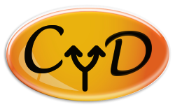
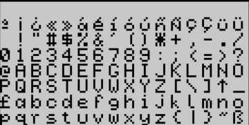
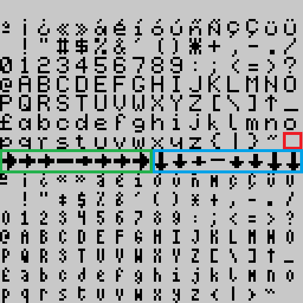

# Choose Your Destiny Manual



The program is a compiler and interpreter to run "Choose Your Own Adventure" type stories or choice-based adventures and game books, for the Spectrum 48, 128, +2 and +3.

It consists of a virtual machine that interprets commands found in the text to perform the different interactive actions and a compiler that is responsible for translating the adventure from a BASIC-like language, with which the adventure script is written, to a file interpretable by the engine.

In addition, it can also display compressed images stored on the same disk, as well as sound effects based on Shiru's BeepFX and PT3-type melodies created with Vortex Tracker.

- [Choose Your Destiny Manual](#choose-your-destiny-manual)
  - [Requirements and Installation](#requirements-and-installation)
    - [Windows Installation](#windows-installation)
    - [Linux, BSDs and UNIX-like Installation](#linux-bsds-and-unix-like-installation)
  - [CYDC (Compiler)](#cydc-compiler)
  - [CYD Character Set Converter](#cyd-character-set-converter)
  - [Basic Syntax](#basic-syntax)
  - [Variables and Numeric Expressions](#variables-and-numeric-expressions)
  - [Flow control and conditional expressions](#flow-control-and-conditional-expressions)
  - [Assignments and indirection](#assignments-and-indirection)
  - [Constants](#constants)
  - [Arrays or "sequences"](#arrays-or-sequences)
  - [List of commands](#list-of-commands)
    - [LABEL ID](#label-id)
    - [#ID](#id)
    - [DECLARE expression AS ID](#declare-expression-as-id)
    - [CONST ID = expression](#const-id--expression)
    - [DIM ID(expression)](#dim-idexpression)
    - [DIM ID(expression) = {expression, expression...}](#dim-idexpression--expression-expression)
    - [GOTO ID](#goto-id)
    - [GOSUB ID](#gosub-id)
    - [RETURN](#return)
    - [IF condexpression THEN ... ENDIF](#if-condexpression-then--endif)
    - [IF condexpression THEN ... ELSE ... ENDIF](#if-condexpression-then--else--endif)
    - [IF condexpression1 THEN ... ELIF condexpression2 THEN ... ELSE ... ENDIF](#if-condexpression1-then--elif-condexpression2-then--else--endif)
    - [WHILE (condexpression) ... WEND](#while-condexpression--wend)
    - [REPEAT ... UNTIL (condexpression)](#repeat--until-condexpression)
    - [SET varID TO varexpression](#set-varid-to-varexpression)
    - [SET \[varID\] TO varexpression](#set-varid-to-varexpression-1)
    - [SET varID TO {varexpression1, varexpression2,...}](#set-varid-to-varexpression1-varexpression2)
    - [SET \[varID\] TO {varexpression1, varexpression2,...}](#set-varid-to-varexpression1-varexpression2-1)
    - [LET varID = varexpression](#let-varid--varexpression)
    - [LET \[varID\] = varexpression](#let-varid--varexpression-1)
    - [LET varID = {varexpression1, varexpression2,...}](#let-varid--varexpression1-varexpression2)
    - [LET \[varID\] = {varexpression1, varexpression2,...}](#let-varid--varexpression1-varexpression2-1)
    - [SET arrayID (varexpression1) TO varexpression2](#set-arrayid-varexpression1-to-varexpression2)
    - [LET arrayID (varexpression1) = varexpression2](#let-arrayid-varexpression1--varexpression2)
    - [LET varID += varexpression](#let-varid--varexpression-2)
    - [LET \[varID\] += varexpression](#let-varid--varexpression-3)
    - [LET varID -= varexpression](#let-varid---varexpression)
    - [LET \[varID\] -= varexpression](#let-varid---varexpression-1)
    - [LET arrayID(varexpression1) += varexpression2](#let-arrayidvarexpression1--varexpression2)
    - [LET arrayID(varexpression1) -= varexpression2](#let-arrayidvarexpression1---varexpression2)
    - [END](#end)
    - [CLEAR](#clear)
    - [CENTER](#center)
    - [WAITKEY](#waitkey)
    - [OPTION GOTO ID](#option-goto-id)
    - [OPTION GOSUB ID](#option-gosub-id)
    - [OPTION VALUE(varexpression) GOTO ID](#option-valuevarexpression-goto-id)
    - [OPTION VALUE(varexpression) GOSUB ID](#option-valuevarexpression-gosub-id)
    - [CHOOSE](#choose)
    - [CHOOSE IF WAIT expression THEN GOTO ID](#choose-if-wait-expression-then-goto-id)
    - [CHOOSE IF CHANGED THEN GOSUB ID](#choose-if-changed-then-gosub-id)
    - [OPTIONSEL()](#optionsel)
    - [NUMOPTIONS()](#numoptions)
    - [OPTIONVAL()](#optionval)
    - [CLEAROPTIONS](#clearoptions)
    - [MENUCONFIG varexpression, varexpression, varexpression, varexpression](#menuconfig-varexpression-varexpression-varexpression-varexpression)
    - [MENUCONFIG varexpression, varexpression, varexpression](#menuconfig-varexpression-varexpression-varexpression)
    - [MENUCONFIG varexpression, varexpression](#menuconfig-varexpression-varexpression)
    - [CHAR varexpression](#char-varexpression)
    - [REPCHAR expression, expression](#repchar-expression-expression)
    - [TAB expression](#tab-expression)
    - [PRINT varexpression](#print-varexpression)
    - [PAGEPAUSE expression](#pagepause-expression)
    - [INK varexpression](#ink-varexpression)
    - [PAPER varexpression](#paper-varexpression)
    - [BORDER varexpression](#border-varexpression)
    - [BRIGHT varexpression](#bright-varexpression)
    - [FLASH varexpression](#flash-varexpression)
    - [NEWLINE expression](#newline-expression)
    - [NEWLINE](#newline)
    - [BACKSPACE expression](#backspace-expression)
    - [BACKSPACE](#backspace)
    - [SFX varexpression](#sfx-varexpression)
    - [PICTURE varexpression](#picture-varexpression)
    - [DISPLAY varexpression](#display-varexpression)
    - [BLIT varexpression, varexpression, varexpression, varexpression AT varexpression, varexpression](#blit-varexpression-varexpression-varexpression-varexpression-at-varexpression-varexpression)
    - [WAIT expression](#wait-expression)
    - [PAUSE expression](#pause-expression)
    - [TYPERATE expression](#typerate-expression)
    - [MARGINS expression, expression, expression, expression](#margins-expression-expression-expression-expression)
    - [FADEOUT expression, expression, expression, expression](#fadeout-expression-expression-expression-expression)
    - [AT varexpression, varexpression](#at-varexpression-varexpression)
    - [FILLATTR varexpression, varexpression, varexpression, varexpression, varexpression](#fillattr-varexpression-varexpression-varexpression-varexpression-varexpression)
    - [PUTATTR varexpression, varexpression AT varexpression, varexpression](#putattr-varexpression-varexpression-at-varexpression-varexpression)
    - [PUTATTR varexpression AT varexpression, varexpression](#putattr-varexpression-at-varexpression-varexpression)
    - [GETATTR (varexpression, varexpression)](#getattr-varexpression-varexpression)
    - [ATTRVAL (expression COMMA expression COMMA expression COMMA expression)](#attrval-expression-comma-expression-comma-expression-comma-expression)
    - [RANDOM(expression)](#randomexpression)
    - [RANDOM()](#random)
    - [RANDOM(expression, expression)](#randomexpression-expression)
    - [INKEY(expression)](#inkeyexpression)
    - [INKEY()](#inkey)
    - [KEMPSTON()](#kempston)
    - [MIN(varexpression,varexpression)](#minvarexpressionvarexpression)
    - [MAX(varexpression,varexpression)](#maxvarexpressionvarexpression)
    - [YPOS()](#ypos)
    - [XPOS()](#xpos)
    - [WINDOW expression](#window-expression)
    - [CHARSET expression](#charset-expression)
    - [RANDOMIZE](#randomize)
    - [TRACK varexpression](#track-varexpression)
    - [PLAY varexpression](#play-varexpression)
    - [LOOP varexpression](#loop-varexpression)
    - [RAMSAVE varID, expression](#ramsave-varid-expression)
    - [RAMSAVE varID](#ramsave-varid)
    - [RAMSAVE](#ramsave)
    - [RAMLOAD varID, expression](#ramload-varid-expression)
    - [RAMLOAD varID](#ramload-varid)
    - [RAMLOAD](#ramload)
    - [SAVE varexpression, varId, expression](#save-varexpression-varid-expression)
    - [SAVE varexpression, varId](#save-varexpression-varid)
    - [SAVE varexpression](#save-varexpression)
    - [LOAD varexpression](#load-varexpression)
    - [SAVERESULT()](#saveresult)
    - [ISDISK()](#isdisk)
    - [LASTPOS(ID)](#lastposid)
  - [Images](#images)
  - [Sound effects](#sound-effects)
  - [Vortex Tracker Music](#vortex-tracker-music)
  - [WyzTracker Music](#wyztracker-music)
  - [How to generate an adventure](#how-to-generate-an-adventure)
    - [Windows version](#windows-version)
    - [Linux, BSDs and Unices version](#linux-bsds-and-unices-version)
  - [Examples](#examples)
  - [Character set](#character-set)
  - [Error codes](#error-codes)
  - [Acknowledgements](#acknowledgements)
  - [Licenses](#licenses)

---

## Requirements and Installation

These are the external requirements for the tool:

- [Python 3.11 or higher](https://www.python.org/)
- [SjAsmPlus 1.20.3 or higher](http://z00m128.github.io/sjasmplus/documentation.html)
- ZIP file decompressor

If you upgrade from an older version, it is recommended NOT to overwrite it. It is better to rename the directory of the old version, unzip the new version, copy your adventure files to the new version and configure the `make_adv` script again for each case.

Here are the more detailed instructions for each operating system:

### Windows Installation

Installation is easy, just unzip the corresponding ZIP file downloaded from the [Releases](https://github.com/cronomantic/ChooseYourDestiny/releases) section of the repository. In this case, everything is included in the package. Windows 10 or higher, 64-bit version is required (32-bit not supported).

### Linux, BSDs and UNIX-like Installation

For these systems, the requirements are:

- GNU/Linux / Unix / macOS / BSD with BASH-compatible shell.
- Python 3.11 or higher
- All common system programs (grep, cat, etc...).
- All programs required to compile C programs on the system (libc, libstdc++, g++, GNU make, etc...).
- Autotools (autoconf, automake, aclocals...).
- wget
- git
- libdsk

These requirements are needed to compile `SjAsmPlus` and `TAPTOOLS`. There is no binary distribution of these tools for UNIX-compatible systems, so you need to compile them directly.

Due to the heterodox nature of the different distributions, it is impossible for me to give detailed instructions for installing the requirements in each particular case, so knowledge is required on the part of the user to do so.

The first thing to do is to clone the engine repository to any location you think is convenient and recursively to download the dependencies:

```bash
git clone --recursive https://github.com/cronomantic/ChooseYourDestiny.git
cd ChooseYourDestiny
```

Now you can proceed to compile **SjASMPlus** with the following commands:

```bash
cd external/sjasmplus
make clean
make
cd ..
```

And with this we have the dependencies ready. As a last step, we must put the compilation script as executable:

```bash
cd ../..
chmod a+x make_adv.sh
```

And with this you could already use the tool in Linux.

## CYDC (Compiler)

This program is the compiler that translates the adventure text into a TAP or DSK file. In addition to compiling the adventure into a file that can be interpreted by the engine, it performs a search for the best abbreviations to reduce the size of the text.

```batch
cydc_cli.py [-h] [-l MIN_LENGTH] [-L MAX_LENGTH] [-s SUPERSET_LIMIT]
              [-T EXPORT-TOKENS_FILE] [-t IMPORT-TOKENS-FILE] [-C EXPORT-CHARSET]
              [-c IMPORT-CHARSET] [-S] [-n NAME] [-img IMAGES_PATH] [-trk TRACKS_PATH]
              [-sfx SFX_ASM_FILE] [-scr LOAD_SCR_FILE] [-v] [-V] [-trim]
              [-wyz] [-nl NUM_LINES] [-720]
              {48k,128k,plus3} input.txt SJASMPLUS_PATH OUTPUT_PATH
```

- **\-h**: Shows the help
- **\-l MIN_LENGTH**: The minimum length of the abbreviations to search for (default 3).
- **\-L MAX_LENGTH**: The maximum length of the abbreviations to search for (default 30).
- **\-s SUPERSET_LIMIT**: Limit for the superset of the search heuristics (default 100).
- **\-T EXPORT-TOKENS_FILE**: Export the found abbreviations to the JSON file indicated by the parameter.
- **\-t IMPORT-TOKENS-FILE**: Import abbreviations from the indicated file and skip the search for them.
- **\-C EXPORT-CHARSET**: Export the 6x8 character set used by default in JSON format.
- **\-c IMPORT-CHARSET**: Import the character set to be used in JSON format.
- **\-S**: If a compressed text fragment does not fit in a bank, it is split into two between the current bank and the next one with this option activated. Otherwise, the fragment is moved to the next bank.
- **\-n NAME**: Name to use for the output file (name for the TAP or DSK file), if not defined it will be the same as the input file.
- **\-scr LOAD_SCR_FILE**: Path to an SCR file with the loading screen to use.
- **\-img IMAGES_PATH**: Path to the directory with the adventure images.
- **\-trk TRACKS_PATH**: Path to the directory with the PT3 AY music files or WyzTracker files.
- **\-sfx SFX_ASM_FILE**: Path to an assembler file generated by BeepFx.
- **\-v**: Verbose mode, gives more information about the process.
- **\-V**: Indicates the version of the program.
- **\-trim**: Removes code from commands that are not used in the adventure to make the interpreter smaller.
- **\-pause**: Number of seconds of pause after finishing the loading process, can be aborted with any keypress.
- **\-wyz**: Use WyzTracker music type instead of Vortex Tracker.
- **\-nl NUM_LINES**: Number of lines to use in image files (default 192).
- **\-720**: If using the Plus3 format, a 720 KB disk image will be used instead of the standard 180 KB size.

-**{48k,128k,plus3}**: Spectrum model to be used:
  -- **48k**: Version for tape in TAP format, does not include the PT3 player and everything is loaded at once. It depends on the size of the available memory.
  -- **128k**: Version for tape in TAP format, everything is loaded at once in the memory banks and depends on the size of the available memory.
  -- **plus3**: This version will generate a DSK file to run on Spectrum+3. Resources are loaded dynamically as needed and depends on the size on disk.

- **input.txt**: Input file with the adventure script.
- **SJASMPLUS_PATH**: Path to the SjASMPlus executable.
- **OUTPUT_PATH**: Path where the output files will be stored.

The compiler is a program written in Python, so it requires the Python environment installed. For convenience, the distribution includes an embedded Python package and a batch script called `cydc.cmd` to launch it from the command line.

**The compiler depends on an external program to run**, the `SjASMPlus` assembler, so you must specify the path to this program in the input parameters. This program is included in the distribution in the `tools` directory.

You must also specify a destination directory to store the files resulting from the compilation.

Optionally, you can specify the paths to directories containing the compressed images in `scr` format, which will be included on the resulting tape or disk. The same applies to `PT3` files. Both file types must be named with 3-digit numbers, from 0 to 255, such as `000.scr`, `001.scr`, `002.PT3`, and so on. The directories containing both files will be indicated with the `-img` and `-`trk` parameters, respectively.

The images will be compressed into a `CSC` file. The screens can be full, or the number of horizontal lines can be limited to save memory. It also detects mirrored (symmetrical) images along the vertical axis, so it only stores half of the image. You can even force this behavior and discard the right side of the image to save space. More details on how this works are found in the [Images](#images) section.

For the music, we can use Vortex Tracker modules (`PT3`) or music created with WyzTracker v2.0 and higher. The behavior is also described in their corresponding sections: [Vortex Tracker Tunes](#vortex-tracker-tunes) and [WyzTracker Tunes](#wyztracker-tunes).

You can add sound effects generated with Shiru's BeepFx application. To use them, export them using the `File->Compile` option in the top menu. In the pop-up window that appears, make sure `Assembly` and `Include Player Code` are selected; the rest of the options are irrelevant. Then save the file somewhere accessible, specifying the path from the command line with the `-sfx` option.

## CYD Character Set Converter

This utility allows you to convert character sets in `.chr`, `.ch8`, `.ch6` and `.ch4` format into a compiler-usable file in JSON format. These formats are editable with ZxPaintbrush.

```batch
cyd_chr_conv.py [-h] [-w WITDH_LOW] [-W WITDH_UP] [-v] [-V] charset.chr charset.json
```

Supported parameters:

- **\-w, --width_low**: Character width (1-8) of the lower character set.
- **\-W, --width_high**: Character width (1-8) of the upper character set.
- **\-h, --help**: Show help.
- **\-v, --verbose**: Verbose mode.
- **\-V, --version**: Program version.
- **charset.chr**: Input character set.
- **charset.json**: File with the character set for the compiler.

The default character width is 6 for the lower character set (from 1st to 127th) and 4 for the upper character set (from 145th to 256th), but these values ​​can be changed with the `-w` and `-W` parameters respectively.
Note that characters 128 to 144 are special, as they are used for cursors and will always have a width of 8, so the font size will be ignored for those characters. If you want to define a specific width for each character you will have to edit it in the output JSON file. You can find more information in the [Character set](#character-set) section.

---

## Basic Syntax

### Including External Files

For larger projects, you can organize your adventure into multiple source files using the `INCLUDE` directive. This allows you to split your code into logical modules (e.g., separate files for different chapters, common subroutines, variable declarations, etc.).

**Syntax:**
```cyd
INCLUDE "filename.cyd"
```

**Example:**
```cyd
[[ INCLUDE "variables.cyd" ]]
[[ INCLUDE "common_functions.cyd" ]]
[[ INCLUDE "chapter1.cyd" ]]

#Start
You begin your adventure...
```

**Features:**
- The `INCLUDE` directive is case-insensitive (`INCLUDE`, `include`, or `Include` all work)
- File paths can be relative or absolute
- Relative paths are resolved from the directory containing the file with the `INCLUDE` directive
- Files can include other files (nested includes) up to a maximum depth of 20 levels
- Circular includes (file A includes B, B includes A) are detected and reported as errors
- The directive can be followed by comments: `INCLUDE "file.cyd" // Load utilities`
- Both single and double quotes are supported: `INCLUDE "file.cyd"` or `INCLUDE 'file.cyd'`

**Example project structure:**
```
my_adventure/
  ├── main.cyd          (main entry point)
  ├── variables.cyd     (DECLARE statements)
  ├── functions.cyd     (common subroutines)
  └── chapters/
      ├── intro.cyd
      ├── chapter1.cyd
      └── chapter2.cyd
```

**main.cyd:**
```cyd
[[ INCLUDE "variables.cyd" ]]
[[ INCLUDE "functions.cyd" ]]

#Start
[[ INCLUDE "chapters/intro.cyd" ]]
[[ GOTO Chapter1 ]]

#Chapter1
[[ INCLUDE "chapters/chapter1.cyd" ]]
```

The preprocessor will expand all `INCLUDE` directives before the actual compilation begins, combining all source files into a single file for processing.

---

### Code Blocks and Text

Commands for the interpreter are enclosed within two pairs of brackets, open and closed respectively. Any text outside of this is considered "printable text", including spaces and line breaks, and will be presented as such by the interpreter. Commands are separated from each other by line breaks or colons if they are on the same line.

Comments within code are delimited by `/*` and `*/`, everything in between is considered a comment.

This is a self-explanatory, abbreviated example of the syntax:

```cyd
This is text [[ INK 6 ]] This is text again but yellow
It's still text [[
/* This is a comment and the following are commands */
WAITKEY
INK 7: PAPER 0
]]
This is text again but white, and watch out for the line break that precedes it!
```

The interpreter runs through the text from the beginning, printing it on the screen if it is "printable text." When a complete word does not fit on the rest of the line, it prints it on the next line. And if it does not fit on the rest of the screen, a wait is generated and the user is asked to press the confirmation key to delete the section of text and continue printing (this last behavior is optional).

When the interpreter detects commands, it executes them sequentially, unless it encounters breaks. Commands allow you to introduce programmable logic into the text to make it dynamic and varied according to certain conditions. The most common and powerful is to ask the player to choose from a series of options (up to a limit of 8 at a time), which can be chosen with the `P` and `Q` keys and selected with `SPACE` or `ENTER`. It supports a Kempston joystick too.
Again, this is a self-explanatory example:

```cyd
[[ /* Commands that set screen colors and clear the screen */
PAPER 0 /* Background color to zero (black)*/
INK 7 /* Ink color (white) */
BORDER 0 /* Border color (black) */
CLEAR /* Clear text area (full screen) */
LABEL Location1]]You are in location 1. Where do you want to go?
[[OPTION GOTO Location2]]Go to location 2
[[OPTION GOTO Location3]]Go to location 3
[[CHOOSE]]
[[ LABEL Location2]]You did it!!!
[[ GOTO Final]]
[[ LABEL Location3]]You are dead!!!
[[ GOTO Final]]
[[ LABEL Final : WAITKEY: END ]]
```

The `OPTION GOTO label` command will generate a selection point at the point where the command has been reached.
When the `CHOOSE` command is reached, the interpreter will allow the user to choose from one of the option points that have been accumulated on the screen up to that point. A maximum of 32 are allowed.

When choosing an option, the interpreter will jump to the section of text where the corresponding label indicated in the option is found. Labels are declared with the `LABEL identifier` pseudo-command within the code, and when a jump to it is indicated, the interpreter will begin processing from the point where we have declared the label.
In the example, if we choose option 1, the interpreter will jump to the point indicated in `LABEL location2`, which will print the text _"You did it!!!"_, and then go to `GOTO Final` which will make an unconditional jump to where `LABEL Final` is defined and ignore everything in between.

Label identifiers only support alphanumeric characters (numbers and letters), must start with a letter and are case-sensitive (upper and lower case are distinguished), i.e. `LABEL Label` is not the same as `LABEL label`. Commands, on the other hand, are not case-sensitive, but for clarity, it is recommended to capitalize them.

A shortened version of labels is also allowed by preceding the label identifier with the character `#`, so that `#MyLabel` is the same as `LABEL MyLabel`. With this, we could rewrite the previous code like this:

```cyd
[[ /* Commands that set screen colors and delete them */
PAPER 0 /* Background color to zero (black) */
INK 7 /* Ink color (white) */
BORDER 0 /* Border color (black) */
CLEAR /* Clear text area (full screen) */
LABEL Location1]]You are in location 1. Where do you want to go?
[[OPTION GOTO Location2]]Go to location 2
[[OPTION GOTO Location3]]Go to location 3
[[CHOOSE]]
[[ #Location2 ]]You did it!!!
[[ GOTO Final ]]
[[ #Location3 ]]You are dead!!!
[[ GOTO Final]]
[[ #Final : WAITKEY: END ]]
```

The available commands are described in their corresponding [section](#commands).

### Strict Colon Mode (Syntax Enforcement)

As of version 1.2.x, the compiler enforces **Strict Colon Mode by default**. This means that when multiple code statements are placed on the same line within `[[ ]]` blocks, they **must** be separated by colons (`:`)

**Correct syntax** (Strict Colon Mode enabled - DEFAULT):
```cyd
[[ PRINT "Hello" : INK 5 : GOTO Label1 ]]
[[ SET myvar TO 10 : WAITKEY : END ]]
```

**Incorrect syntax** (missing colons):
```cyd
[[ PRINT "Hello" INK 5 GOTO Label1 ]]  <-- ERROR: Statements must be separated by colons
```

**If you need to support old code** without colon separators, pass the `--no-strict-colons` flag to the compiler:
```bash
cydc_cli.py --no-strict-colons 48k input.cyd sjasmplus output
```

**Key points:**
- Line breaks automatically separate statements, so colons are only needed when multiple commands are on the same line
- Colons are optional with the `--no-strict-colons` flag for backwards compatibility
- This change improves code readability and prevents parsing ambiguities

---

## Variables and Numeric Expressions

Numeric constant values ​​can be expressed in base 10 by default, in hexadecimal with the prefix `0x`, or in binary with the prefix `0b`. For example, `240` would be decimal, `0xF0` in hexadecimal, and `0b11110000` in binary.

There are 256 one-byte containers (from 0 to 255) available to the programmer to store values, perform operations, and compare them. They constitute the state of the program. From this point on, they may be called variables, flags, or "variables" interchangeably throughout this document.

To refer to a variable in a numeric expression, the number must be preceded by the `@` character. But it is possible to give a meaningful name to variables using the `DECLARE` command as follows:

```cyd
[[
DECLARE 7 AS InkColor
INK @InkColor
]]
```

It should be noted that a variable cannot be declared twice, nor can there be labels and variables with the same names, but synonyms are allowed as follows:

```cyd
[[
DECLARE 10 AS SomeName
DECLARE 10 AS OtherName
]]
```

Thus, both _SomeName_ and _OtherName_ will serve to identify variable 10. Keep in mind that despite having different names, they are the same variable.

To assign values to a variable, we use the command `SET varId TO varexpression`, as follows:

```cyd
[[
SET 0 TO 1 /* Set the variable zero to 1 */
SET variable TO 2 /* Set the variable named variable to 2 */
SET variable2 TO @variable + 2 /* Set the variable named variable2 to two plus the value of the variable named variable */
SET variable2 TO @variable2 - (@variable + 2) /* Allows parentheses */
]]

```

We also now have the following synonym with `LET varId = varexpression`, so the previous examples could be rewritten like this:

```cyd
[[
LET 0 = 1 /* Set the variable zero to 1 */
LET variable = 2 /* Set the variable named variable to 2 */
LET variable2 = @variable + 2 /* We set the variable called variable2 to two plus the value of the variable called variable */
LET variable2 = @variable2 - (@variable + 2) /* Allows parentheses */
]]
```

As you can see, a variable can be assigned the value of a mathematical expression composed of numbers, functions and variables. As already indicated, variables within a numeric expression, that is, the right side of an assignment **must always be preceded by the `@` character**.

The available operands are:

- Addition: `SET variable TO @variable + 2`
- Subtraction: `SET variable TO @variable - 2`
- Binary "AND": `SET variable TO @variable & 2`
- Binary "OR": `SET variable TO @variable | 2`
- Binary "NOT" or bit complement: `SET variable TO !@variable`
- Bit shift left: `SET variable TO @variable << 2`
- Bit shift right: `SET variable TO @variable >> 2`

The most common operation performed with variables is incrementing or decrementing them by a specific value. `CYD` provides two abbreviated ways to do this:

- `LET variable += 2`, which is equivalent to `SET variable TO @variable + 2` or `LET variable = @variable + 2`.
- `LET variable -= 1`, which is equivalent to `SET variable TO @variable - 1` or `LET variable = @variable - 1`.

The result of a numeric expression cannot be greater than 255 (1 byte) or less than zero (negative numbers are not supported). If, when performing operations, both limits are exceeded, the result will be adjusted to the corresponding limit. That is, if a sum exceeds 255, it will be adjusted to 255, and a subtraction that results in a value less than zero will be zero. Therefore, negative numbers do not exist.

One thing to note is that binary operators are not the same as the logical operators of conditional expressions described below. An **&** is not the same as an **AND**. Binary operators perform the corresponding operations on the bits of the variable.

Most commands accept numeric expressions in their parameters, for example:

```cyd
[[
INK 7
INK @7
]]
```

The first command will set the text color to white (color 7), while the second will set the text color to the value contained in the variable number 7. Combining all of the above, you could do:

```cyd
[[
INK 3+4
INK @Var-1
]]
```

Check the [commands](#commands) reference to find out which commands accept them.

Finally, there are a number of special commands called **functions**. These commands cannot be used on their own, but must be used within a numeric expression, since they return a value to be used within it.

- **RANDOM(expression)**: Returns a random number between 0 and the value specified in **expression**.
- **RANDOM()**: Returns a random number between 0 and 255. This is equivalent to `RANDOM(255)`.
- **RANDOM(expression,expression)**: Returns a random number between the value indicated in the first parameter and the second, both inclusive.
- **INKEY()** Waits until a key is pressed and returns the code of the key pressed. (Only for keyboard).
- **KEMPSTON()** Returns the buttons pressed on a Kempston joystick connected to the Spectrum.
- **MIN(varexpression,varexpression)**: Limits the value of the first parameter to the minimum indicated by the second. That is, if parameter 1 is less than parameter 2, parameter 2 is returned, otherwise 1 is returned.
- **MAX(varexpression,varexpression)**: Limits the value of the first parameter to the maximum indicated by the second. That is, if parameter 1 is greater than parameter 2, parameter 2 is returned, otherwise 1 is returned.
- **POSY()**: Returns the current row the cursor is on in 8x8 coordinates.
- **POSX()**: Returns the current column the cursor is on in 8x8 coordinates (Due to the nature of variable width font, the returned value will be the 8x8 column where the cursor is currently located).
- **LASTPOS(ID)**: Returns the index of the last position in the given array.

So, for example `SET variable_no TO RANDOM(6)`, assigns to the variable _variable_no_ a random number from 0 to 6. And in the same way, we can operate with them: `SET variable_no TO RANDOM(6) + @var + 1`

---

## Flow control and conditional expressions

To control the flow of execution, we have different commands, which I will now describe:

- **GOTO ID**

Jumps to the label _ID_.

- **GOSUB ID**

Subroutine jump, jumps to the label _ID_, but returns execution to the next instruction to the `GOSUB` as soon as it finds a `RETURN` command.

- **RETURN**

Returns to the point after the subroutine call, see `GOSUB`

- **IF condexpression THEN ... ENDIF**

If the conditional expression _condexpression_ is true, the text is printed and the commands from `THEN` to `ENDIF` are executed.

- **IF condexpression THEN ... ELSE ... ENDIF**

If the conditional expression _condexpression_ is true, the text is printed and the commands from `THEN` to `ELSE` are executed. Otherwise, the text is printed and the commands from `ELSE` to `ENDIF` are executed

- **IF condexpression THEN ... ELSEIF condexpression THEN [... ELSEIF condexpression THEN] ... ELSE ... ENDIF**

If the conditional expression _condexpression1_ evaluates to true, the text is printed and the commands from `THEN` to `ELSE` are executed. Otherwise, the conditional expression _condexpression2_ is checked, in which case the text is printed and the commands from `ELIF` to the `ELSE` or another `ELSEIF` are executed. Multiple `ELSEIF`s can be chained together until a final `ELSE` clause is reached, which is executed if none of the previous conditions have been met.

- **WHILE (condexpression) ... WEND**

The text and commands up to `WEND` are repeated repeatedly as long as the condition _condexpression_ evaluates to true. Evaluation is performed at the beginning of each iteration.

- **REPEAT ... UNTIL (condexpression)**

The text and commands from `REPEAT` to `UNTIL` are repeated repeatedly as long as the _condexpression_ condition evaluates to false. Evaluation is performed at the end of each iteration.

As you can see, many of these functions are executed depending on whether a condition is met. For example:

```cyd
[[IF @var = 0 THEN GOTO jump ENDIF]]
```

For the jump to be executed, the variable _var_ must be equal to zero. This is what is called a conditional expression.

A condition is always a comparison between two numeric expressions:

- Equal to: `IF @variable = 0 THEN GOTO jump ENDIF`
- Greater than: `IF @variable > 0 THEN GOTO jump ENDIF`
- Less than: `IF @variable2 < @variable THEN GOTO jump ENDIF`
- Not equal to: `IF @variable <> 0 THEN GOTO jump ENDIF`
- Greater than or equal to: `IF @variable <= 0 THEN GOTO jump ENDIF`
- Less than or equal to: `IF @variable >= 0 THEN GOTO jump ENDIF`

In addition, conditions can be combined into conditional expressions using logical operations. For example:

```cyd
[[IF (@variable = 0 AND @variable2 = 1) AND NOT @variable3 = 1 THEN GOTO jump ENDIF]]
```

- Cond1 **AND** Cond2: True if both Cond1 and Cond2 are true.
- Cond1 **OR** Cond2: True if either Cond1 or Cond2 is true.
- **NOT** Cond1: True if the condition Cond1 is false.

Again, remember that the logical operators of conditional expressions **are not the same as binary operators**.

Also, for those with advanced programming knowledge, conditions are not "short-circuiting", that is, all logical operations and comparisons are evaluated until the end.

---

## Assignments and indirection

We have already seen assignments and numerical expressions in [their section](#variables-and-numeric-expressions), but we are going to explain in more detail how they work with indirection, which deserves a separate section.

Indirection is done by putting a numerical expression in single brackets, for example `[@var+1]`. What we are trying to say is that **we are going to refer to the variable or variables with the number calculated by the numerical expression enclosed in brackets**. Let's see it with examples:

- `SET var to [2+2]`: indicates that we are going to assign to _var_ the content of the variable 2+2, that is, 4. This is equivalent to `SET var TO @4`, but it allows us to strengthen the concept.
- `SET var TO [@index]`: this is where the utility really comes into play, since we are indicating that we are saving in _var_ the content of the variable whose number corresponds to the content of the variable _index_. That is, we can dynamically change the variable to which we make the assignment.
- `SET var TO [@index+2]`: indirection supports any numeric expression, this means that we save in _var_ the content of the variable that corresponds to the content of _index_ plus two.
- `SET [var] TO 0`: Indirection can also be used on the right-hand side, and in this case, numeric expressions are not supported, only the number or the variable identifier if it has been declared. This means "assign zero to the variable whose index corresponds to the content of the variable _var_.
- `INK [@var]`: Indirection is also supported by those commands that admit numeric expressions.
- `SET [@@var] TO 0`: For completeness, since we operate with pointers, using `@@` we have the complementary operation to indirection, that is, it returns the index number of a given variable, so in the example, the operation would be equivalent to `SET var TO 0`.

If we use numeric indicators with variables (e.g. `@0`) it is not very useful. Its real utility lies in using it with variable identifiers, such that if we have:

```cyd
[[
DECLARE 20 AS var : DECLARE 10 AS index: SET index AS @@var : SET [index] AS 0
]]
```

We see that this allows us to initialize variables that we are going to use. to be used for indirection with the identifier of another variable.

Indirection is a powerful tool that allows us to implement arrays in variables, but be careful, we only have 256! Also, we must not confuse them with the arrays described in the next section, which are of a different nature.

Finally, we can perform multiple assignments using the following construction:

```cyd
[[
DECLARE 10 AS var
SET var AS {0, 1, 2, 3}
]]
```

This would be equivalent to:

```cyd
[[
SET 10 AS 0
SET 11 AS 1
SET 12 AS 2
SET 13 AS 3
]]
```

That is, we can consecutively assign a sequence of values to a sequence of variables, starting with the variable indicated on the left side. This allows multiple values to be assigned consecutively.

---

## Constants

During development, we may need to have values with a meaningful name. Just like with variables, we can name them with `CONST name = value`, and then use `name` instead. For example:

```cyd
[[
CONST maxBalas = 10 /* we declare the constant maxBalas with value 10 */
PRINT maxBalas /* we print the value 10 */
]]
```

Unlike variables, we can use as many constants as we want, since during the compilation process they will be replaced by their corresponding value.

The name of the constant cannot match that of another variable, label or any of the commands.

---

## Arrays or "sequences"

In the previous section we have described the use of indirection to use variables as an array, but `CYD` also has an alternative way of creating data arrays using the `DIM` command, such that with `DIM name(size)` we declare an array with name `name` and size `size`. The size of an array cannot be greater than 256 nor be zero. We access each of the elements of the array with the nomenclature `name(pos)`, where `pos` is the position number of the element to be accessed within the array, starting from zero. Let's see it with examples:

```cyd
[[
DIM myArray(5) /* We declare an array of 5 elements from 0 to 4 */
LET myArray(3) = 1 /* We assign 1 to position 3 of the array, which would be the fourth */
PRINT myArray(3) /* We print the value stored in position 3 */
]]
```

If we try to access a position outside the range, the engine will fail and give an error. To find out which is the last accessible position of the array, we have the `LASTPOS` function:

```cyd
[[
DIM myArray(5) /* We declare an array of 5 elements */
PRINT LASTPOS(myArray) /* It would return 4 */
]]
```

Assigning initial values to an array can be done in the following way: `DIM array_name(size) = {value1, value2, ...}`. Following the previous example:

```cyd
[[
DIM myArray(5) = {1, 2, 3, 4, 5} /* We assign values to the array */
PRINT myArray(1) /* This would print 2 */
]]
```

Uninitialized positions will always have a value of 0 by default, so we can have an array with more positions than values. The opposite would give us an error:

```cyd
[[
DIM myArray(5) = {1, 2, 3} /* This is allowed */
DIM myArray(3) = {1, 2, 3, 4, 5} /* This would give an error */
]]
```

Finally, and as a convenience, we can leave the number of positions of the array empty when declaring it with values. The compiler will create an array with as many positions as there are elements in the initialization:

```cyd
[[
DIM myArray() = {1, 2, 3} /* This is allowed, myArray would have 3 positions */
DIM myArray() /* This would give an error */
]]
```

This type of arrays have a series of limitations that must be taken into account when using them. The most obvious one is that they cannot have more than 256 elements and are one-dimensional and cannot be resized.

Another limitation is that you cannot save or retrieve data from these arrays using `SAVE` and `LOAD` directly. The only option is to move the array data to or from variables and perform save or retrieve operations on them.

Finally, if you modify the data in an array, you cannot retrieve the original values unless you make a copy to another array first.

---

## List of commands

Before describing the commands, let's briefly discuss the legend used:

- **ID** is an identifier and is a string of numbers, letters or underscores. Accented letters and ñ are not allowed.
- **expression** is a numeric expression without variables. It is a decimal or hexadecimal number, but simple arithmetic operations are also allowed and will be calculated at compile time.
- **varexpression**, numeric expression as described in its corresponding [section](#variables-and-numeric-expressions). It can contain variables with `@` and indirections.
- **condexpression**, conditional expression as described in its corresponding [section](#flow-control-and-conditional-expressions). They consist of one or several comparisons with logical operations between them.
- **varID**, variable identifier, can be an _expression_ if we use its numeric index or an _ID_ if we have declared it like this with `DECLARE`.

---

Here is the full list of commands:

### LABEL ID

Declare the label labelId at this point. All jumps with reference to this label will direct execution to this point.

### #ID

Shortened version for declaring the label _ID_, such that `#LabelId` is the same as `LABEL LabelId`.

### DECLARE expression AS ID

Declare the identifier _ID_ as a symbol representing the variable _expression_ instead.

### CONST ID = expression

Declare the constant _ID_ with the value of _expression_.

### DIM ID(expression)

Create an array named _ID_ with as many elements as indicated by _expression_. The number of elements cannot exceed 256.

### DIM ID(expression) = {expression, expression...}

Same as [DIM ID(expression)](#dim-idexpression), but assigning comma-separated values.

### GOTO ID

Jump to the _ID_ label.

### GOSUB ID

Subroutine jump, jumps to the _ID_ label, but returns to the next command when it encounters a `RETURN` command.

### RETURN

Returns to the point after the subroutine call, see `GOSUB`

### IF condexpression THEN ... ENDIF

If the conditional expression _condexpression_ is true, the text is printed and the commands from `THEN` to `ENDIF` are executed.

### IF condexpression THEN ... ELSE ... ENDIF

If the conditional expression _condexpression_ is true, the text is printed and the commands from `THEN` to `ELSE` are executed. Otherwise, the text is printed and the commands from `ELSE` to `ENDIF` are executed.

### IF condexpression1 THEN ... ELIF condexpression2 THEN ... ELSE ... ENDIF

If the conditional expression _condexpression1_ is true, the text is printed and the commands from `THEN` to `ELSE` are executed. Otherwise, the conditional expression _condexpression2_ is checked, in which case the text is printed and the commands from `ELIF` to the `ELSE` or another `ELSEIF` are executed. Several `ELSEIF`s can be chained together until a final `ELSE` clause is reached, which is executed if none of the previous conditions have been met.

### WHILE (condexpression) ... WEND

Text and commands up to `WEND` are repeated repeatedly as long as the _condexpression_ condition evaluates to true. Evaluation is performed at the beginning of each iteration.

### REPEAT ... UNTIL (condexpression)

Text and commands from `REPEAT` to `UNTIL` are repeated repeatedly as long as the _condexpression_ condition evaluates to false. Evaluation is performed at the end of each iteration.

### SET varID TO varexpression

Assigns the value of _varexpression_ to the variable _varID_.

### SET [varID] TO varexpression

Assigns the value of _varexpression_ to the variable whose index corresponds to the contents of _varID_.

### SET varID TO {varexpression1, varexpression2,...}

Assigns the value of _varexpression1_ to the variable _varID_, _varexpression2_ to the variable _varID_+1, and so on.

### SET [varID] TO {varexpression1, varexpression2,...}

Assigns the value of _varexpression1_ to the variable whose index corresponds to the content of _varID_, _varexpression2_ to the variable whose index corresponds to the content of _varID_+1, and so on.

### LET varID = varexpression

Assigns the value of _varexpression_ to the variable _varID_.

### LET [varID] = varexpression

Assigns the value of _varexpression_ to the variable whose index corresponds to the content of _varID_.

### LET varID = {varexpression1, varexpression2,...}

Assigns the value of _varexpression1_ to the variable _varID_, _varexpression2_ to the variable _varID_+1, and so on.

### LET [varID] = {varexpression1, varexpression2,...}

Assigns the value of _varexpression1_ to the variable whose index corresponds to the contents of _varID_, _varexpression2_ to the variable whose index corresponds to the contents of _varID_+1, and so on.

### SET arrayID (varexpression1) TO varexpression2

Assigns the value _varexpression2_ to the position _varexpression1_ of the array _arrayID_.

### LET arrayID (varexpression1) = varexpression2

Assigns the value _varexpression2_ to the position _varexpression1_ of the array _arrayID_.

### LET varID += varexpression

Increments the variable _varID_ with the value of _varexpression_.

### LET [varID] += varexpression

Increments the variable whose index corresponds to the content of _varID_ with the value of _varexpression_.

### LET varID -= varexpression

Decrements the variable _varID_ with the value of _varexpression_.

### LET [varID] -= varexpression

Decrements the variable whose index corresponds to the content of _varID_ with the value of _varexpression_.

### LET arrayID(varexpression1) += varexpression2

Increments the value at position _varexpression1_ of the array _arrayID_ with the value _varexpression2_.

### LET arrayID(varexpression1) -= varexpression2

Decrements the value at position _varexpression1_ of the array _arrayID_ with the value _varexpression2_.

### END

Ends the adventure and restarts the computer.

### CLEAR

Clears the defined text area.

### CENTER

Sets the print cursor to the center of the line.

### WAITKEY

Waits for the OK key to continue, displaying an animated wait icon. Ideal for separating paragraphs or screens.

### OPTION GOTO ID

Creates a choice point that the user can select (see `CHOOSE`). If the choice is confirmed, it jumps to the _ID_ label. If the screen is cleared, the choice point is deleted, and a maximum of 32 are allowed on a screen. Choice points are accumulated in the order they are declared in a list that is traversed according to the keystrokes pressed, and in the same order in which the choice points were declared. If it is the selected option in the menu, the value returned by `OPTIONVAL()` is its position within the list of menu options.

### OPTION GOSUB ID

Creates a choice point that the user can select (see `CHOOSE`). If this option is confirmed, it jumps to label _ID_, returning after the `CHOOSE` when it encounters a `RETURN`. If the screen is cleared, the choice point is deleted, and a maximum of 32 are allowed on a screen. Choice points are accumulated in the order they are declared in a list that is traversed according to the keystrokes used, and in the same order in which the choice points were declared. If it is the selected option in the menu, the value returned by `OPTIONVAL()` is its position within the list of menu options.

### OPTION VALUE(varexpression) GOTO ID

Works the same as `OPTION GOTO ID`, but we assign it a specific value that is returned by `OPTIONVAL()` if it is the chosen option in the menu.

### OPTION VALUE(varexpression) GOSUB ID

Works the same as `OPTION GOSUB ID`, but we assign it a specific value that will be returned by `OPTIONVAL()` if it is the chosen option in the menu.

### CHOOSE

Stops execution and allows the player to select one of the options currently on the screen. It will jump to the label indicated in the corresponding option.

Selection is made with the **O** and **P** keys for horizontal scrolling and **Q** and **A** for vertical scrolling. The corresponding directions on the Kempston joystick and the cursor keys can also be used.

When these keys are pressed, a pointer moves over the list of options, incrementing or decrementing them according to the current configuration (see [MENUCONFIG](#menuconfig-varexpression-varexpression)). By default, only vertical scrolling is configured with the **Q** and **A** keys or **up** and **down** on the Kempston joystick or cursor keys. It is the user's responsibility to place the option points on the screen in a manner consistent with the configured menu movement.

Remember that if you clear the screen before this command, you will lose the options and a system error will be given.

### CHOOSE IF WAIT expression THEN GOTO ID

It works exactly the same as `CHOOSE`, but with the exception that a timeout is declared, which if it expires without selecting any option, it jumps to the _ID_ label.
The timeout has a maximum of 65535 (16 bits).

### CHOOSE IF CHANGED THEN GOSUB ID

It works exactly the same as `CHOOSE`, but a subroutine jump is made to the _ID_ label each time the option is changed. Therefore, it is recommended that a `RETURN` is made as soon as possible to avoid slowness. To know the chosen option and the total number of options in our menu, we can use the `OPTIONSEL()` and `NUMOPTIONS` functions respectively.

### OPTIONSEL()

_Function_ that returns the currently selected option in the currently active menu. If we do not have an active menu, the result of this function is undefined.

### NUMOPTIONS()

_Function_ that returns the number of options in the currently active menu. If we do not have an active menu, the result of this function is undefined.

### OPTIONVAL()

_Function_ that returns the value assigned to the option selected and accepted in the menu, it is only updated when an option is chosen and the menu is exited.

### CLEAROPTIONS

Deletes the options stored in the menu.

### MENUCONFIG varexpression, varexpression, varexpression, varexpression

Configures the options menu. The parameters that can be configured are the following:

- The first parameter determines the increment or decrement of the selected option number when we press **P** and **O** respectively (or the left and right cursor keys or the joystick).
- The second parameter determines the increment or decrement of the selected option number when we press **A** and **Q** respectively (or the up and down cursor keys or the joystick).
- The third parameter is the option that will be selected at the beginning when the menu is started with `CHOOSE`. The default value is zero (the first option registered).
- The fourth parameter, if zero, does not show the selection icon and if non-zero, does.

The behavior when starting the interpreter is as if `MENUCONFIG 0,1,0,1` had been executed.
**If you change the configuration for a menu, it is recommended to do so first, before setting the options.**

### MENUCONFIG varexpression, varexpression, varexpression

If the fourth parameter is omitted, `MENUCONFIG x,y,d` is equivalent to `MENUCONFIG x,y,d,1`.

### MENUCONFIG varexpression, varexpression

If the third and fourth parameters are omitted, `MENUCONFIG x,y` is equivalent to `MENUCONFIG x,y,0,1`.

### CHAR varexpression

Prints the character indicated by its corresponding number.

### REPCHAR expression, expression

Prints the character indicated in the first parameter as many times as the number indicated in the second parameter. Both values ​​have a size of 1 byte, that is, val from 0 to 255. Also, if the number of times is zero, the character will be repeated 256 times instead of none.

### TAB expression

Prints as many spaces as indicated in the parameter. It is the equivalent of `REPCHAR 32, expression`, but it takes up less memory.

### PRINT varexpression

Prints the indicated numeric value.

### PAGEPAUSE expression

Controls whether the player is prompted to continue after the current text area is completely filled, displaying an animated wait icon (parameter \<> 0) or scrolling up the text and continuing printing (parameter = 0).

### INK varexpression

Defines the character color (ink). Values ​​0-7, corresponding to the Spectrum colors.

### PAPER varexpression

Defines the background color (paper). Values ​​0-7, corresponding to the Spectrum colors.

### BORDER varexpression

Defines the border color, values ​​0-7.

### BRIGHT varexpression

Turns brightness on or off (0 off, 1 on).

### FLASH varexpression

Turns flashing on or off (0 off, 1 on).

### NEWLINE expression

Prints newlines equal to the number specified in the parameter (0 is 256)

### NEWLINE

Equivalent to `NEWLINE 1`.

### BACKSPACE expression

Moves the print cursor back by the number of positions specified in the parameter (0 is 256), deleting the character at the new position and replacing it with a space. The character size used is the space (number 32).
Note that if characters of different sizes than the space are used, this operation will not work properly.

### BACKSPACE

Equivalent to `BACKSPACE 1`.

### SFX varexpression

If a sound effects file has been loaded, plays the specified effect.
If no such file has been loaded, the command is ignored.

### PICTURE varexpression

Loads the image specified as the parameter into the buffer. For example, if 3 is specified, the file `003.CSC` will be loaded.
The image is not displayed, which allows control over when the file is loaded.

### DISPLAY varexpression

Displays the current content of the buffer on the screen.
The parameter indicates whether or not the image is displayed; a value of 0 does not display it, and a value other than zero indicates yes.
As many lines as have been defined in the corresponding image are displayed and the screen content will be overwritten.

### BLIT varexpression, varexpression, varexpression, varexpression AT varexpression, varexpression

Copies a part of the image loaded in the buffer to the screen.
We define with the parameters a rectangle within the buffer that will be copied to the screen from the indicated position.

The parameters, in order, are:

- Source column of the rectangle to be copied from the buffer.
- Source row of the rectangle to be copied from the buffer.
- Width of the rectangle to be copied from the buffer.
- Height of the rectangle to be copied from the buffer.
- Destination column on the screen.
- Destination row on the screen.

The unit of measurement used in all parameters is the 8x8 character and only the last two accept variables.

### WAIT expression

Pauses. The parameter is the number of "frames" (50 per second) to wait, and is a 16-bit number.

### PAUSE expression

Same as `WAIT`, but with the exception that the player can abort the pause by pressing the confirmation key.

### TYPERATE expression

Indicates the pause that must occur between the printing of each character. Minimum 0, maximum 65535.

### MARGINS expression, expression, expression, expression

Defines the screen area where the text will be written. The parameters, in order, are:

- Initial column.
- Initial row.
- Width (in characters).
- Height (in characters).

Sizes and positions are always defined as if they were 8x8 characters.

### FADEOUT expression, expression, expression, expression

Fades out the screen area defined by the parameters, which in order are:

- Initial column.
- Initial row.
- Width (in characters).
- Height (in characters).

Sizes and positions are always defined as if they were 8x8 characters.

### AT varexpression, varexpression

Places the cursor at a given position, relative to the area defined by the `MARGINS` command.
The parameters, in order, are:

- Column relative to the origin of the text area.
- Row relative to the origin of the text area.

Positions are assumed to be 8x8 character size.

### FILLATTR varexpression, varexpression, varexpression, varexpression, varexpression

We fill a rectangle on the screen with a given attribute value. The pixels are not altered.
The parameters, in order, are:

- Column of origin of the rectangle to be filled.
- Row of origin of the rectangle to be filled.
- Width of the rectangle to be filled.
- Height of the rectangle to be filled.
- Value of attributes in Spectrum screen format, that is, a byte with bits in FBPPPIII format (F = Flash, B = Brightness, P = Paper, I = Ink).

### PUTATTR varexpression, varexpression AT varexpression, varexpression

We put the attributes of an 8x8 character on the screen with given values. The pixels are not altered.
The parameters, in order, are:

- Value of attributes in Spectrum screen format, that is, a byte with bits in FBPPPIII format (F = Flash, B = Brightness, P = Paper, I = Ink).
- Mask to be applied to the attributes already existing on the screen. If the bit is zero, we keep the one on the screen, and if it is one we use the new value.
- Column of the 8x8 character.
- Row of the 8x8 character.

### PUTATTR varexpression AT varexpression, varexpression

Equivalent to `PUTATTR varexpression, 0xFF AT varexpression, varexpression`

### GETATTR (varexpression, varexpression)

_Function_ that returns the attribute value of an 8x8 character on the screen, in Spectrum screen format, that is, a byte with bits in FBPPPIII format (F = Flash, B = Bright, P = Paper, I = Ink).

The parameters, in order, are:

- Column of the 8x8 character.
- Row of the 8x8 character.

### ATTRVAL (expression COMMA expression COMMA expression COMMA expression)

_Function_ that returns the attribute value in Spectrum screen format, that is, a byte with bits in FBPPPIII format (F = Flash, B = Bright, P = Paper, I = Ink).

### ATTRMASK (expression COMMA expression COMMA expression COMMA expression)

_Function_ that returns a mask value, used in the `PUTATTR` and `FILLATTR` commands.

The parameters, in order, are:

- Ink mask. If the value is zero, we preserve the screen value, and if it is one we use the new value.
- Paper mask. If the value is zero, we preserve the screen value, and if it is one we use the new value.
- Bright mask. If the value is zero, we preserve the screen value, and if it is one we use the new value.
- Flash mask. If the value is zero, we preserve the screen value, and if it is one we use the new value.

### RANDOM(expression)

_Function_ that returns a random number between 0 and the value specified in **expression**. The maximum value is 255.

### RANDOM()

_Function_ that returns a random number between 0 and 255. It is the equivalent of `RANDOM(255)`.

### RANDOM(expression, expression)

_Function_ that returns a random number between the value indicated in the first parameter and the second, both inclusive.

### INKEY(expression)

_Function_ that returns the code of the key pressed. If the parameter is zero, it waits until a key is pressed. If it is non-zero, it returns the code of the key pressed at that moment, and zero if no key is pressed. **Only responds to keyboard presses, not the joystick**.

### INKEY()

_Function_ that waits until a key is pressed and returns the code of the key pressed. It is equivalent to `INKEY(0)`

### KEMPSTON()

_Function_ that returns the keys pressed on a connected Kempston joystick. The following bits will be set to one if the corresponding button is pressed:

- Bit 0 = Right.
- Bit 1 = Left.
- Bit 2 = Down.
- Bit 3 = Up.
- Bit 4 = Fire.

### MIN(varexpression,varexpression)

_Function_ that limits the value of the first parameter to the minimum indicated by the second. That is, if parameter 1 is less than parameter 2, parameter 2 is returned, otherwise 1 is returned.

### MAX(varexpression,varexpression)

_Function_ that limits the value of the first parameter to the maximum indicated by the second. That is, if parameter 1 is greater than parameter 2, parameter 2 is returned, otherwise 1 is returned.

### YPOS()

_Function_ that returns the current row in which the cursor is located in 8x8 coordinates.

### XPOS()

_Function_ that returns the current column where the cursor is located in 8x8 coordinates (Due to the nature of the variable width font, the value returned will be the 8x8 column where the cursor is currently located.)

### WINDOW expression

Switches to the "window" indicated by the parameter and supports up to 8 windows (from 0 to 7). By default, the initial window is 0.
CYD "windows" are a screen area defined by their original position, width, height, cursor position, and current attributes. This allows you to have different independent text areas on screen simultaneously without having to keep changing margins and cursor position to move from one area to another. Note that if windows overlap, the content of a window is not preserved if it is overwritten by another window.

### CHARSET expression

Switches the character set used when printing text. With the parameter set to zero, the lower set (characters 0 through 127) is used, and with a non-zero value, the upper set (characters 128 through 255) is used. Remember that characters 0 through 32 and 127 through 143 are non-printable. This instruction does not affect REPCHAR and CHAR.

### RANDOMIZE

Initializes the random number generator. Random number generation is not really "random" and this can cause the generator to always return the same results if used in an emulator, so some source of randomness or entropy is needed. What this command does is initialize the generator using the number of "frames" that have elapsed, so if it is executed in response to some arbitrary event, such as a key press, we guarantee randomness.

### TRACK varexpression

Loads the Vortex Tracker file into memory as a parameter. For example, if 3 is specified, it will load the music track from file `003.PT3`. If a track was previously loaded, it will be overwritten.

### PLAY varexpression

If the parameter is non-zero and music is off, it plays the loaded music track. If it is currently playing, and 0 is passed as a parameter, it stops playing.

### LOOP varexpression

Sets whether or not to repeat the music track after the end of the currently loaded music track. A value of 0 means false and non-zero means true.

### RAMSAVE varID, expression

Copies from the variable specified in the first parameter, as many variables as were specified in the second parameter (if zero, it is considered as 256) to temporary storage. Before copying, the temporary storage is filled with zeros, so that the variables not copied will have this value in the temporary storage.

### RAMSAVE varID

This is the equivalent of `RAMSAVE varId, 0`, that is, it copies all the variables from the first parameter to the end to the temporary storage.

### RAMSAVE

This is the equivalent of `RAMSAVE 0, 0`, that is, it copies all the variables to the temporary storage.

### RAMLOAD varID, expression

This is the inverse operation of `RAMSAVE`. It copies from temporary storage to the variables, from the variable indicated in the first parameter and as many variables as those indicated in the second (if it is zero, it is considered as 256).

### RAMLOAD varID

This is the equivalent of `RAMLOAD varId, 0`, that is, it copies all the variables from the first parameter to the end from the temporary storage.

### RAMLOAD

This is the equivalent of `RAMLOAD 0, 0`, that is, it copies all variables from the storage

### SAVE varexpression, varId, expression

Saves a series of variables to tape or disk. The first parameter indicates the file number to save, the second parameter is the initial variable of the range of variables to save the file, and the third parameter is the number of variables to save in that range (if zero, it is considered 256).
Anything in the temporary storage that was loaded with `RAMSAVE` will be removed, since it will be used to store the file temporarily.

- In the case of disk, the file with the indicated three-digit number and `.SAV` extension will be saved. For example, the file to load with 16 would be `016.SAV`. If the file already exists, it will be overwritten.
- In the case of tape, it will be saved to tape. The system will immediately start saving, so the author is responsible for telling the user that he is going to record and that he has to put the cassette unit (or equivalent) to record. The process can be interrupted with the **BREAK** key.

The result of the operation can be checked with the `SAVERESULT()` function.

### SAVE varexpression, varId

This is the equivalent of `SAVE varexpression, varId, 0`, that is, it saves all variables from the second parameter to the end.

### SAVE varexpression

This is the equivalent of `SAVE varexpression, 0, 0`, that is, it saves all variables

### LOAD varexpression

Loads a series of variables from tape or disk. The parameter indicates the file number to load, and the range of variables that was indicated when saving the file will be loaded. Anything in the temporary storage that was loaded with `RAMSAVE` will be deleted, since it will be used to store the file temporarily.

- In the case of disk, the file with the indicated three-digit number and `.SAV` extension will be loaded. For example, the file to be loaded with 16 would be `016.SAV`.
- In the case of a tape, the first block without a header that is found will be loaded, so the user must advance the tape to the correct position. The system will immediately start loading, so the author is responsible for indicating to the user that it is going to load and that he has to put the cassette unit (or equivalent) to play. The process can be interrupted with the **BREAK** key.

The result of the load can be consulted with the `SAVERESULT()` function.

### SAVERESULT()

_Function_ that returns the result of the last `SAVE` or `LOAD` operation. The possible values ​​are the following:

0. Correct result.
1. Error when loading/saving on tape/disk. In the case of a tape, operation interrupted with **BREAK**.
2. The saved game does not correspond to the current game.
3. The selected slot of the saved game does not correspond to the one requested.
4. Error checking the saved game file.

Any other value results in undefined results.

### ISDISK()

_Function_ that returns 1 if the interpreter is the Plus3 version and 0 otherwise.

### LASTPOS(ID)

_Function_ that returns the last accessible position of the given array. For all purposes, the size of the array minus 1.

## Images

The engine supports a maximum of 256 images, plus whatever fits on disk or memory. They must be named with a 3-digit number, corresponding to the image number that will be invoked from the program. For example, image 0 should be called `000.scr`, image 1 `001.scr`, and so on up to 255. Images must be in the Spectrum display format.

To display images, the compiler compresses the SCR format files from the Spectrum display into compressed files with a `csc` extension. The compression process can be lengthy, so the compiler detects whether for each `scr` file, there is a more recent equivalent file with a `csc` extension in the images directory. If so, it skips this file, and if not, it recompresses it, generating the `csc` file again.

You can configure the number of horizontal lines to display in the image using the corresponding parameter in the compiler to further reduce the size. Additionally, if it detects that the right half of the image is mirrored by the left half, it discards the left half to further reduce the size, although we can force this behavior with any image. To do this, create a file called `images.json` in the images directory.

The structure of the `images.json` file is as follows:

```json
[
{
"id": 0,
"num_lines": 192,
"force_mirror": false
},
{
"id": 1,
"num_lines": 64,
"force_mirror": true
}
]
```

It is a list of records with the following fields:

- `id` : This is the image number corresponding to this entry. In the example, `"id":0` corresponds to the image `000.scr` and `"id":1` corresponds to the image `001.scr`.
- `num_lines`: Indicates the number of lines to include in the compressed file. The minimum is 1 and the maximum (full screen) is 192.
- `force_mirror`: With a value of `true`, we force the image to be considered symmetrical. This will cause the right half of the image to be discarded, and when it is decompressed in memory, the mirrored left half will be drawn in its place. Otherwise, this field must be set to `false`.

We must specify in the JSON as many records as images we want to define the behavior. Images not defined in the `images.json` file will be treated with normal behavior, which is to use the number of lines defined with the `-nl` parameter, or 192 by default, and to use mirroring only for images detected as symmetrical.

There are two commands required to display an image: the `PICTURE n` command will load image number n into a buffer. That is, if you type `PICTURE 1`, it will load the `001.CSC` file into the buffer. Any operation on an image requires first loading it into the buffer. This is useful for controlling when the image should be loaded, as it will require waiting for the image to load from disk, in addition to allowing some time to decompress the image on both tape and disk. Therefore, it is recommended to run this command at an appropriate time, for example, at the start of a chapter. If we try to load an image that doesn't exist, we'll receive an error 1, and if we try to load an image whose file doesn't exist on disk, we'll generate a disk error 23.

To display an image loaded into the buffer, we use `DISPLAY n`, where n must be zero to execute. The image displayed will be the last one loaded into the buffer (if it exists). The image starts painting from the top left corner of the screen, drawing the same number of lines as the file compression commands, overwriting everything previously on the screen.

There is also an alternative method for displaying images: the `BLIT` command. This allows us to copy a fragment of the image onto the screen instead of the entire image, and also allows us to specify its position on the screen. The command format is `BLIT xo, yo, width, height AT xd, yd`, and you can find more details about it in its corresponding [section](#blit-varexpression-varexpression-varexpression-varexpression-at-varexpression-varexpression). `BLIT` is more versatile than `DISPLAY`, but it is also slower, and it also requires an image to be loaded into the image buffer with `PICTURE` beforehand, and it will overwrite anything that was on the screen at the drawing position.

---

## Sound effects

Adding sound effects with the beeper is very simple. To do this we have to create an effects bank with the BeepFx utility. We must export the effects file as an assembler file using the `File->Compile` option from the top menu. In the floating window that appears, we must make sure that we have `Assembly` and `Include Player Code` selected, the rest of the options are irrelevant, since the compiler will modify the source file to embed it in the interpreter.

To invoke an effect, we use the command `SFX n`, where n is the number of the effect to be played. If this command is called without an effect file loaded, it will be ignored and execution will continue.

It is not contemplated to call an effect number that does not exist in the included file.

---

## Vortex Tracker Music

The `CYD` engine allows you to play music modules created with Vortex Tracker in `PT3` format. Its operation replicates the image loading mechanism; that is, modules must be named with three digits representing the track number that the player will load with the `TRACK` command. For example, if the player encounters the `TRACK 3` command, they will search for the track in the `003.PT3` file and load the module into memory for playback. Similarly, the maximum number of modules that can be loaded is 256 (from 0 to 255), and the module cannot exceed 16 kilobytes for tape and 8 kilobytes for Plus3.

Once a module is loaded, it can be played with the `PLAY` command. As indicated in the command reference, if the parameter is non-zero, the module will be played; if it is equal to zero, playback will stop.

When the end of the module is reached, playback will automatically stop, but we can change this behavior with the `LOOP` command. Again, as indicated in the reference, if the parameter is equal to zero, playback will stop when the end is reached, as indicated above. However, if the parameter is non-zero, the module will restart from the beginning.

---

## WyzTracker Music

`CYD` also allows you to play music modules created with WyzTracker v2.0. It works similarly to Vortex Tracker Melodies and images; module file names must be three-digit numbers from 0 to 255, so with `TRACK 3`, we would load the corresponding `003.mus` module.

Once a module is loaded, it can be played with the `PLAY` command. As indicated in the command reference, if the parameter is non-zero, the module will play; and if it is equal to zero, playback will stop.

Unlike with Vortex Tracker modules, the `LOOP` command is not fully supported, as the modules themselves define whether they will loop or not.

Due to the peculiarities of the WyzTracker format, several considerations must be taken into account that will affect the use of the engine with this music player:

- All modules must share the same instruments. The instrument file must be named `instruments.asm` and must be stored with the module files in the `TRACKS` directory.
- *The entire bank 1 of the Spectrum's memory will be reserved, where the player code, instruments, and melodies will be stored. This means that 16 KB less will be available for the tape version, and 8 KB less for the Plus3 version.
- The different melodies will be compressed to save space, and each time one is loaded, it will be decompressed into the remaining space in bank 1. The compiler will generate an error if any of the included melodies do not fit in this remaining space.
- Sound effects are not supported.

To enable WyzTracker support, you must use the `-wyz` parameter when compiling your adventure. To make things easier, you can include it in the `CYDC_EXTRA_PARAMS` variable in the `make_adv.cmd` program if you're using Windows or `make_adv.sh` if you're using Linux. WyzTracker and Vortex Tracker support are mutually exclusive; they cannot be used simultaneously in the same adventure.

---

## How to generate an adventure

The first thing to do is to generate a script for the adventure using any text editor using the syntax described above. It is HIGHLY recommended to write the script before programming the logic, since it is important to have the text outlined beforehand to ensure proper compression (more details later).

It is important that the file is encoded in UTF-8, but it must be taken into account that characters over 128 will not be printed correctly and only the characters specific to Spanish are allowed, indicated in the [Character Set](#character-set) section, which will be converted to the codes indicated there.

Once we have the adventure, we use the `CYDC` compiler to generate a DSK or TAP file. The compiler looks for the best abbreviations to compress the text as much as possible. The process can be very long depending on the size of the adventure. That is why it is important to have the adventure outlined beforehand, to carry out this process at the beginning. We will compile the file with the parameter `-T`, so that with `-T abbreviations.json`, for example, we will export the abbreviations found to the file _abreviations.json_.

From this point on, if we run the compiler with the parameter `-t abbreviations.json`, it will not search for abbreviations and will use the ones we had already found before, so the compilation will be almost instantaneous.
When we consider that the adventure is finished, we can perform a new search for abbreviations to try to achieve a little more compression.

To add sound effects, images and melodies, see the corresponding sections.

The process is quite simple, but it has some dependent steps, so it is recommended to use BAT files (Windows) or shell scripts (Linux, Unix) or the Make utility (or similar) to speed up development.

To make things easier, a program called `make_adventure.py` is included that will do all of these tasks for us, as well as the corresponding `make_adv.cmd` scripts for Windows and `make_adv.sh` for UNIX to run it.

The `make_adventure.py` program will automatically search for and compress SCR files that conform to the established filename format (a 3-digit number from 0 to 255) in the `.\IMAGES` directory. It will do the same with any modules in the `.\TRACKS` directory that conform to the filename format. It will then compile the `test.txt` file and generate the `tokens.json` file with the abbreviations, if it doesn't already exist. If you want to regenerate the abbreviations file (it's recommended to do so when you're running out of memory or are finishing the adventure), simply deleting it will tell the compiler to regenerate it. It will also automatically search for a sound effects file called `SFX.ASM` that should be generated with **BeepFX**, and if a JSON file with the character set called `charset.json` exists, it will use that as well.

This program needs the `dist` and `tools` directories with their contents to perform the process. The peculiarities of each operating system are detailed below:

### Windows version

As an example, the file `make_adv.cmd` has been included in the root of the repository, which will compile the sample adventure included in the file `test.cyd`.

You can use it as a base to easily create your own adventure. You can customize the behavior by modifying some variables in the script header: 

```batch
REM ---- Configuration variables ----------

REM Name of the game
SET GAME=test
REM This name will be used as:
REM   - The file to compile will be test.cyd with this example
REM   - The name of the TAP file or +3 disk image

REM Target for the compiler (48k, 128k for TAP, plus3 for DSK)
SET TARGET=48k

REM Number of lines used on SCR files at compressing
SET IMGLINES=192

REM Loading screen
SET LOAD_SCR="./IMAGES/LOAD.scr"

REM Parameters for compiler
SET CYDC_EXTRA_PARAMS=

REM Run emulator after compilation (none/internal/default)
REM     -None: Do nothing
REM     -internal: run the compiled file with Zesarux (must be on the directory .\tools\zesarux\)
REM     -default: run the compiled file with the program set on Windows to run its extension
SET RUN_EMULATOR=none

REM Backup CYD file after compilation (yes/no) on ./BACKUP directory.
SET BACKUP_CYD=no

REM --------------------------------------
```

- The variable `TARGET` is the output system and format, with these possible options:
-- 48k: Generates a TAP file for Spectrum 48K, without AY music support.
-- 128k: Generates a TAP file for Spectrum 128K.
-- plus3: Generates a DSK file for Spectrum +3, with higher capacity and dynamic loading of resources.
- The variable `IMGLINES` is the number of horizontal lines of the image files to be compressed. By default it is 192 (the full Spectrum screen)
- The variable `LOAD_SCR` is the path to a SCR file (Spectrum screen) with the screen to be used during loading.
- The variable `CYDC_EXTRA_PARAMS` is used to add extra parameters in the call to the compiler [cydc](#cydc-compiler).
- The variable `RUN_EMULATOR` indicates if we want the compiled program to be executed under an emulator with the following possible values:
-- none: If we do not want it to do this.
-- internal: Executes the compiled file under Zesarux which must be inside the `.\tools\zesarux\` directory.
-- default: If the file extension is associated under Windows with another emulator, it will be executed with this one.
- The variable `BACKUP_CYD` with the value `yes` makes a backup copy of the current file inside the `.\BACKUP` directory. Each copy adds the date on which it was created to the file name.

The script will produce a DSK or TAP file (depending on the format selected in `TARGET`) that you can run with your favorite emulator. But if you want to speed up the work even more, if you download [Zesarux](https://github.com/chernandezba/zesarux) and install it in the `.\tools\zesarux` folder, after compilation it will run automatically with the appropriate options.

### GUI Compiler (make_adventure_gui v1.0.0)

For those who prefer a graphical interface instead of editing scripts or command lines, the **make_adventure_gui** tool provides a cross-platform GUI for compiling Choose Your Destiny adventures.

**Features:**
- Cross-platform support (Windows, Linux, macOS with Python 3.11+)
- Embedded Python on Windows (no separate Python installation needed)
- 26 configurable options including compilation targets, paths, and post-build actions
- Settings persistence (remembered between sessions)
- Full internationalization support (Spanish included)
- Real-time compilation output display

**Launching the GUI:**

**Windows:**
```batch
make_adventure_gui.cmd
```

**Linux/macOS:**
```bash
./make_adventure_gui.sh
```

**Configurable Options:**

| Category | Options |
|----------|----------|
| **Project** | Game name, Target (48k/128k/plus3) |
| **Paths** | Output directory, Images path, Tracks path, SFX file, Loading screen, Tokens file, Character set |
| **Compiler** | Image display lines, Text abbreviation limits, Superset limit, Verbose mode, Trim interpreter code, Show bytecode, Strict colon mode, WyzTracker support, 720KB disk |
| **Post-Build** | Run emulator after compilation, Backup CYD file |
| **Appearance** | Font size, Log font family/size, Log text/background colors |

All compiled output files are placed in the specified output directory, and the GUI will display detailed compilation messages for debugging if needed.

### Linux, BSDs and Unices version

As an example, the file `make_adv.sh` has been included in the root of the repository, which will compile the sample adventure included in the file `test.cyd`.

You can use it as a base to easily create your own adventure. You can customize the behavior by modifying some variables in the script header: 

```bash
# ---- Configuration variables ----------
# Name of the game
GAME="test"
# This name will be used as:
#   - The file to compile will be test.cyd with this example
#   - The name of the TAP file or +3 disk image
#
# Target for the compiler (48k, 128k for TAP, plus3 for DSK)
TARGET="48k"
#
# Number of lines used on SCR files at compressing
IMGLINES="192"
#
# Loading screen
LOAD_SCR="./LOAD.scr"
#
# Parameters for compiler
CYDC_EXTRA_PARAMS=
# --------------------------------------
```

- The variable `TARGET` is the output system and format, with these possible options:
-- 48k: Generates a TAP file for Spectrum 48K, without AY music support.
-- 128k: Generates a TAP file for Spectrum 128K.
-- plus3: Generates a DSK file for Spectrum +3, with higher capacity and dynamic loading of resources.
- The variable `IMGLINES` is the number of horizontal lines of the image files to be compressed. By default it is 192 (the full Spectrum screen)
- The variable `LOAD_SCR` is the path to a SCR file (Spectrum screen) with the screen to be used during loading.

## Examples

A number of examples are available to test the engine's capabilities and learn from them:

- In the folder `examples\test` there is an extended sample of the example included in the [Syntax](#syntax) section. There are test images in the directory `examples\test\IMAGES`, and a test song inside its directory `examples\test\TRACKS`. It only works on 128K computers.

- In the folder `examples\ETPA_example` you have an example of the beginning of a simple "Choose Your Own Adventure" type book, which is somewhat more advanced. There are test images in `examples\ETPA_example\IMAGES`

- In the folder `examples\guess_the_number` there is a usage example for multi-column menus.

- The `examples\input_test` folder demonstrates how to read from the keyboard and the use of indirection to simulate arrays.

- The `BLIT` command is demonstrated in the `examples\blit` folder, with progressively more advanced examples in `examples\blit_island`, `examples\Rocky_Horror_Show`, and `examples\CYD_presents`. Test images are included in the `IMAGES` subfolder.

- The `examples\Golden_Axe_select_character` folder teaches you about the `FILLATTR` and `CHOOSE IF CHANGED...` commands. The `IMAGES` subfolder contains test images.

- The `examples\windows` folder contains a simple example that illustrates the use of the `WINDOW` command.

- In the `examples\SCUMM_16` folder, there's an example of a SCUMM-style menu for creating such an adventure. And in the `examples\delerict` folder, there's the skeleton of a more complete adventure, including object and location handling logic.

A TAP file with the compiled result is included in each directory so you can test them live on an emulator.

To compile them yourself, you would simply copy the files and directories of the example you want to test into the main directory of the distribution and run `make_adv.cmd`. Remember to delete (and save if necessary) any files that already existed.

---

## Character set

The engine supports a character set of 256 characters, with a height of 8 pixels and variable width size from 1 to 8 pixels. The default character set included is 6x8 in size, along with an alternative set of 4x8 size starting from character 144. This is the default character set, ordered from left to right and top to bottom:



The characters correspond to standard ASCII, except for the Spanish characters, which correspond to the following positions for both character sets:

| Character | Position 6x8 | Position 4x8 |
| -------- | ------------ | ------------ |
| 'ª' | 16 | 144 |
| '¡' | 17 | 145 |
| '¿' | 18 | 146 |
| '«' | 19 | 147 |
| '»' | 20 | 148 |
| 'á' | 21 | 149 |
| 'é' | 22 | 150 |
| 'í' | 23 | 151 |
| 'ó' | 24 | 152 |
| 'ú' | 25 | 153 |
| 'ñ' | 26 | 154 |
| 'Ñ' | 27 | 155 |
| 'ç' | 28 | 156 |
| 'Ç' | 29 | 157 |
| 'ü' | 30 | 158 |
| 'Ü' | 31 | 159 |

Characters above the value 127 (starting from zero) to 143 (both included) are special. They are used as icons in options, i.e. where an option appears when the `OPTION` command is processed, and as wait indicators with a `WAITKEY` or when changing pages if the `PAGEPAUSE` command is active.

- Character 127 is the character used when an option is not selected in a menu. (In red in the screenshot below)
- Characters 128 to 135 form the animation cycle of an option selected in a menu. (In green in the screenshot below)
- Characters 135 to 143 form the animation cycle of the wait indicator. (In blue in the screenshot below)



The compiler has two parameters, `-c` to import a new character set, and `-C` to export the currently used character set, in case it can be used as a template or for customizations.

This is the import/export format for the character set:

```python
[{"Id": 0, "Character": [255, 128, ...], "Width":8}, {"Id": 1, "Character": [0, 1, ...], "Width":6}, ...]
```

It is a JSON with an array of records with three fields:

- _Id_: character number from 0 to 255, which cannot be repeated.
- _Character_: an array of 8 numbers that corresponds to the value of the bytes of the character and, therefore, there cannot be values greater than 255. Each byte corresponds to the pixels of each line of the character.
- _Width_: an array with the width in pixels of the character (the values cannot be less than 1 or greater than 8). Since the size of each character line in the above field is 8, any extra pixels on the right will be discarded.

To make it easier to create an alternative character set, the [CYD Character Set Converter](#cyd-character-set-converter) or cyd_chr_conv tool has been included. This tool allows you to convert fonts in `.chr`, `.ch8`, `.ch6` and `.ch4` formats created with ZxPaintbrush into the aforementioned JSON format. In addition, in the `assest` directory of the distribution you can find the `default_charset.chr` file with the default font so you can edit and customize it with that program.

---

## Error codes

The application may generate errors at runtime. There are two types of errors, disk errors and engine errors.

Engine errors are, as their name indicates, errors that occur when the engine detects an anomalous situation. They are the following:

- Error 1: The accessed chunk does not exist. (An attempt is made to access a chunk that does not exist in the index)
- Error 2: Too many options have been created, the limit of possible options has been exceeded.
- Error 3: There are no options available, a `CHOOSE` command has been launched without having any `OPTION` before.
- Error 4: The file with the music module to load is too large, it must be less than 16Kib.
- Error 5: There is no music module loaded to play.
- Error 6: Invalid instruction code.
- Error 7: Access to array position out of range.
- Error 8: Missing option. When scrolling, the declared options shift upwards. If one of them goes over the top of the margins, this error is generated.

Disk errors are errors that could be caused when the game engine accesses the disk, and correspond to +3DOS errors:

- Error 0: Drive not ready
- Error 1: Disk is write protected
- Error 2: Seek fail
- Error 3: CRC data error
- Error 4: No data
- Error 5: Missing address mark
- Error 6: Unrecognised disk format
- Error 7: Unknown disk error
- Error 8: Disk changed whilst +3DOS was using it
- Error 9: Unsuitable media for drive
- Error 20: Bad filename
- Error 21: Bad parameter
- Error 22: Drive not found
- Error 23: File not found
- Error 24: File already exists
- Error 25: End of file
- Error 26: Disk full
- Error 27: Directory full
- Error 28: Read-only file
- Error 29: File number not open (or open with wrong access)
- Error 30: Access denied (file is in use already)
- Error 31: Cannot rename between drives
- Error 32: Extent missing (which should be there)
- Error 33: Uncached (software error)
- Error 34: File too big (trying to read or write past 8 megabytes)
- Error 35: Disk not bootable (boot sector is not acceptable to DOS BOOT)
- Error 36: Drive in use (trying to re-map or remove a drive with files open)

These errors appear when accessing the disk, when searching for more pieces of text, images, etc. If error 23 appears (File not found), it is usually because you have forgotten to include a necessary file on the disk. Other errors already indicate an error with the disk drive or the disk itself.

---

## Acknowledgements

- David Beazley by [PLY](https://github.com/dabeaz/ply)
- Einar Saukas for the compressor [ZX0](https://github.com/einar-saukas/ZX0).
- Mokona for their version of the [ZX0 compressor for Python](https://gitea.zaclys.com/Mokona/pyZX0.git).
- Sylvain Glaize for the decompressor version [ZX0 for Python](https://gitea.zaclys.com/Mokona/pyZX0).
- DjMorgul for the abbreviation finder, adapted from [Daad Reborn Tokenizer](https://https://github.com/daad-adventure-writer/DRT)
- Shiru by [BeepFx](http://shiru.untergrund.net).
- Seasip for mkp3fs from [Taptools](http://www.seasip.info/ZX/unix.html).
- [Sergey.V.Bulba](http://bulba.untergrund.net) for the Vortex Tracker player.
- Augusto Ruiz for the [WyzTracker player](https://github.com/AugustoRuiz/WYZPlayer).
- To the team behind the [sjasmplus](https://github.com/z00m128/sjasmplus) assembler.
- [Tranqui69](https://mastodon.social/@tranqui69) for the logo.
- XimoKom, Javier Fopiani, and Fran Kapilla for their invaluable help testing the engine.
- Pablo Martínez Merino for help with Linux testing and examples.
- Sergio ThePoPe for getting me interested in Plus3.
- [El_Mesías](https://twitter.com/El__Mesias__), [Arnau Jess](https://twitter.com/arnauballe), and [Javi Ortiz](https://twitter.com/tbrazil_speccy) for sharing the story.
- To the AD Adventure Club [CAAD](https://caad.club) for their support.
- To all the members of the [`Choose your Destiny` Telegram group](https://t.me/+aUfKiqBUc2FiNDhk).

---

## Licenses

This software package is subject to different licenses depending on its components:

- The compiler is licensed under the [GNU Affero General Public License v3.0](https://www.gnu.org/licenses/agpl-3.0.en.html).

- The interpreter (the executable portion on the target machine) is licensed under the following license:

```text
Choose Your Destiny

Copyright (c) 2025 Sergio Chico (Cronomantic)

Permission is hereby granted, free of charge, to any person obtaining a copy of this software and associated documentation files (the "Software"), to deal in the Software without restriction, including without limitation the rights to use, copy, modify, merge, publish, distribute and/or sell copies of the Software, and to permit persons to whom the Software is furnished to do so, subject to the following conditions:

- The above copyright notice and this permission notice shall be included in all copies or substantial portions of the Software.

- The above copyright notice and/or one of the project logos must be prominently displayed both on the loading screen and/or within the programs that include this Software, as well as on the download website in the case of a digital copy and/or on the cover page in the case of a physical copy.

- THE SOFTWARE IS PROVIDED "AS IS", WITHOUT WARRANTY OF ANY KIND, EXPRESS OR IMPLIED, INCLUDING BUT NOT LIMITED TO THE WARRANTIES OF MERCHANTABILITY, FITNESS FOR A PARTICULAR PURPOSE AND NONINFRINGEMENT. IN NO EVENT SHALL THE AUTHORS OR COPYRIGHT HOLDERS BE LIABLE FOR ANY CLAIM, DAMAGES OR OTHER LIABILITY, WHETHER IN AN ACTION OF CONTRACT, TORT OR OTHERWISE, ARISING FROM, OUT OF OR IN CONNECTION WITH THE SOFTWARE OR THE USE OR OTHER DEALINGS IN THE SOFTWARE.
```

- [PyZX0](https://gitea.zaclys.com/Mokona/pyZX0) is licensed under a [BSD-3](https://github.com/cronomantic/ChooseYourDestiny/blob/main/src/cydc/cydc/pyZX0/LICENSE).

- The [WyzTracker player](https://github.com/AugustoRuiz/WYZPlayer) is licensed under the [MIT](https://github.com/AugustoRuiz/WYZPlayer/blob/main/LICENSE) license.

- [PLY](https://github.com/dabeaz/ply) and the [WyzTracker player](https://github.com/AugustoRuiz/WYZPlayer) do not have specific licenses; a license similar to BSD or MIT is assumed.

- [BeepFx](http://shiru.untergrund.net) is licensed under the [WTFPL v.2](https://wtfpl2.com).

In simple terms, this means that if you use this engine to make a game, you must always indicate on the loading screen or within the game itself that it was made with `CYD` or use one of the project logos (included in the `assets` directory). You must also do so on the download website if you distribute the game online, and on the box or media container if you distribute it physically. Aside from the above condition, the game you create **ALWAYS** remains your property and authorship; you can sell or distribute it without having to publish the source code or artwork.
However, the tool is licensed under the AGPL, which means that if you modify it or create your own version, you are required to publish the code and indicate that it is based on this project.
