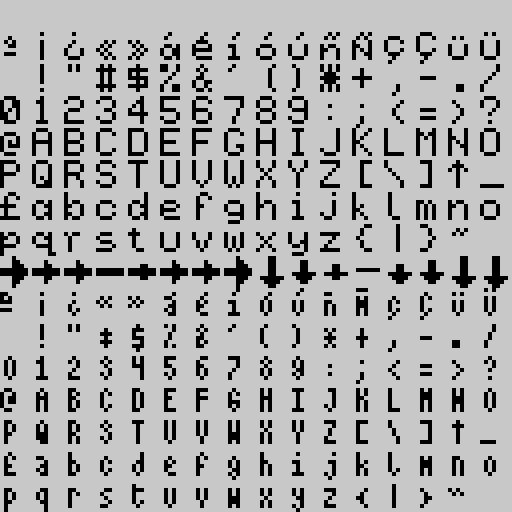

# Choose Your Destiny

El programa es un intérprete para ejecutar historias de tipo "Escoge tu propia aventura" o aventuras por opciones, para el Spectrum 48, 128, +2 y +3.

Consiste una máquina virtual que va interpretando "tokens" que se encuentra durante el texto para realizar las distintas acciones interactivas y un compilador que se encarga de traducir la aventura desde un lenguaje mas "humano" con el que se escribe el guión de la aventura, a un fichero interpretable por el motor.

Además, también puede mostrar imágenes comprimidas y almacenadas en el mismo disco, así como efectos de sonido basados en BeepFX de Shiru y melodías tipo PT3 creadas con Vortex Tracker.

- [Choose Your Destiny](#choose-your-destiny)
  - [CYDC (Compilador)](#cydc-compilador)
  - [CSC (Compresor de Imágenes)](#csc-compresor-de-imágenes)
  - [CYD Character Set Converter](#cyd-character-set-converter)
  - [Sintaxis](#sintaxis)
  - [Flags](#flags)
  - [Condicionales](#condicionales)
  - [Comandos](#comandos)
    - [LABEL labelId](#label-labelid)
    - [DECLARE flag\_no AS VarId](#declare-flag_no-as-varid)
    - [END](#end)
    - [CLEAR](#clear)
    - [GOTO labelId](#goto-labelid)
    - [GOSUB labelId](#gosub-labelid)
    - [RETURN](#return)
    - [IF cond THEN GOTO labelId](#if-cond-then-goto-labelid)
    - [IF cond THEN GOSUB labelId](#if-cond-then-gosub-labelid)
    - [IF cond THEN RETURN](#if-cond-then-return)
    - [CENTER](#center)
    - [WAITKEY](#waitkey)
    - [OPTION GOTO labelId](#option-goto-labelid)
    - [OPTION GOSUB labelId](#option-gosub-labelid)
    - [IF cond OPTION GOTO labelId](#if-cond-option-goto-labelid)
    - [IF cond OPTION GOSUB labelId](#if-cond-option-gosub-labelid)
    - [CHOOSE](#choose)
    - [CHOOSE IF WAIT expression THEN GOTO labelId](#choose-if-wait-expression-then-goto-labelid)
    - [CHAR expression](#char-expression)
    - [REPCHAR expression, expression](#repchar-expression-expression)
    - [PRINT expression](#print-expression)
    - [PRINT @ flag\_no](#print--flag_no)
    - [TAB expression](#tab-expression)
    - [PAGEPAUSE expression](#pagepause-expression)
    - [INK expression](#ink-expression)
    - [INK @ flag\_no](#ink--flag_no)
    - [PAPER expression](#paper-expression)
    - [PAPER @ flag\_no](#paper--flag_no)
    - [BORDER expression](#border-expression)
    - [BORDER @ flag\_no](#border--flag_no)
    - [BRIGHT expression](#bright-expression)
    - [BRIGHT @ flag\_no](#bright--flag_no)
    - [FLASH expression](#flash-expression)
    - [FLASH @ flag\_no](#flash--flag_no)
    - [SFX expression](#sfx-expression)
    - [SFX @ flag\_no](#sfx--flag_no)
    - [PICTURE expression](#picture-expression)
    - [PICTURE @ flag\_no](#picture--flag_no)
    - [DISPLAY expression](#display-expression)
    - [DISPLAY @ flag\_no](#display--flag_no)
    - [WAIT expression](#wait-expression)
    - [PAUSE expression](#pause-expression)
    - [TYPERATE expression](#typerate-expression)
    - [MARGINS expression, expression, expression, expression](#margins-expression-expression-expression-expression)
    - [AT expression, expression](#at-expression-expression)
    - [SET flag\_no TO RANDOM(expression)](#set-flag_no-to-randomexpression)
    - [SET flag\_no TO RANDOM](#set-flag_no-to-random)
    - [SET flag\_no TO INKEY](#set-flag_no-to-inkey)
    - [RANDOMIZE](#randomize)
    - [TRACK expression](#track-expression)
    - [TRACK @ flag\_no](#track--flag_no)
    - [PLAY expression](#play-expression)
    - [PLAY @ flag\_no](#play--flag_no)
    - [LOOP expression](#loop-expression)
    - [LOOP @ flag\_no](#loop--flag_no)
  - [Imágenes](#imágenes)
  - [Efectos de sonido](#efectos-de-sonido)
  - [Melodías](#melodías)
  - [Cómo generar una aventura](#cómo-generar-una-aventura)
  - [Juego de caracteres](#juego-de-caracteres)
  - [Códigos de error](#códigos-de-error)
  - [F.A.Q](#faq)
  - [Referencias y agradecimientos](#referencias-y-agradecimientos)
  - [Licencia](#licencia)

---

## CYDC (Compilador)

Este programa es el compilador que traduce el texto de la aventura a un fichero TAP o DSK. Además de compilar la aventura en un fichero interpretable por el motor, realiza una búsqueda de las mejores abreviaturas para reducir el tamaño del texto.

```batch
cydc_cli.py [-h] [-l MIN_LENGTH] [-L MAX_LENGTH] [-s SUPERSET_LIMIT]
              [-T EXPORT-TOKENS_FILE] [-t IMPORT-TOKENS-FILE] [-C EXPORT-CHARSET]
              [-c IMPORT-CHARSET] [-S] [-n NAME] [-csc CSC_IMAGES_PATH] [-trk TRACKS_PATH]
              [-sfx SFX_ASM_FILE] [-scr LOAD_SCR_FILE] [-v] [-V]
              {48k,128k,plus3} input.txt SJASMPLUS_PATH MKP3FS_PATH OUTPUT_PATH
```

- **\-h**: Muestra la ayuda
- **\-l MIN_LENGTH**: La longitud mínima de las abreviaturas a buscar (por defecto, 3).
- **\-L MAX_LENGTH**: La longitud máxima de las abreviaturas a buscar (por defecto, 30).
- **\-s SUPERSET_LIMIT**: Límite para el superconjunto de la heurística de la búsqueda (por defecto, 100).
- **\-T EXPORT-TOKENS_FILE**: Exportar al fichero JSON indicado por el parámetro las abreviaturas encontradas.
- **\-t IMPORT-TOKENS-FILE**: Importar abreviaturas desde el fichero indicado y obviar la búsqueda de las mismas.
- **\-C EXPORT-CHARSET**: Exporta el juego de caracteres 6x8 usado por defecto en formato JSON.
- **\-c IMPORT-CHARSET**: Importa en formato JSON el juego de caracteres a emplear.
- **\-S**: Si un fragmento de texto comprimido no cabe en un banco, se divide en dos entre el banco actual y el siguiente con esta opción activada. Si no, el fragmento pasa al banco siguiente.
- **\-n NAME**: Nombre a usar para el fichero de salida (nombre para el fichero TAP o DSK), si no se define será el mismo que el fichero de entrada.
- **\-scr LOAD_SCR_FILE**: Ruta hacia un fichero SCR con la pantalla de carga a usar.
- **\-csc CSC_PATH**: Ruta al directorio con las imágenes CSC comprimidas de la aventura.
- **\-trk TRACKS_PATH**: Ruta al directorio con los ficheros PT3 de música AY.
- **\-sfx SFX_ASM_FILE**: Ruta a un fichero ensamblador generado por BeepFx.
- **\-v**: Modo verboso, da más información del proceso.
- **\-V**: Indica la versión del programa.

-**{48k,128k,plus3}**: Modelo de Spectrum a emplear:
  -- **48k**: Versión para cinta en formato TAP, no incluye el reproductor de PT3 y se carga todo de una vez. Depende del tamaño de la memoria disponible.
  -- **128k**: Versión para cinta en formato TAP, se carga todo de una vez en los bancos de memoria y depende del tamaño de la memoria disponible.
  -- **plus3**: Esta versión generará un fichero DSK para ejecutarlo en Spectrum+3. Los recursos se cargan dinámicamente según se necesiten y depende del tamaño en disco.

- **input.txt**: Fichero de entrada con el guion de la aventura.
- **SJASMPLUS_PATH**: Ruta al ejecutable de SjASMPlus.
- **MKP3FS_PATH**: Ruta al ejecutable mkp3fs.
- **OUTPUT_PATH**: Ruta donde se depositarán los ficheros de salida.

El compilador es un programa escrito en Python, por lo que se requiere tener el entorno de Python instalado. Para mayor comodidad, se incluye en la distribución un Python embebido y un guion batch llamado `cydc.cmd` para lanzarlo desde la línea de comandos.

**El compilador depende de dos programas externos para funcionar**. El ensamblador `SjASMPlus` y el constructor de imágenes DSK `mkp3fs`, por lo que habrá que indicar en los parámetros de entrada las correspondientes rutas a esos programas, los cuales están incluidos en la distribución en el directorio `tools`.

También hay que indicar un directorio de destino para dejar los ficheros resultantes de la compilación.

Opcionalmente, podemos indicar las rutas a directorios que contengan las imágenes comprimidas en formato `CSC`, que se incluirán en la cinta o disco resultante. Lo mismo para los ficheros de tipo `PT3`. Ambos tipos de archivos deben estar nombrados con números de 3 dígitos, del 0 al 255, de tal forma que sean `000.CSC`, `001.CSC`, `002.PT3`, y así. Se indicarán los directorios que contienen ambos ficheros con los parámetros `-csc` y -`pt3` respectivamente.

Se pueden añadir efectos de sonido generados con la aplicación BeepFx de Shiru. Para utilizarlos, hay que exportar usando la opción `File->Compile` del menú superior. En la ventana flotante que aparece, debemos asegurarnos de que tenemos seleccionado `Assembly` e `Include Player Code`, el resto de opciones son indiferentes. Luego guardar el fichero en algún punto accesible para indicar la ruta desde la línea de comandos con la opción `-sfx`.

---

## CSC (Compresor de Imágenes)

Esta utilidad permite comprimir imágenes tipo **SCR** de ZX Spectrum para mostrarlas en el motor. Las pantallas pueden ser completas, o se puede limitar el número de líneas horizontales para ahorrar memoria. Además detecta imágenes espejadas (simétricas) por el eje vertical, con lo que sólo almacena la mitad de la misma, pudiéndose incluso forzar este comportamiento y descartar el lado derecho de la imagen para ahorrar espacio.

```batch
CSC [-f] [-m] [-l=num_lines] [-o=output] input
    -f, --force                Force overwrite of output file
    -m, --mirror               The right side of the image is the reflection of the left one.
    -o, --output=FILE          Output path for the file
    -l, --num-lines=NUMBER     Number of visible lines
    -h, --help                 Shows the command help
```

Esto es una definición de los parámetros:

- **\-f, --force**: Fuerza la sobreescritura del fichero de destino si ya existiese.
- **\-m, --mirror**: Descarta el lado derecho de la imagen y usa la imagen espejada del izquierdo.
- **\-o, --output=FILE**: Ruta del salida del fichero comprimido.
- **\-l, --num-lines=NUMBER**: Número de líneas de la pantalla a tratar (en carácteres, de 1 a 24).
- **\-h, --help**: Muestra la ayuda.

El motor soporta un máximo de 256 imágenes, aparte de lo que quepa en el disco o la memoria, y deben estar nombradas con un número de 3 dígitos, que corresponderá al número de imagen que se invocará desde el programa. Por ejemplo, la imagen 0 debería llamarse `000.CSC`, la imagen número 1 `001.CSC`, y así hasta 255, como ya se ha indicado en la sección anterior.

---

## CYD Character Set Converter

Esta utilidad permite convertir juegos de caracteres en formato `.chr`, `.ch8`, `.ch6` y `.ch4` en un fichero utilizable por el compilador en formato JSON. Estos formatos son editables con ZxPaintbrush.

```batch
cyd_chr_conv.py [-h] [-w WITDH] [-V] charset.chr charset.json
```
Los parámetros que soporta:

- **\-w, --width**: Ancho de los caracteres (1-8).
- **\-h, --help**: Muestra la ayuda.
- **charset.chr**: Huego de caracteres de entrada.
- **charset.json**: Fichero con el juego de caracteres para el compilador.

El ancho de los caracteres empleado depende de la extensión del fichero de entrada, 8 pixels para `.chr` y `.ch8`, 6 para `.ch6` y 4 para`.ch4`, pero se pueden forzar el ancho con el parámetro `-w`. Indicar que los caracteres del 127 al 143 son especiales para los cursores y siempre tendrán ancho 8, con lo que el tamaño de la fuente será ignorado en esos caracteres. Si se desea definir un ancho específico para cada caracter tendrás que editarlo en el fichero JSON de salida. Tienes más información en la sección [Juego de caracteres](#juego-de-caracteres).

---

## Sintaxis

Los comandos para el intérprete se delimitan dentro de dos pares de corchetes, abiertos y cerrados respectivamente. Todo texto que aparezca fuera de esto, se considera "texto imprimible", incluidos los espacios y saltos de línea, y se presentarán como tal por el intérprete. Los comandos se separan entre sí con saltos de línea o dos puntos si están en la misma línea.

Los comentarios dentro del código se delimitan con `/*` y `*/`, todo lo que haya en medio se considera un comentario.

Este es un ejemplo resumido y auto explicativo de la sintaxis:

```
Esto es texto [[ INK 6 ]] Esto es texto de nuevo pero amarillo
    Sigue siendo texto [[
         /* Esto es un comentario y lo siguiente son comandos */
        WAITKEY
        INK 7: PAPER 0
    ]]
    Esto vuelve a ser texto pero blanco, y ¡ojo con el salto de línea que lo precede!
```

El intérprete recorre el texto desde el principio, imprimiéndolo en pantalla si es "texto imprimible". Cuando una palabra completa no cabe en lo que queda de la línea, la imprime en la línea siguiente. Y si no cabe en lo que queda de pantalla, se genera una espera y petición al usuario de que pulse la tecla de confirmación para borrar la sección de texto y seguir imprimiendo (este último comportamiento es opcional).

Cuando el intérprete detecta comandos, los ejecuta secuencialmente, a menos que encuentre saltos. Los comandos permiten introducir lógica programable dentro del texto para hacerlo dinámico y variado según ciertas condiciones. La más común y poderosa es la de solicitar escoger al jugador entre una serie de opciones (hasta un límite de 8 a la vez), y que puede elegir con las teclas `P` y `Q` y seleccionar con `SPACE` o `ENTER`.  
De nuevo, éste es un ejemplo autoexplicativo:

```
[[ /* Comandos que ponen colores de pantalla y la borra */
   PAPER 0   /* Color de fondo a cero (negro)*/
   INK   7   /* Color de la tinta (blanco) */
   BORDER 0  /* Color del borde (negro) */
   CLEAR     /* Borrar el área de texto (pantalla completa) */
   LABEL Localidad1]]Estás en la localidad 1. 쮻onde quieres ir?
[[OPTION GOTO Localidad2]]Ir a la localidad 2
[[OPTION GOTO Localidad3]]Ir a la localidad 3
[[CHOOSE]]
[[ LABEL Localidad2]]¡¡¡Lo lograste!!!
[[ GOTO Final]]
[[ LABEL Localidad3]]¡¡¡Estas muerto!!!
[[ GOTO Final]]
[[ LABEL Final : WAITKEY: END ]]
```

El comando `OPTION GOTO etiqueta` generará un punto de selección en el lugar en donde se haya llegado al comando.  
Cuando llegue al comando `CHOOSE`, el intérprete permitirá elegir al usuario entre uno de los puntos de opción que haya acumulados en pantalla hasta el momento. Se permiten un máximo de 16 y siempre que la pantalla no se borre antes, ya que entonces se eliminarán las opciones acumuladas.

Al escoger una opción, el intérprete saltará a la sección del texto donde se encuentre la etiqueta correspondiente indicada en la opción. Las etiquetas se declaran con el pseudo-comando `LABEL identificador` dentro del código, y cuando se indica un salto a la misma, el intérprete comenzará a procesar a partir del punto en donde hemos declarado la etiqueta.  
En el caso del ejemplo, si elegimos la opción 1, el intérprete saltará al punto indicado en `LABEL localidad2`, con lo que imprimirá el texto _"¡¡¡Lo lograste!!!"_, y después pasa a `GOTO Final` que hará un salto incondicional a donde está definido `LABEL Final` e ignorando todo lo que haya entre medias.

Los identificadores de las etiquetas sólo soportan caracteres alfanuméricos (cifras y letras), deben empezar con una letra y son sensibles al caso (se distinguen mayúsculas y minúsculas), es decir `LABEL Etiqueta` no es lo mismo que `LABEL etiqueta`. Los comandos, por el contrario, no son sensibles al caso, pero por claridad, es recomendable ponerlos en mayúsculas.

**A partir de la versión 0.5** se permite una versión acortada de las etiquetas precediento el caracter `#` al identificador de la etiqueta, de tal manera que `#MiEtiqueta` es lo mismo que `LABEL MiEtiqueta`.

Los comandos disponibles están descritos en su [sección](#comandos) correspondiente.

---

## Flags

Hay a disposición del programador 256 variables o 'flags' de un byte (de 0 a 255) para almacenar valores, realizar operaciones con ellos y realizar saltos de acuerdo a comparaciones con los valores contenidos en ellos.

Algunos comandos pueden hacer uso de indirección, indicada por `@`, es decir que el valor indicado en el parámetro no es el valor a utilizar, sino que el valor lo obtiene del flag indicado. Es decir:

```
[[
INK 7
INK @7
]]
```

El primer comando pondrá el color del texto en blanco (color 7), mientras que el segundo pondrá el color del texto con el valor contenido en la variable número 7.

**Desde la versión 0.6** es posible dar un nombre significativo a las variables usando el comando `DECLARE`:

```
[[
DECLARE 7 AS ColorTinta
INK @ColorTinta
]]
```

Hay que indicar que no se puede declarar una variable dos veces, ni puede haber etiquetas y variables con los mismos nombres, pero se permiten sinónimos de la siguiente forma:

```
[[
DECLARE 10 AS UnNombre
DECLARE 10 AS OtroNombre
]]
```

Así, tanto *UnNombre* como *OtroNombre* servirán para identificar el flag 10. Ten en cuenta de a persar de tener distinto nombre, son la misma variable.

Para asignar valores a un flag, usamos el comando `SET ... TO`, de la siguiente manera:

```
[[
  SET 0 TO 1                      /* Ponemos el flag cero a 1 */
  SET variable TO 2               /* Ponemos el flag llamado variable a 2 */
  SET variable2 TO @variable + 2  /* Ponemos el flag llamado variable2 al dos sumado al valor del flag llamado variable */
  SET variable2 TO @variable2 - (@variable + 2)  /* Permite paréntesis */
]]

```

Como se puede ver, a un flag se le puede asignar el valor de una expresión matemática o lógica compuesta por números y variables. Las variables en el lado derecho **siempre deben estar precedidas del símbolo de indirección (@)**. Los operandos disponibles son:

- Suma: `SET variable TO @variable + 2`
- Resta: `SET variable TO @variable - 2`
- "AND" binario: `SET variable TO @variable & 2`
- "OR" binario: `SET variable TO @variable | 2`
- "NOT binario: `SET variable TO !@variable`

Los números que se pasen no pueden ser mayores de 255 (1 byte) ni menores que cero (no se soportan números negativos). Si al realizar las operaciones se rebasan ambos límites, el resultado se ajustará al límite correspondiente, es decir, si una suma supera 255, se ajustará a 255 y una resta que de un resultado inferior a cero, se quedará en cero.

---

## Condicionales

Muchos comandos son condicionales, es decir, que se ejecutan dependiendo de si se cumple una condición. Son todos los comandos que empiezan por `IF`, por ejemplo:

```
[[IF @variable = 0 THEN GOTO salto]]
```

La condición para que se ejecute el salto es siempre una comparación entre dos elementos, que pueden ser números o variables, precedidas éstas últimas por el correspondiente indicador de indirección. Las operaciones de comparación son las siguientes:

- Igual que: `IF @variable = 0 THEN GOTO salto`
- Mayor que: `IF @variable > 0 THEN GOTO salto`
- Menor que: `IF @variable2 < @variable THEN GOTO salto`
- Distinto que: `IF @variable <> 0 THEN GOTO salto`
- Mayor o igual que: `IF @variable <= 0 THEN GOTO salto`
- Menor o igual que: `IF @variable >= 0 THEN GOTO salto`

Además, las condiciones se pueden combinar formando expresiones lógicas:

```
[[IF (@variable = 0 AND @variable2 = 1) AND NOT @variable3 = 1 THEN GOTO salto]]
```

- Cond1 AND Cond2: Cierto si se cumple tanto como Cond1 como Cond2.
- Cond1 OR Cond2: Cierto si se cumple Cond1 o Cond2.
- NOT Cond1: Cierto si la condición Cond1 es falsa.

---

## Comandos

### LABEL labelId

Declara la etiqueta labelId en este punto. Todos los saltos con referencia a esta etiqueta dirigirán la ejecución a este punto.

**Novedad**: A partir de la versión 0.5, se permite una versión acortada de las etiquetas precediento el caracter `#` al identificador de la etiqueta, de tal manera que `#LabelId` es lo mismo que `LABEL LabelId`.

### DECLARE flag_no AS VarId

**Novedad**: A partir de la versión 0.6, lo que hacer es declarar el identificador VarId como un símbolo que representa al flag flag_id en su lugar.

### END

Finaliza la aventura y reinicia el Spectrum.

### CLEAR

Borra el área de texto definida.

### GOTO labelId

Salta a la etiqueta labelId.

### GOSUB labelId

Salto de subrutina, hace un salto a la etiqueta labelId, pero vuelve a este punto en cuanto encuentra un comando `RETURN`.  
Se permiten hasta 8 niveles de anidamiento.

### RETURN

Retorna al punto de llamada de una subrutina, ver `GOSUB`

### IF cond THEN GOTO labelId

Si se cumple la condición *cond*, se ejecuta el `GOTO` posterior.

### IF cond THEN GOSUB labelId

Si se cumple la condición *cond*, se ejecuta el `GOSUB` posterior.

### IF cond THEN RETURN

Si se cumple la condición *cond*, se ejecuta el `RETURN` posterior.

### CENTER

Pone el cursor de impresión en el centro de la línea.

### WAITKEY

Espera la pulsación de la tecla de aceptación para continuar, presentando un icono animado de espera. Ideal para separar párrafos o pantallas.

### OPTION GOTO labelId

Crea un punto de opción que el usuario puede seleccionar (ver `CHOOSE`). Si confirma esta opción, salta a la etiqueta _labelId_. Si se borra la pantalla, el punto de opción se elimina y sólo se permiten 16 como máximo en una pantalla.

### OPTION GOSUB labelId

Crea un punto de opción que el usuario puede seleccionar (ver `CHOOSE`). Si confirma esta opción, hace un salto de subrutina a etiqueta _labelId_, volviendo después del `CHOOSE` cuando encuentra un `RETURN`. Si se borra la pantalla, el punto de opción se elimina y sólo se permiten 16 como máximo en una pantalla.

### IF cond OPTION GOTO labelId

Si se cumple la condición *cond*, crea un punto de opción que el usuario puede seleccionar (ver `CHOOSE`). Si confirma esta opción, salta a la etiqueta _labelId_. Si se borra la pantalla, el punto de opción se elimina y sólo se permiten 16 como máximo en una pantalla.

### IF cond OPTION GOSUB labelId

Si se cumple la condición *cond*, crea un punto de opción que el usuario puede seleccionar (ver `CHOOSE`). Si confirma esta opción, hace un salto de subrutina a etiqueta _labelId_, volviendo después del `CHOOSE` cuando encuentra un `RETURN`. Si se borra la pantalla, el punto de opción se elimina y sólo se permiten 16 como máximo en una pantalla.

### CHOOSE

Detiene la ejecución y permite al jugador seleccionar una de las opciones que haya en este momento en pantalla. Realizará el salto a la etiqueta indicada en la opciñon correspondiente.

### CHOOSE IF WAIT expression THEN GOTO labelId

Funciona exactamente igual que `CHOOSE`, pero con la salvedad de que se declara un timeout, que si se agota sin seleccionar ninguna opción, salta a la etiqueta _LabelId_.  
El timeout tiene como máximo 65535 (16 bits).

### CHAR expression

Imprime el carácter indicando con su número correspondiente.

### REPCHAR expression, expression

Imprime el carácter indicado en el primer parámetro tantas veces como número se indique en el segundo parámetro. Ambos valores tienen un tamaño de 1 byte, es decir, val del 0 al 255. Además, si el número de veces es cero, el carácter se repetirá 256 veces en lugar de ninguna.

### PRINT expression

Imprime el valor indicado (máximo 16 bits).

### PRINT @ flag_no

Imprime el valor del flag indicado.

### TAB expression

Desplaza el cursor a la derecha tantas posiciones como indicadas en el parámetro.

### PAGEPAUSE expression

Controla si al rellenar el área de texto actual, debe solicitar continuar al jugador, presentando un icono animado de espera (parámetro \<> 0) ó hace un borrado de pantalla y sigue imprimiendo (parámetro = 0).

### INK expression

Define el valor del color de los caracteres (tinta). Valores de 0-7, correspondientes a los colores del Spectrum.

### INK @ flag_no

Igual que ´INK´ pero usando indirección con un flag cuyo contenido será el color a emplear.

### PAPER expression

Define el valor del color del fondo (papel). Valores de 0-7, correspondientes a los colores del Spectrum.

### PAPER @ flag_no

Igual que ´PAPER´ pero usando indirección con un flag cuyo contenido será el color a emplear.

### BORDER expression

Define el color del borde, valores 0-7.

### BORDER @ flag_no

Igual que ´BORDER´ pero usando indirección con un flag cuyo contenido será el color a emplear.

### BRIGHT expression

Activa o desactiva el brillo (0 desactivado, 1 activado).

### BRIGHT @ flag_no

Igual que ´BRIGHT´ pero usando indirección con un flag dado.

### FLASH expression

Activa o desactiva el parpadeo (0 desactivado, 1 activado).

### FLASH @ flag_no

Igual que ´BRIGHT´ pero usando indirección con un flag dado.

### SFX expression

Si se ha cargado un fichero de efectos de sonido, reproduce el efecto indicado.  
Si no se ha cargado dicho fichero, el comando es ignorado.

### SFX @ flag_no

Si se ha cargado un fichero de efectos de sonido, reproduce el efecto indicado en el flag correspondiente.  
Si no se ha cargado dicho fichero, el comando es ignorado.

### PICTURE expression

Carga en el buffer la imagen indicada como parámetro. Por ejemplo, si se indica 3, cargará el fichero `003.CSC`.  
La imagen no se muestra, lo que permite controlar cuándo se realiza la carga del fichero.

### PICTURE @ flag_no

Igual que `PICTURE`, pero usando el contenido de una variable como parámetro.

### DISPLAY expression

Muestra el contenido actual del buffer en pantalla.  
El parámetro indica si se muestra o no la imagen, con un 0 no se muestra, y con un valor distinto de cero, sí. En este caso, esta funcionalidad no es útil, pero sí lo es en su versión indirecta.  
Se muestran tantas líneas como se hayan definido en la imagen correspondiente y el contenido de la pantalla será sobrescrito.

### DISPLAY @ flag_no

Igual que `DISPLAY`, pero el parámetro que indica si se muestra o no lo toma de una variable.

### WAIT expression

Realiza una pausa. El parámetro es el número de "fotogramas" (50 por segundo) a esperar, y es un número de 16 bits.

### PAUSE expression

Igual que `WAIT`, pero con la salvedad de que el jugador puede abortar la pausa con la pulsación de la tecla de confirmación.

### TYPERATE expression

Indica la pausa que debe haber entre la impresión de cada carácter. Mínimo 1, máximo 65535.

### MARGINS expression, expression, expression, expression

Define el área de pantalla donde se escribirá el texto. Los parámetros, por órden, son:

- Columna inicial.
- Fila inicial.
- Ancho (en carácteres).
- Alto (en carácteres).

Los tamaños y posiciones siempre se definen como si fuesen caracteres 8x8.

### AT expression, expression

Sitúa el cursor en una posición dada, relativa al área definida por el comando `MARGINS`.  
Los parámetros, por órden, son:

- Columna relativa al origen del área de texto.
- Fila relativa al origen del área de texto.

Las posiciones se asumen en tamaño de carácter 8x8.

### SET flag_no TO RANDOM(expression)

Almacena en el flag indicado un número aleatorio entre 0 y el valor indicado en **expression** menos uno. Si se indica cero, el resultado será como si fuese entre 0 y 255.

### SET flag_no TO RANDOM

Almacena en el flag indicado un número aleatorio entre 0 y 255. Es el equivalente a `SET flag_no TO RANDOM(0)`.

### SET flag_no TO INKEY

Se espera hasta que se pulse una tecla y almancena en el flag indicado el código de la tecla pulsada.

### RANDOMIZE

Inicializa el generador de números aleatorios. La generación de números aleatorios no es realmente "aleatoria" y esto puede ocasionar que el generador devuelva siempre los mismos resultados si se usa en un emulador, por lo que se necesita alguna fuente de aleatoriedad o entropía. Lo que hace este comando es inicializar el generador usando el número de "frames" o "fotogramas" transcurridos, con lo que si se ejecuta en respuesta a algún evento arbitrario, como la pulsación de una tecla, garantizamos la aleatoriedad.

### TRACK expression

Carga en memoria el fichero de Vortex Tracker como parámetro. Por ejemplo, si se indica 3, cargará la pista de música del fichero `003.PT3`. Si existiese una pista cargada previamente, la sobrescribirá.

### TRACK @ flag_no

Igual que `TRACK`, pero el fichero a cargar viene del contenido de la variable del parámetro.

### PLAY expression

Si el parámetro es distinto de cero y la música está desactivada, reproduce la pista musical cargada. Si está en ese momento reproduciendo, y se pasa 0 como parámetro, para la reproducción.

### PLAY @ flag_no

Igual que `PLAY`, pero con el contenido del flag indicado.

### LOOP expression

Establece si al acabar la pista musical cargada en ese momento, se repite de nuevo o no. Un valor 0 significa falso y distinto de cero, verdadero.

### LOOP @ flag_no

Igual que `LOOP`, pero toma el parámetro del contenido de la variable indicada.

---

## Imágenes

Para mostrar imágenes, tenemos que comprimir ficheros en formato SCR de la pantalla de Spectrum con la utilidad `CSC`.  
Los ficheros deben estar nombradas con un número de 3 dígitos, que corresponderá al número de imagen que se invocará desde el programa, es decir, `000.CSC` para la imagen 0, `001.CSC` para la imagen 1, y así con el resto.

Se puede configurar el número de líneas horizontales de la imagen a mostrar usando el parámetro correspondiente con la utilidad `CSC` para reducir aún más el tamaño. Además, si detecta que la mitad derecha de la misma está espejada con la izquierda, descarta ésta para reducir aún mas el tamaño, aunque se puede forzar esto con otro parámetro de la misma.

Hay dos comandos necesarios para mostrar una imagen, el comando `PICTURE n` cargará en un buffer la imagen n. Es decir, si hacemos `PICTURE 1`, cargará el fichero `001.CSC` en el buffer. Esto es útil para controlar cuándo se debe cargar la imagen, ya que supondrá espera desde el disco (por ejemplo, hacerlo al iniciar un capítulo). Si se carga una imagen cuyo fichero no existe, se generará el error de disco 23.

Para mostar una imagen cargada en el buffer, usamos `DISPLAY n` ó `DISPLAY @n`, donde n en el primer caso, o el contenido del flag n en el segundo, tiene que ser cero para ejecutarse. La imagen que se mostrará será la última cargada en el buffer (si existe). La imagen comienza a pintarse desde la esquina superior izquierda de la pantalla y se dibujan tantas líneas como las indicadas al comprimir el fichero y se sobrescribe todo lo que hubiese en pantalla hasta el momento.

---

## Efectos de sonido

Añadir efectos de sonido con el beeper es muy sencillo. Para ello tenemos que crear un banco de efectos con la utilidad BeepFx. Debemos exportar el fichero de efectos como un fichero en ensamblador usando la opción `File->Compile` del menú superior. En la ventana flotante que aparece, debemos asegurarnos de que tenemos seleccionado `Assembly` e `Include Player Code`, el resto de opciones son irrelevantes, ya que el compilador modificará el fichero fuente para incrustarlo en el intérprete.

Para invocar un efecto, usamos el comando `SFX n`, siendo n el número del efecto a reproducir. Si se llama a este comando sin que exista un fichero de efectos cargado, será ignorado y seguirá la ejecución.

No está contemplado llamar a un número de efecto que no exista en el fichero incluido.

---

## Melodías

El motor `CYD` también permite reproducir módulos de música creados con Vortex Tracker en formato `PT3`. Su funcionamiento replica el mecanismo de carga de imágenes, es decir, los módulos deben nombrarse con tres dígitos que representan el número de pista que el intérprete cargará con el comando `TRACK`. Por ejemplo, si el intérprete encuentra el comando `TRACK 3`, entonces buscará la pista del fichero `003.PT3` y cargará en memoria el módulo para su reproducción. Y de la misma manera, el máximo número de módulos que se pueden cargar son 256 (de 0 a 255) y no se permite que el módulo sea de más de 16 Kilobytes.

Una vez cargado un módulo, se podrá reproducir con el comando `PLAY`. Como se indica en la referencia de comandos, si el parámetro es distinto de cero, se reproducirá el módulo; y si es igual a cero, se detendrá la reproducción.

Cuando se llegue al final del módulo, la reproducción se detendrá automáticamente, pero podemos cambiar este comportamiento con el comando `LOOP`. De nuevo, según se indica en la referencia, si el parámetro es igual a cero, al llegar al final se detendrá la reproducción, como se ha indicado antes. Pero si el parámetro es distinto de cero, el módulo volverá a reproducirse desde el principio.

---

## Cómo generar una aventura

Lo primero es generar un guion de la aventura mediante cualquier editor de textos empleando la sintaxis arriba descrita. Es MUY recomendable hacer el guion de la misma antes de ponerse a programar la lógica ya que conviene tener el texto perfilado antes para tener una compresión adecuada (más detalles más adelante).

Es importante que la codificación del fichero sea UTF-8, pero hay que tener en cuenta que caractéres por encima de 128 no se imprimirán bien y sólo se admiten los caracteres propios del castellano, indicados en la sección [Juego de Caracteres](#juego-de-caracteres), que serán convertidos a los códigos allí indicados.

Una vez tenemos la aventura, usamos el compilador `CYDC` para generar un fichero DSK o TAP. EL compilador busca las mejores abreviaturas para comprimir el texto lo máximo posible. El proceso puede ser muy largo dependiendo del tamaño de la aventura. Por eso es importante tener la aventura perfilada antes, para realizar este proceso al principio. La compilación la realizaremos con el parámetro `-T` de tal manera que con `-T abreviaturas.json`, por ejemplo, exportaremos las abreviaturas encontradas al fichero _abreviaturas.json_.

A partir de este momento, si ejecutamos el compilador con el parámetro `-t abreviaturas.json`, éste no realizará la búsqueda de abreviaturas y usará las que ya habíamos encontrado antes, con lo que la compilación será casi instantánea.  
Cuando ya consideremos que la aventura está terminada, podremos volver a realizar una nueva búsqueda de abreviaturas para intentar conseguir algo más de compresión.

Para añadir efectos de sonido, imágenes y melodías, consulta las secciones correspondientes.

El proceso es bastante simple, pero tiene algunos pasos dependientes, con lo que se recomienda usar ficheros BAT (Windows) o guiones de shell (Linux, Unix) o la utilidad Make (o similar) para acelerar el desarrollo.

Como ejemplo y para Windows 10 (versión 64 bits) o superiores, se ha incluido el fichero `MakeAdv.bat` en la raíz del repositorio, que compilará la aventura de muestra incluida en el fichero `test.txt`.

El script buscará y comprimirá automáticamente los ficheros SCR que se atengan al formato de nombre establecido (número de 0 a 255 con 3 dígitos) dentro del directorio `.\IMAGES`. Lo mismo hará con los módulos que haya dentro del directorio `.\TRACKS` que cumplan el formato de nombre. Luego compilará el fichero `test.txt` y generará el fichero `tokens.json` con las abreviaturas, si no existiese previamente. Si se desea que se vuelva a generar el fichero de abreviaturas, simplemente borrándolo hará que el script indique al compilador que lo genere de nuevo. Además buscará de forma automática si existe un fichero de efectos de sonido llamado `SFX.ASM` que debe generarse con **BeepFX**, y si existiese un fichero JSON con el juego de caracteres llamado `charset.json`, también lo utilizará.

El script necesita los directorios `dist` y `tools` con su contenido para realizar el proceso. Puedes usarlo como base para crear tu propia aventura de forma sencilla. Se puede personalizar el comportamiento modificando en la cabecera del script algunas variables:

```batch
REM ---- Configuration variables 

REM Name of the game
SET GAME=test
REM This name will be used as:
REM   - The file to compile will be test.txt with this example
REM   - The name of the TAP file or +3 disk image

REM Target for the compiler (48k, 128k for TAP, plus3 for DSK)
SET TARGET=plus3

REM Number of lines used on SCR files at compressing
SET IMGLINES=192

REM Loading screen
SET LOAD_SCR=%~dp0\IMAGES\000.scr
```

- La variable `GAME` será el nombre del fichero txt que se compilará y el nombre del fichero DSK o TAP resultante.
- La variable `TARGET` es el sistema y formato de salida, con estas posibles opciones:
  -- 48k: Genera un fichero TAP para Spectrum 48K, sin soporte de música AY.
  -- 128k: Genera un fichero TAP para Spectrum 128K.
  -- plus3: Genera un fichero DSK para Spectrum +3, con mayor capacidad y carga dinámica de recursos.
- La variable `IMGLINES` es el número de líneas horizontales de los ficheros de imagen que se comprimirán. Por defecto es 192 (la pantalla completa del Spectrum)
- La variable `LOAD_SCR` es la ruta a un fichero de tipo SCR (pantalla de Spectrum) con la pantalla que se usará durante la carga.

El guión producirá un fichero DSK o TAP (dependiendo del formato seleccionado en `TARGET`) que podrás ejecutar con tu emulador favorito. Pero si deseas acelerar más el trabajo, si te descargas [Zesarux](https://github.com/chernandezba/zesarux) y lo instalas en de la carpeta `.\tools\zesarux`, tras la compilación se ejecutará automáticamente con las opciones adecuadas.

En la carpeta `examples\test` hay un ejemplo que corresponde con el ejemplo indicado en la sección de [Sintaxis](#sintaxis), y creará el fichero `test.DSK`, que se puede ejecutar con un emulador para poder probarla. Se incluye imágenes de prueba en el directorio `examples\test\IMAGES`, y una canción de prueba dentro de su directorio `examples\test\TRACKS`.

---

## Juego de caracteres

El motor soporta un juego de 256 caracteres, con 8 píxeles de altura y tamaño variable de ancho.  
El juego de caracteres por defecto incluido tiene un tamaño 6x8, excepto los caracteres del 127 al 143, que son especiales (ver más adelante) y tienen un tamaño 8x8. Éste es el juego de caracteres por defecto, ordenados de izquierda a derecha y de arriba a abajo:



Los carácteres corresponden con el ASCII estándar, excepto los extendidos (mayor o igual que 128 hasta 255) y los de control (menores que 32).  
Los carácteres propios del castellano, corresponden a las siguientes posiciones:

| Carácter | Posición |
| -------- | -------- |
| 'ª'      | 16       |
| '¡'      | 17       |
| '¿'      | 18       |
| '«'      | 19       |
| '»'      | 20       |
| 'á'      | 21       |
| 'é'      | 22       |
| 'í'      | 23       |
| 'ó'      | 24       |
| 'ú'      | 25       |
| 'ñ'      | 26       |
| 'Ñ'      | 27       |
| 'ü'      | 28       |
| 'Ü'      | 29       |

Los caracteres por encima del valor 127 (empezando desde cero) son especiales, como ya se ha indicado. Son utilizados como iconos en las opciones, es decir, en donde aparece una opción cuando se procesa el comando `OPTION`, y como indicadores de espera con un `WAITKEY` o al cambiar de página si el comando `PAGEPAUSE` está activo.

- El carácter 127 es el carácter usado cuando una opción no está seleccionada en un menú. (En rojo en la captura inferior)
- Los caracteres del 128 al 135 forman el ciclo de animación de una opción seleccionada en un menú. (En verde en la captura inferior)
- Los caracteres del 135 al 143 forman el ciclo de animación del indicador de espera. (En azul en la captura inferior)


El compilador dispone de dos parámetros, `-c` para importar un juego de caracteres nuevo, y `-C` para exportar el juego de caracteres actualmente empleado, por si puede servir de plantilla o realizar personalizaciones.

Este es el formato de importación/exportación del juego de caracteres:

```python
[{"Id": 0, "Character": [255, 128, ...], "Width":8}, {"Id": 1, "Character": [0, 1, ...], "Width":6}, ...]
```

Es un JSON con un array de registros de tres campos:

- _Id_: número del carácter de 0 a 255, que no se puede repetir.
- _Character_: un array de 8 números que corresponde con el valor de los bytes del caracter y, por tanto, no puede haber valores mayores de 255. Cada byte corresponde con los pixels de cada línea del carácter.
- _Width_: un array con el ancho en pixels del carácter (los valores no pueden ser menores que 1 ni mayores que 8). Dado que el tamaño de cada línea del carácter del campo anterior es 8, los píxeles que sobren por la derecha serán descartados.

Para facilitar la tarea de creación de un juego de caracteres alternativo, se ha incluido la herramienta [CYD Character Set Converter](#cyd-character-set-converter) o cyd_chr_conv. Esta herramienta permite convertir fuentes en formato `.chr`, `.ch8`, `.ch6` y `.ch4` creadas con ZxPaintbrush en el formato JSON anteriormente mencionado. Además, en el directorio `assest` de la distribución podrás encontrar el fichero `default_charset.chr` con la fuente por defecto para que puedas editarla y personalizarla con dicho programa.

---

## Códigos de error

La aplicación puede generar errores en tiempo de ejecución. Los errores son de dos tipos, de disco y del motor.  
Los errores de disco son los errores que pudiesen ocasionarse cuando el motor del juego accede al disco, y corresponden con los errores de +3DOS:

- Error 0: Drive not ready
- Error 1: Disk is write protected
- Error 2: Seek fail
- Error 3: CRC data error
- Error 4: No data
- Error 5: Missing address mark
- Error 6: Unrecognised disk format
- Error 7: Unknown disk error
- Error 8: Disk changed whilst +3DOS was using it
- Error 9: Unsuitable media for drive
- Error 20: Bad filename
- Error 21: Bad parameter
- Error 22: Drive not found
- Error 23: File not found
- Error 24: File already exists
- Error 25: End of file
- Error 26: Disk full
- Error 27: Directory full
- Error 28: Read-only file
- Error 29: File number not open (or open with wrong access)
- Error 30: Access denied (file is in use already)
- Error 31: Cannot rename between drives
- Error 32: Extent missing (which should be there)
- Error 33: Uncached (software error)
- Error 34: File too big (trying to read or write past 8 megabytes)
- Error 35: Disk not bootable (boot sector is not acceptable to DOS BOOT)
- Error 36: Drive in use (trying to re-map or remove a drive with files open)

La aparición de estos errores ocurre cuando se accede al disco, al buscar más trozos de texto, imágenes, etc. Si aparece el error 23 (File not found), suele ser que se haya olvidado de incluir algún fichero necesario en el disco. Otros errores ya suponen algún error de la unidad de disco o del propio disco.

Los errores de motor son, como su nombre indica, los errores propios del motor cuando detecta una situación anómala. Son los siguientes:

- Error 1: El trozo accedido no existe. (Se intenta acceder a un fragmento no existente en el índice)
- Error 2: Se han creado demasiadas opciones, se ha superado el límite de opciones posibles.
- Error 3: No hay opciones disponibles, se ha lanzado un comando `CHOOSE` sin tener antes ninguna `OPTION`, o puede que se haya borrado inadvertidamente la pantalla, y por tanto, las opciones.
- Error 4: El fichero con el módulo de música a cargar es demasiado grande, tiene que ser menor que 16Kib.
- Error 5: No hay un módulo de música cargado para reproducir.
- Error 6: Código de instrucción inválido.

---

## F.A.Q

(TBC)

---

## Referencias y agradecimientos

- David Beazley por [PLY](https://www.dabeaz.com/ply/ply.html)
- Einar Saukas por el compresor [ZX0](https://github.com/einar-saukas/ZX0).
- DjMorgul por el buscador de abreviaturas, adaptado de [Daad Reborn Tokenizer](https://https://github.com/daad-adventure-writer/DRT)
- Shiru por [BeepFx](http://shiru.untergrund.net).
- Seasip por mkp3fs de [Taptools](http://www.seasip.info/ZX/unix.html).
- [Tranqui69](https://mastodon.social/@tranqui69) por el logotipo.
- XimoKom y Fran Kapilla por su inestimable ayuda.
- 𝕊𝕖𝕣𝕘𝕚𝕠 ᵗʰᴱᵖᴼᵖᴱ por meterme el gusanillo del Plus3.
- [El_Mesías](https://twitter.com/El__Mesias__), [Arnau Jess](https://twitter.com/arnauballe) y la gente de [CAAD](https://caad.club) por el apoyo.

---

## Licencia

```

Copyright (c) 2023 Sergio Chico

Por la presente se concede permiso, libre de cargos, a cualquier persona que obtenga una copia de este software y de los archivos de documentación asociados (el "Software"), a utilizar el Software sin restricción, incluyendo sin limitación los derechos a usar, copiar, modificar, fusionar, publicar, distribuir, sublicenciar, y/o vender copias del Software, y a permitir a las personas a las que se les proporcione el Software a hacer lo mismo, sujeto a las siguientes condiciones:

El aviso de copyright anterior y este aviso de permiso se incluirán en todas las copias o partes sustanciales del Software.
EL SOFTWARE SE PROPORCIONA "COMO ESTÁ", SIN GARANTÍA DE NINGÚN TIPO, EXPRESA O IMPLÍCITA, INCLUYENDO PERO NO LIMITADO A GARANTÍAS DE COMERCIALIZACIÓN, IDONEIDAD PARA UN PROPÓSITO PARTICULAR E INCUMPLIMIENTO. EN NINGÚN CASO LOS AUTORES O PROPIETARIOS DE LOS DERECHOS DE AUTOR SERÁN RESPONSABLES DE NINGUNA RECLAMACIÓN, DAÑOS U OTRAS RESPONSABILIDADES, YA SEA EN UNA ACCIÓN DE CONTRATO, AGRAVIO O CUALQUIER OTRO MOTIVO, DERIVADAS DE, FUERA DE O EN CONEXIÓN CON EL SOFTWARE O SU USO U OTRO TIPO DE ACCIONES EN EL SOFTWARE.
```
