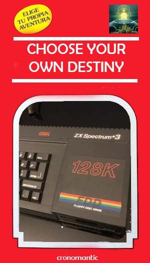

# ChooseYourDestiny

An interpreter to run choose-your-own-adventure stories or optional adventures, for the Spectrum +3.

It consists of a virtual machine that interprets "tokens" found during the text to perform the different interactive actions and a compiler that is responsible for translating the adventure from a more "human" language to a binary file interpretable by the engine.

In addition, it can also display compressed images stored on the same disk, as well as sound effects based on Shiru's [BeepFx](http://shiru.untergrund.net/files/beepfx.zip) and PT3-like melodies created with Vortex Tracker.

More information in the [Manual (Spanish)](https://github.com/cronomantic/ChooseYourDestiny/wiki/MANUAL_es.md) (Translation pending)

Improvements and contributions are welcome.

---

Un interprete para ejecutar historias de tipo "Escoje tu propia aventura" o aventuras por opciones y librojuegos, para el Spectrum 48k, 128k, +2 y +3.

Consiste una máquina virtual que va intepretando "tokens" que se encuentra durante el texto para realizar las distintas acciones interactivas y un compilador que se encarga de traducir la aventura desde un lenguaje mas "humano" con el que se escribe el guión de la aventura, a un fichero interpretable por el motor.

Además, también puede mostrar imágenes comprimidas y almacenadas en el mismo disco, así como efectos de sonido basados en [BeepFx](http://shiru.untergrund.net/files/beepfx.zip) de Shiru y melodías tipo PT3 creadas con Vortex Tracker.

Más información en el [Manual (Español)](https://github.com/cronomantic/ChooseYourDestiny/wiki/MANUAL_es.md) y en el [tutorial](https://github.com/cronomantic/ChooseYourDestiny/wiki/TUTORIAL_es.md).

Mejoras y aportaciones son bienvenidas.
