# Tutorial de Choose Your Destiny

(En progreso)

- [Tutorial de Choose Your Destiny](#tutorial-de-choose-your-destiny)
  - [Instalación](#instalación)
    - [Windows](#windows)
  - [Preparando nuestra primera aventura](#preparando-nuestra-primera-aventura)
  - [Formato del fichero fuente](#formato-del-fichero-fuente)
  - [Saltos y etiquetas](#saltos-y-etiquetas)
  - [Opciones](#opciones)
  - [Pausas y esperas](#pausas-y-esperas)
  - [Disposición del texto en pantalla](#disposición-del-texto-en-pantalla)
  - [Imágenes](#imágenes)
  - [Efectos de sonido (Beeper)](#efectos-de-sonido-beeper)
  - [Música (AY)](#música-ay)
  - [Variables e indirecciones](#variables-e-indirecciones)
  - [Subrutinas](#subrutinas)
  - [Compresión de textos y abreviaturas](#compresión-de-textos-y-abreviaturas)
  - [Flujo de trabajo](#flujo-de-trabajo)

---

## Instalación

### Windows

Para instalar en Windows 10 (64 bits) o superiores, descarga el archivo ChooseYourDestiny.Win64.zip de la sección [Releases](https://github.com/cronomantic/ChooseYourDestiny/releases) del repositorio y descomprímelo en una carpeta llamada Tutorial, que puedes crear donde creas conveniente. El guión para montar aventuras se llama `MakeAdv.bat`, tendrás que ejecutarlo para compilar la aventura. Te recomiendo hacerlo desde la línea de comandos.

---

## Preparando nuestra primera aventura

Lo primero que vamos a hacer es cambiar un par de cosas para poder generar una aventura personalizada. Para ello abrimos el fichero `MakeAdv.bat` con cualquier editor de texto y vemos esto al principio:

```batch
@echo off  &SETLOCAL

REM ---- Configuration variables 

REM Name of the game
SET GAME=test
REM This name will be used as:
REM   - The file to compile will be test.txt with this example
REM   - The name of the TAP file or +3 disk image

REM Target for the compiler (48, 128 for TAP, plus3 for DSK)
SET TARGET=plus3

REM Number of lines used on SCR files at compressing
SET IMGLINES=192

REM Loading screen
SET LOAD_SCR=%~dp0\IMAGES\000.scr
```

Lo primero que vamos a hacer es poner nuestro nombre a la aventura que vamos a crear. Por ejemplo, la llamaremos `Tutorial`:

```batch
@echo off  &SETLOCAL

REM ---- Configuration variables 

REM Name of the game
SET GAME=test
REM This name will be used as:
REM   - The file to compile will be test.txt with this example
REM   - The name of the TAP file or +3 disk image

REM Target for the compiler (48, 128 for TAP, plus3 for DSK)
SET TARGET=plus3

REM Number of lines used on SCR files at compressing
SET IMGLINES=192

REM Loading screen
SET LOAD_SCR=%~dp0\IMAGES\000.scr
```

Guardamos el fichero y ahora creamos un fichero nuevo de texto, llamado `Tutorial.txt`. En éste fichero, escribimos esto:

```
Hola Mundo[[WAITKEY]]
```

Y lo guardamos en el mismo sitio que `MakeAdv.bat`. Ejecutamos el fichero BAT y si todo va bien, habrá creado un fichero de disco llamado Tutorial.DSK, que puedes ejecutar con tu emulador favorito.

## Formato del fichero fuente

Al lanzar el fichero DSK resultante con un emulador, sale ésto:

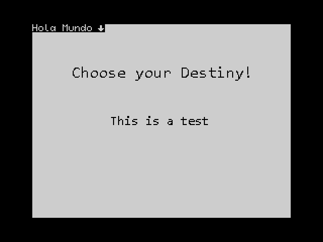

Vamos a analizar lo que sucede...

Al realizar la carga, sale la pantalla que tenemos dentro de la carpeta IMAGES, que tiene el nombre `000.scr`. Eso es porque en el guión `MakeAdv.bat`, en la cabecera donde hemos cambiado el nombre del juego, hay otra variable llamada `LOAD_SCR` donde se ha indicado la ruta a un fichero SCR de pantalla de Spectrum que se usará durante el proceso de carga. Puedes cambiarla a otra pantalla si te apetece modificando el guión.

Otra variable importante es `TARGET`, la cual indica el modelo de Spectrum y el tipo de archivo de salida a emplear. De momento usaremos el valor `plus3` para este tutorial.

Volviendo al código de la aventura, vemos que se pinta el texto *Hola Mundo* y después sale una especie de cursor. Si pulsamos la tecla `Enter` o `Space`, se reinicia el programa. Si volvemos al código:

```
Hola Mundo[[WAITKEY]]
```

Hay dos partes diferenciadas, una es el *Hola Mundo*, y después *[[WAITKEY]]*. La segunda parte es un comando que se le manda al intérprete para que saque ese cursor animado y espere la pulsación de una tecla. Esto es la base fundamental para entender cómo funciona el compilador: **Todo lo que se encuentre entre `[[` y `]]` se considera código o comandos para el motor y todo lo que esté fuera se considera texto imprimible**.

Para entender ésto mejor, vamos a hacer un experimento. Vamos a poner un salto de línea detrás de los dos corchetes abiertos, tal que así:

```
Hola Mundo[[
WAITKEY]]
```

Si compilamos y cargamos el juego, vemos que sale lo mismo. Ahora, borramos el salto de línea que hemos puesto y lo ponemos **antes** de los dobles corchetes:

```
Hola Mundo
[[WAITKEY]]
```

Si compilamos y cargamos de nuevo, vemos que ahora el icono está en la siguiente línea:

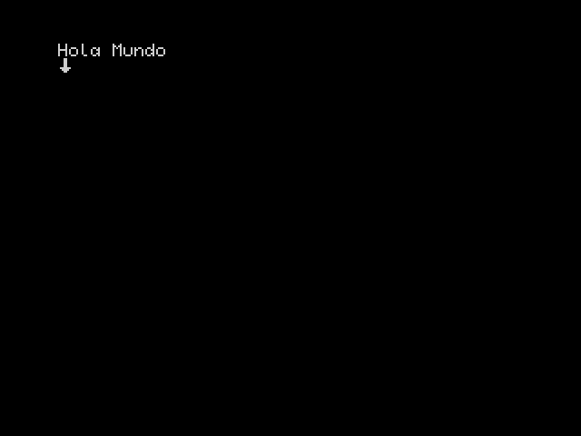

Eso es debido a que el salto de línea, al estar fuera de los dobles corchetes, es considerado texto imprimible y, por tanto, el icono de espera pasa a la siguiente línea. Ten en cuenta estas situaciones cuando escribas la aventura.

Dejemos de momento esto como estaba y vamos a añadir más comandos. Teclea ésto dentro de `Tutorial.txt`:

```
[[CLEAR]]Hola Mundo[[WAITKEY]]
```

Ahora hemos puesto un comando por delante del texto. Si compilamos y ejecutamos, obtenemos esto:

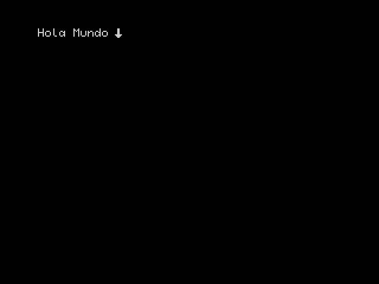

Con el comando CLEAR borramos la zona imprimible que, de momento, es la pantalla completa. Como la pantalla se borra automáticamente al iniciarse el intérprete, no veremos de momento nada, pero con este comando tendremos la pantalla limpia para imprimir desde el comienzo. Tienes una referencia completa de los comandos en el [manual](https://github.com/cronomantic/ChooseYourDestiny/blob/main/MANUAL_es.md).

Ahora vamos a cambiar el color del texto. Para ello vamos a usar el comando INK n, donde n es un número del 0 al 7 que corresponde con los colores del Spectrum. Por defecto es blanco, así que vamos a ponerlo de color cian, que es el número 5, con lo que sería INK 5. Lo pondremos antes del CLEAR, tal que así:

```
[[INK 5]][[CLEAR]]Hola Mundo[[WAITKEY]]
```

El resultado es...

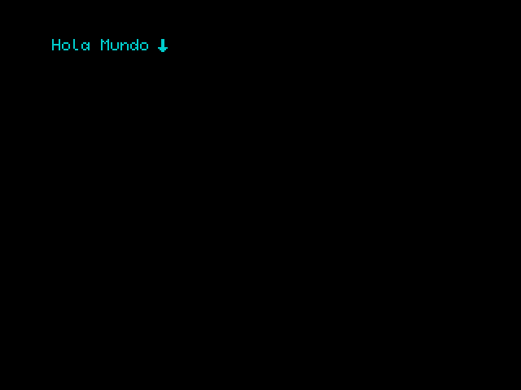

Pero el color es un poco apagado... ¡Vamos a darle brillo!
Para ello usamos el comando BRIGHT 1, (de nuevo, mirar la referencia en el [manual](https://github.com/cronomantic/ChooseYourDestiny/blob/main/MANUAL_es.md)), de esta manera:

```
[[INK 5]][[BRIGHT 1]][[CLEAR]]Hola Mundo[[WAITKEY]]
```


Esto ya está mejor.

Pero tanto corchete puede ser bastante confuso y poco agradable a la vista. Como ya he indicado, cada vez que se encuentra `[[`, el compilador interpreta que lo siguiente son comandos. ¿Cómo podemos encadenarlos sin estar abriendo y cerrando corchetes? Pues hay dos maneras:

- Mediante saltos de línea:
  
```
[[
    INK 5
    BRIGHT 1
    CLEAR
]]Hola Mundo[[WAITKEY]]
```

- Mediante dos puntos en la misma línea:

```
[[ INK 5 : BRIGHT 1 : CLEAR ]]Hola Mundo[[ WAITKEY ]]
```

Las dos variantes anteriores producirán el mismo resultado y son equivalentes.

Un último punto son los comentarios. Dentro del código podemos poner comentarios encerrándolos con `/*` y `*/`:

```
[[
    INK 5     /* Imprime en color Cyan */
    BRIGHT 1  /* Activamos brillo */
    CLEAR     /* Borramos la pantalla */
]]Hola Mundo[[
  WAITKEY     /* Espera a pulsar tecla */
]]
```

Con esto ya deberías tener una buena noción de cómo funciona el código fuente de CYD.

---

## Saltos y etiquetas

En el ejemplo del capítulo anterior, habrás notado que cuando pulsamos la tecla de selección, se resetea el Spectrum. Eso es debido a que al pulsar la tecla de validación (estando en espera con WAITKEY), llega al final del fichero. Cuando ésto sucede, se reinicia el Spectrum. Podemos hacer lo mismo usando el comando END en cualquier parte del código.

Pero no queremos que haga eso. Queremos que vuelva a empezar de nuevo. Para ello copia lo siguiente en el fichero fuente:

```
[[
  LABEL principio
  INK 5
  BRIGHT 1
  CLEAR
]]Hola Mundo[[
  WAITKEY
  GOTO principio
]]
```

Cuando compiles y ejecutes, no se verá muy bien, pero notarás que cuando pulses la tecla de validación, no se reinicia, sino que borra la pantalla y vuelve a imprimir el texto y hacer la espera.

Los dos añadidos al código son `LABEL principio` y `GOTO principio`. El primer comando no es en realidad un comando, sino una etiqueta, que lo que hace es poner un marcador es ese punto con un identificador de nombre *principio*; y el segundo lo que hace es indicar al intérprete que salte hacia donde se encuentre la etiqueta *principio*.

El resultado es que, al pulsar la tecla de validación con WAITKEY, se encuentra el `GOTO principio` y salta hacia donde está declarada la etiqueta *principio* que, al ser el comienzo, lo que hace es volver a ejecutar todos los comandos posteriores e imprimir el texto *Hola Mundo*, y esperar con WAITKEY de nuevo... En resumen, hemos hecho un bucle infinito.

Sin embargo, podemos mejorar el ejemplo así:

```
[[
  INK 5
  BRIGHT 1
  LABEL principio
  CLEAR
]]Hola Mundo[[
  WAITKEY
  GOTO principio
]]
```

Ahora la etiqueta está declarada justo antes del borrado de la pantalla, y allí irá cuando se alcance el GOTO, dejando sin ejecutar de nuevo el INK y el BRIGHT. ¿Por qué? Pues porque ya no es necesario ejecutarlos otra vez, ya hemos puesto el color del texto y el brillo al principio y ¡ejecutarlos de nuevo es redundante!

El concepto de etiquetas y saltos es fundamental para comprender cómo hacer un "Elige tu propia aventura", ya que presentaremos opciones al jugador, y dependiendo de esas opciones, iremos de un lugar a otro del texto.

Un importante detalle es el formato de los identificadores de etiquetas. Éstos sólo pueden ser una **secuencia de cifras y letras, sin espacios y deben empezar por una letra**. Es decir, `LABEL 1` o `LABEL La Etiqueta` no son válidos, pero `LABEL l1` o `LABEL LaEtiqueta` sí lo son. Además son sensibles al caso, es decir, que **se distinguen mayúsculas y minúsculas**, con lo que `LABEL Etiqueta` y `LABEL etiqueta` no son la misma etiqueta. Y, obviamente, no se puede declarar una etiqueta con el mismo nombre dos veces.

Por el contrario, los comandos no son sensibles al caso, es decir, que `CLEAR`, `clear` ó `Clear`, son perfectamente válidos. Sin embargo, yo recomiendo ponerlos en mayúsculas para distinguirlos mejor.

---

## Opciones

Las opciones es el punto mas importante del motor. De nuevo, vamos a verlo con el ejemplo del manual:

```
[[ /* Pone colores de pantalla y la borra */
   PAPER 0    /* Color de fondo negro  */
   INK   7    /* Color de texto blanco */
   BORDER 0   /* Borde de color negro  */
   CLEAR      /* Borramos la pantalla*/
]][[ LABEL Localidad1]]Estás en la localidad 1. ¿Donde quieres ir?
[[ OPTION GOTO Localidad2 ]]Ir a la localidad 2
[[ OPTION GOTO Localidad3 ]]Ir a la localidad 3
[[ CHOOSE ]]
[[ LABEL Localidad2 ]]¡¡¡Lo lograste!!!
[[ GOTO Final ]]
[[ LABEL Localidad3 ]]¡¡¡Estas muerto!!!
[[ GOTO Final]]
[[ LABEL Final : WAITKEY: END ]]
```

Al compilar y ejecutar tenemos esto:

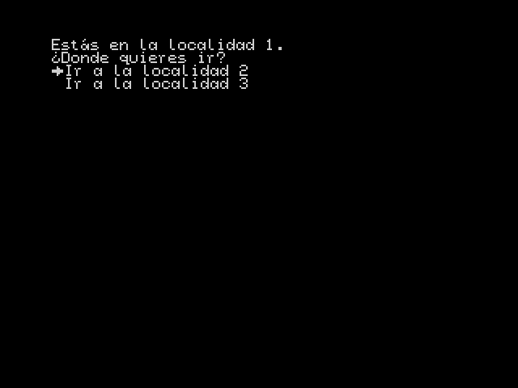

Nos aparecen dos opciones que podemos elegir con las teclas **P** y **Q** y seleccionar una con **Space** o **Enter**.
Si elegimos la primera opción, nos sale esto:

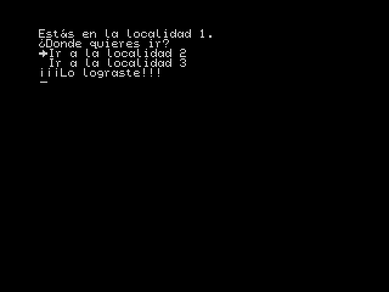

Y si elegimos la segunda:

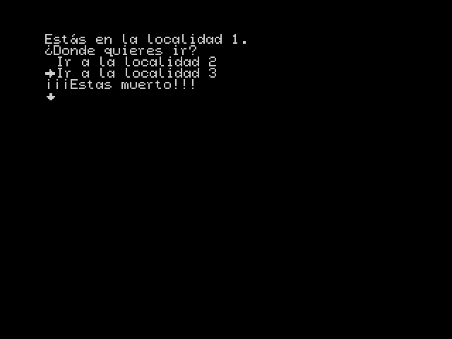

Con el comando `OPTION GOTO etiqueta`, lo que hacemos es declarar una opción seleccionable. El lugar donde esté el cursor en ese momento será el punto donde aparezca el icono de opción. Vamos a recolocar un poco las opciones para ilustrar esto último:

```
[[ /* Pone colores de pantalla y la borra */
   PAPER 0    /* Color de fondo negro  */
   INK   7    /* Color de texto blanco */
   BORDER 0   /* Borde de color negro  */
   CLEAR      /* Borramos la pantalla*/
]][[ LABEL Localidad1]]Estás en la localidad 1.
¿Donde quieres ir?

  [[ OPTION GOTO Localidad2 ]]Ir a la localidad 2

  [[ OPTION GOTO Localidad3 ]]Ir a la localidad 3
[[ CHOOSE ]]
[[ LABEL Localidad2 ]]¡¡¡Lo lograste!!!
[[ GOTO Final ]]
[[ LABEL Localidad3 ]]¡¡¡Estas muerto!!!
[[ GOTO Final]]
[[ LABEL Final : WAITKEY: END ]]
```

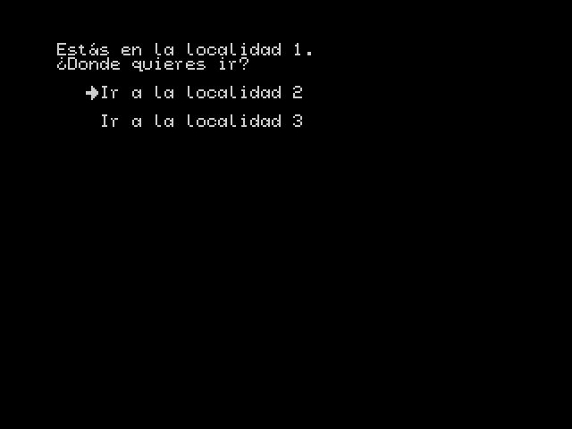

Como se puede ver, hemos separado las opciones con saltos de línea y puesto dos espacios de sangrado por delante del comando `OPTION GOTO` y eso se refleja en el resultado final.

Una vez declaradas las opciones, con el comando `CHOOSE`, activamos el menú, que nos permitirá elegir entre una de las opciones que ya estuviesen en pantalla. Cuando seleccionemos una, se saltará a la etiqueta indicada en el correspondiente `OPTION GOTO`. En el ejemplo, Si seleccionamos la primera opción, `OPTION GOTO Localidad2`, saltará a la etiqueta `LABEL Localidad2` e imprimirá *Lo lograste* y luego saltará a la etiqueta `LABEL Final`. El `GOTO Final` es necesario hacerlo, porque si no, nos imprimiría *¡¡¡Lo lograste!!!* y después *¡¡¡Estas muerto!!!*; el `GOTO` es necesario, en este caso, para evitar que se ejecute el resultado de la segunda opción.

**IMPORTANTE**, cuando se ejecute `CHOOSE`, **¡sólo se podrán elegir las opciones que haya en ese momento en la pantalla!**. Ten en cuenta que si imprimes en la última línea y pasas a la siguiente, la pantalla se borra para seguir imprimiendo desde el principio. Cuando se borra la pantalla las opciones que hubiese hasta ese momento son descartadas, con lo que si imprimes demasiado puedes perder opciones. Ten cuidado con esto a la hora de disponer tu menú de opciones en pantalla.

Como nota adicional con `CHOOSE`, sólo se permiten un máximo de 16 opciones y un mínimo de una (inútil, pero se permite). Fuera de ese rango el intérprete dará un error.

También destacar que hay una variante de `CHOOSE` temporizada, compila y ejecuta esto sin seleccionar nada en el menú :

```
[[ /* Pone colores de pantalla y la borra */
   PAPER 0    /* Color de fondo negro  */
   INK   7    /* Color de texto blanco */
   BORDER 0   /* Borde de color negro  */
   CLEAR      /* Borramos la pantalla*/
]][[ LABEL Localidad1]]Estás en la localidad 1.
¿Donde quieres ir?

  [[ OPTION GOTO Localidad2 ]]Ir a la localidad 2

  [[ OPTION GOTO Localidad3 ]]Ir a la localidad 3
[[ CHOOSE IF WAIT 500 THEN GOTO Localidad3]]
[[ LABEL Localidad2 ]]¡¡¡Lo lograste!!!
[[ GOTO Final ]]
[[ LABEL Localidad3 ]]¡¡¡Estas muerto!!!
[[ GOTO Final]]
[[ LABEL Final : WAITKEY: END ]]
```

Te darás cuenta que al pasar unos 10 segundos, ha mostrado *¡¡¡Estas muerto!!!*.

Lo que hace `CHOOSE IF WAIT 500 THEN GOTO Localidad3` es lo mismo que `CHOOSE`, activar la selección de opciones, pero con la salvedad que también realiza una cuenta atrás, en este caso desde 500. Si dicha cuenta atrás llega a cero sin seleccionarse nada, entonces se hace el salto a la etiqueta indicada; en este caso *Localidad3*.
El contador funciona en base a los fotogramas del Spectrum, es decir, 1/50 de segundo, con lo que 500/50 = 10 segundos. Esto lo veremos en el siguiente capítulo.

Con esto ya tenemos las base para hacer un "Elije tu propia aventura" básico. Pero todavía tenemos muchas más posibilidades que explorar...

---

## Pausas y esperas

En los ejemplos anteriores ya habrás visto el comando `WAITKEY`. Ese comando genera una pausa, con un icono animado, en espera de que se pulse la tecla de confirmación. Con eso puedes controlar la visualización del texto y evitar que el usuario tenga que leer un muro de texto de una sentada, además de permitir controlar la presentación.

Un ejemplo sería cuando se está acabando la "página" y queremos que el usuario pulse una tecla para pasar a la siguiente, que podemos hacer así:

```
Texto al final de la página.[[ 
  WAITKEY 
  CLEAR
]]Texto al principio de la siguiente página.
```

Con el `WAITKEY` hacemos la espera, y al confirmar, con el `CLEAR` siguiente borramos el texto en pantalla y comenzamos a escribir desde el principio de lo que sería la siguiente "página".

Sin embargo, hay una opción para que CYD haga esto por sí solo. El comportamiento por defecto cuando acabamos de imprimir en la última línea es borrar completamente la pantalla y seguir escribiendo; pero con el comando `PAGEPAUSE` podemos activar un comportamiento alternativo. Si indicamos `PAGEPAUSE 1`, por ejemplo, cuando se acabe el espacio disponible, generará automáticamente una espera para que el usuario pulse la tecla de confirmación antes de borrar la pantalla y seguir imprimiendo.

Además, también se dispone de esperas "temporizadas", siendo `CHOOSE IF WAIT X THEN GOTO Y` del capítulo anterior un ejemplo. Cuando se ejecutan, un contador se carga con el valor que se pasa como parámetro y se realiza una cuenta atrás hasta que el contador llega a cero. El contador se decrementa una vez cada fotograma del Spectrum, es decir, una vez cada 1/50 de segundo, o lo que es lo mismo, 50 veces por segundo. De tal manera, que si queremos esperar un segundo, tenemos que poner el contador a 50.

Con ésto, ya tenemos lo necesario para conocer los comandos:

- Con el comando `WAIT`, se realiza una espera incondicional, es una detención hasta que se agote el contador.
  
```
Espera tres segundos[[WAIT 150]]
Ya está[[WAITKEY]]
```

- El comando `PAUSE` es una combinación de `WAITKEY` y `WAIT`, se realiza una espera hasta que se agote el contador ó el usuario pulse la tecla de confirmación, podríamos considerarlo un `WAITKEY` con caducidad.
  
```
Espera tres segundos o pulsa una tecla[[PAUSE 150]]
Ya está[[WAITKEY]]
```

- `CHOOSE IF WAIT X THEN GOTO Y` ya ha sido explicado el en capítulo anterior, si se agota el contador antes de que se seleccione una opción del menú, se realiza el salto indicado.

Para terminar, hablar del comando `TYPERATE`, que es un poco especial comparado con el resto de comandos de espera. Con este comando indicamos la espera que se produce cada vez que se imprime un carácter. Ésta espera no está ajustada a los fotogramas, sino que es un contador que ya depende de la velocidad del procesador (más rápido). La idea de este comando es la de escribir de forma más pausada y paulatina, para cierta situaciones "dramáticas".

```
[[TYPERATE 100]]Esto imprime lento
[[TYPERATE 1]]Esto imprime normal[[WAITKEY]]
```

---

## Disposición del texto en pantalla

Una de las partes más importantes para el diseño de una aventura con CYD es ajustar la presentación del texto. CYD no "sabe" como presentar el texto. Como autores, tenemos que ayudarle.

Podemos visualizar su comportamiento imaginando que en la pantalla hay un cursor invisible que va imprimiendo el texto de izquierda a derecha y de arriba a abajo. El motor siempre procura que las palabras no se dividan, de tal manera que si la siguiente palabra no cabe en lo que queda de línea, salta a la línea siguiente y la imprime allí. Se considera una palabra cualquier texto separado por espacios.

Pongamos un texto tipo *Loren ipsum*, todo seguido, sin saltos de línea:

```
[[ /* Pone colores de pantalla y la borra */
   PAPER 0    /* Color de fondo negro  */
   INK   7    /* Color de texto blanco */
   BORDER 0   /* Borde de color negro  */
   CLEAR      /* Borramos la pantalla*/
   PAGEPAUSE 1
]]Lorem ipsum dolor sit amet, consectetur adipiscing elit. Nam eget pretium felis. Quisque tincidunt tortor eget libero fermentum, rutrum aliquet nisl semper. Pellentesque id eros non leo ullamcorper hendrerit. Fusce pretium bibendum lectus, vel dignissim velit interdum quis. Integer vel ipsum ac elit tincidunt vulputate. Mauris sagittis sapien in justo pretium cursus. Proin nec tincidunt purus, et tempus metus. Nunc dapibus vel ante eu dictum. Donec vestibulum scelerisque orci in tempus. Nunc quis velit id velit faucibus tempus vel id tellus.[[ WAITKEY: END ]]
```

El resultado:

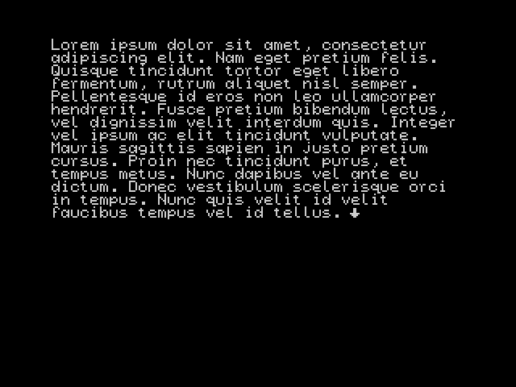

Puedes ver que las palabras que no caben en su renglón, continúan en la línea siguiente sin cortarse.

Cuando el cursor de impresión llega a la última línea y debe pasar a la siguiente, se borra la pantalla y sigue imprimiendo desde el origen de la pantalla, arriba a la izquierda; excepto si se usa el comando `PAGEPAUSE`, que genera una espera de confirmación antes de borrar la pantalla.

Podemos maquetar la pantalla adecuadamente usando espacios y saltos de línea según convenga, pero si queremos hacer una sangría o tabulaciones, dispones del comando `TAB pos`, que desplaza el cursor tantas posiciones a la derecha como indicadas en el parámetro:

```
[[ /* Pone colores de pantalla y la borra */
   PAPER 0    /* Color de fondo negro  */
   INK   7    /* Color de texto blanco */
   BORDER 0   /* Borde de color negro  */
   CLEAR      /* Borramos la pantalla*/
   PAGEPAUSE 1
]]Texto normal
[[TAB 5]]Texto 5 posiciones a la derecha.[[ WAITKEY: END ]]
```

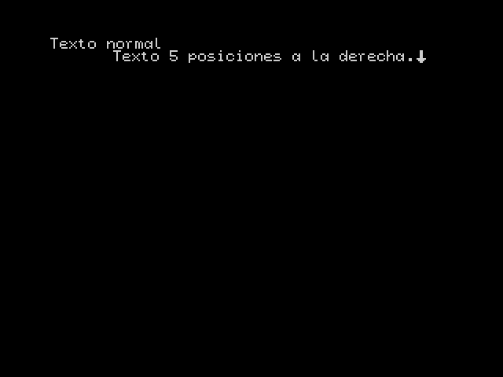

Notarás que el texto de arriba no *parece* cuadrar con el de abajo en 5 posiciones. Esto trae a colación un punto importante. La pantalla del Spectrum tiene, de forma natural, 32 caracteres por línea, que es algo insuficiente para textos largos. CYD soporta fuentes de ancho variable y la que tiene por defecto usa caracteres de 6x8, lo que nos permite tener 42 caracteres por línea, pero esto ocasiona que no coincida con la rejilla de atributos del Spectrum, que es 8x8, y haya "colour clash" o choque de atributos.

Por este motivo, `TAB` y todos los comandos que ahora explicaré, tienen un sistema de coordenadas basadas en caracteres de 8x8 píxeles, es decir, 32 columnas y 24 filas, contadas de 0 a 31 y 0 a 23 respectivamente.

Vamos ahora a ver un comando para situar el cursor de impresión en cualquier punto de la pantalla. Con el comando `AT columna,fila`, podemos indicar las coordenadas donde queremos colocar el cursor para seguir imprimiendo. Vamos a verlo con éste ejemplo:

```
[[ /* Pone colores de pantalla y la borra */
   PAPER 0    /* Color de fondo negro  */
   INK   7    /* Color de texto blanco */
   BORDER 0   /* Borde de color negro  */
   CLEAR      /* Borramos la pantalla*/
   PAGEPAUSE 1
]]
Texto abajo
[[AT 5,0]]¿Esto está arriba?.[[ WAITKEY: END ]]
```

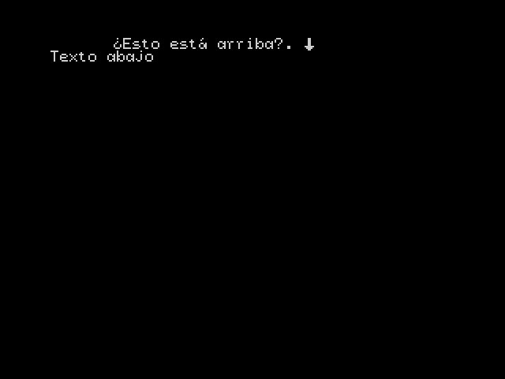

¿Qué ha pasado aquí? Si examinamos el código, vemos que antes de "Texto abajo", hay un salto de línea. Con lo que el cursor salta a la línea siguiente e imprime el "Texto abajo", pero después tenemos `AT 5,0`, que significa *mueve el cursor a la columna 5 y fila 0*, es decir, que vuelve a la fila anterior y 5 posiciones a la derecha desde el origen.

Con esto ya podemos colocar textos donde queramos. Pero nos falta algo para controlar del todo la disposición del texto en pantalla, y es definir unos márgenes. Por defecto CYD imprime el texto a pantalla completa, pero puede interesarnos que sólo imprima en cierta zona para no "tapar" imágenes que queramos mostrar. Para ello disponemos del comando `MARGINS`, que nos permite indicar el "rectángulo" o área de impresión de los textos.

El formato del comando es `MARGINS col_origen, fila_origen, ancho, alto`, donde los parámetros, son la columna y la fila origen del área de impresión y el correspondiente ancho y alto. Por defecto, el motor arranca como si se hubiese ejecutado el comando `MARGINS 0, 0, 32, 24`, es decir, el origen en lado izquierdo superior de la pantalla y el tamaño la pantalla completa.

Vamos ahora a retomar el ejemplo inicial de éste capítulo y vamos a ponerlo en la zona inferior de la pantalla:

```
[[ /* Pone colores de pantalla y la borra */
   PAPER 0    /* Color de fondo negro  */
   INK   7    /* Color de texto blanco */
   BORDER 0   /* Borde de color negro  */
   CLEAR      /* Borramos la pantalla*/
   PAGEPAUSE 1
   MARGINS 0, 10, 32, 14
]]Lorem ipsum dolor sit amet, consectetur adipiscing elit. Nam eget pretium felis. Quisque tincidunt tortor eget libero fermentum, rutrum aliquet nisl semper. Pellentesque id eros non leo ullamcorper hendrerit. Fusce pretium bibendum lectus, vel dignissim velit interdum quis. Integer vel ipsum ac elit tincidunt vulputate. Mauris sagittis sapien in justo pretium cursus. Proin nec tincidunt purus, et tempus metus. Nunc dapibus vel ante eu dictum. Donec vestibulum scelerisque orci in tempus. Nunc quis velit id velit faucibus tempus vel id tellus.[[ WAITKEY: END ]]
```

Hemos bajado el origen del área de impresión a la fila 10, y su alto lo reducimos a 14:

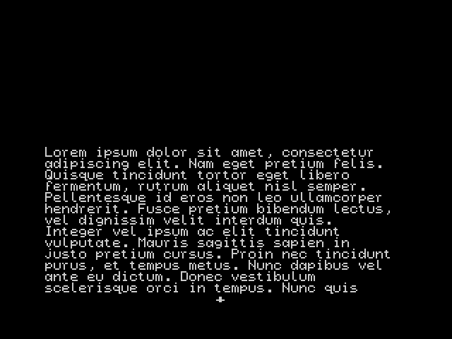

Con esto podemos ajustar la zona donde queramos que se imprima. Nótese el efecto de `PAGEPAUSE 1`, que al no caber todo, genera un icono de confirmación en el centro.

Vamos ahora a usar lo mismo en el segundo ejemplo de este capítulo:

```
[[ /* Pone colores de pantalla y la borra */
   PAPER 0    /* Color de fondo negro  */
   INK   7    /* Color de texto blanco */
   BORDER 0   /* Borde de color negro  */
   CLEAR      /* Borramos la pantalla*/
   PAGEPAUSE 1
   MARGINS 0, 10, 32, 14
]]
Texto abajo
[[AT 5,0]]¿Esto está arriba?.[[ WAITKEY: END ]]
```

¿Notas algo raro?

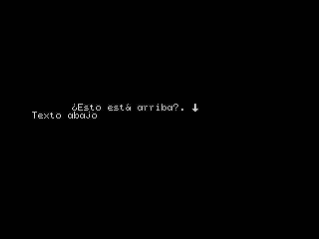

Si no lo has visto, pues que las coordenadas de `AT` no son, en este caso, las coordenadas de pantalla. Las coordenadas de `AT` **son siempre relativas al origen del área de impresión**. Cuando teníamos definida el área como la pantalla completa, pues correspondía con las coordenadas de la pantalla, (0,0). Ahora son relativas al nuevo origen, (0,10), lo que mandaría el cursor a la posición (5,10) en pantalla.

Por último, vamos a ver un problema de choque de atributos con este ejemplo:

```
[[ /* Pone colores de pantalla y la borra */
   PAPER 0    /* Color de fondo negro  */
   BORDER 0   /* Borde de color negro  */
   CLEAR      /* Borramos la pantalla*/
   PAGEPAUSE 1
   INK   7    /* Color de texto azul */
]]LALALALALA[[INK 4 /* COlor verde */]] LOLOLOLOLOLO[[ WAITKEY: END ]]
```

Se puede ver que al cambiar el color a verde con el comando `INK`, debido a que el siguiente carácter a imprimir (un espacio), se queda entre medias de dos celdas de atributos, se pinta el carácter anterior de blanco:

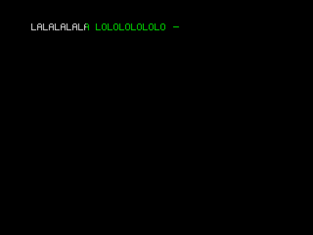

Esto lo podemos solventar realizando el cambio de color después del espacio:

```
[[ /* Pone colores de pantalla y la borra */
   PAPER 0    /* Color de fondo negro  */
   BORDER 0   /* Borde de color negro  */
   CLEAR      /* Borramos la pantalla*/
   PAGEPAUSE 1
   INK   7    /* Color de texto blanco */
]]LALALALALA [[INK 4 /*COlor verde */]]LOLOLOLOLOLO[[ WAITKEY: END ]]
```

Y ahora ya está correcto:


Será necesario por parte del autor realizar estos pequeños ajustes para mejorar la presentación del texto. Si se quiere evitar totalmente, pues no hay que mezclar colores diferentes dentro de la misma línea.

---

## Imágenes

Para darle más vistosidad a la aventura, es posible añadir imágenes en formato SCR, de pantalla de Spectrum. Estas imágenes serán comprimidas con la utilidad `CSC`, creando archivos con la misma extensión, que deberán ser incluidos en el disco final.

En el manual se encuentra explicado cómo funciona `CSC`, por si quieres hacerlo manualmente. Pero el guion `MakeAdv` busca y comprime automáticamente los ficheros SCR que haya en el directorio `\IMAGES`, con lo que simplemente tendrás que depositar los ficheros allí.

Vamos a usar una imagen que tenemos de ejemplo, llamada `ORIGIN1.SCR`, dentro del directorio `\IMAGES`. Cópiala y renómbrala como `001.SCR`. Y pon el siguiente código en `tutorial.txt`:

```
[[ /* Pone colores de pantalla y la borra */
   PAPER 0    /* Color de fondo negro  */
   BORDER 0   /* Borde de color negro  */
   CLEAR      /* Borramos la pantalla*/
   INK   7    /* Color de texto blanco */
   PAGEPAUSE 1
]]Voy a cargar la pantalla 1.[[
   WAITKEY
   /* Cargamos la imagen del fichero 001.CSC */
   PICTURE 1]]
Voy a mostrar la imagen.[[
   WAITKEY
   /* Cargamos la imagen cargada  */
   DISPLAY 1
]]
Hecho[[ WAITKEY: END ]]
```

Antes de lanzar el emulador, mira el directorio `\IMAGES`, donde encontrarás `ORIGIN1.SCR`, `000.SCR`, `001.SCR`, `000.CSC` y `001.CSC`. El guion `MakeAdv` lo que hace es buscar los ficheros con nombre xxx.SCR, donde las tres x son dígitos, y los comprime con `CSC`, generando los ficheros correspondientes con la extensión `.CSC`. El motor buscará en el disco ficheros con esta nomenclatura cuando se le pida cargar imágenes.

Ahora ya podemos lanzar el emulador. Lo primero que verás es esto:

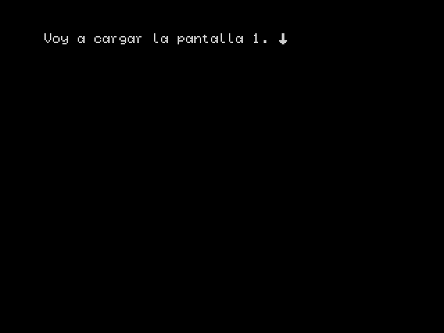

Cuando se pulse la tecla de confirmación, se lanzará el comando `PICTURE 1`. Lo que hará este comando es cargar y descomprimir en memoria la imagen del fichero `001.CSC`, pero cuidado, ¡todavía no se muestra!, pero notarás que se ha accedido a disco (esto depende del emulador).

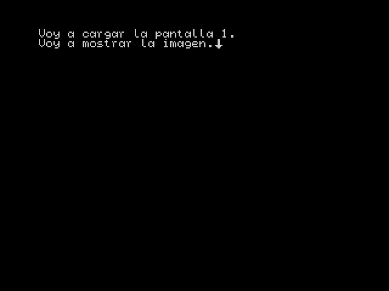

Con esto tenemos la imagen cargada, pero para mostrarla , tenemos que usar el comando `DISPLAY 1`, y entonces ya se muestra la imagen:

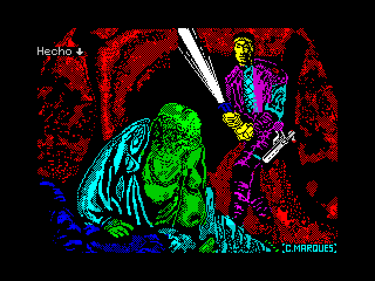

Ya podemos mostrar imágenes, pero hay que aclarar antes algunas cosas. Lo primero que te puede llamar la atención es... ¿para qué sirve el 1 de DISPLAY? Como se indica en la referencia, el comando `DISPLAY` necesita un parámetro que indica si debe mostrar la imagen o no; si el valor es cero, no la muestra, y si es distinto de cero, sí. Esto puede parecer inútil, pero tiene sentido si se usa con la indirección, que explicaré más adelante, para hacer que se muestre la imagen de forma condicional de acuerdo al valor de una variable.

Otra cosa que te puede extrañar es ¿por qué los comandos de cargar la imagen y mostrarla están separados, en lugar de usar un único comando para hacer las dos cosas? Pues la respuesta es una decisión de diseño para las versión de disco, ya que al separar la carga en una operación diferente, podemos controlar cuándo se hace ésta para, por ejemplo, hacer la carga cuando comience un capítulo, y mostrar luego la imagen en el momento más oportuno, ya que al cargar, se detendrá el motor y generará una pausa en la lectura en un momento no deseado.

De momento, quédate que primero necesitas `PICTURE 3`, para cargar la imagen `003.CSC`, por ejemplo, y después `DISPLAY 1` para mostrarla. Hay que destacar que sólo podemos cargar una imagen a la vez, con lo que si cargamos otra imagen, la que ya estuviese cargada se borrará, y una imagen cargada la podemos mostrar tantas veces como queramos. Y tendrás un bonito error si intentas cargar una imagen que no exista en el disco o en memoria, o al mostrar una imagen sin cargarla antes.

Al visualizar imágenes hay que tener en cuenta que siempre se sobrescribirá lo que ya hubiese en pantalla. El comportamiento por defecto es cargar imágenes a pantalla completa (192 líneas), pero podemos editar el número de líneas a cargar modificando el valor de la variable `IMGLINES` en el guion `MakeAdv.bat`:

```batch
REM Number of lines used on SCR files at compressing
SET IMGLINES=192
```

Tras cargar la imagen, podemos ajustar el tamaño del área de impresión para que no se sobrescriba el dibujo usando `MARGINS`.

---

## Efectos de sonido (Beeper)

Para mejorar la ambientación de nuestra aventura, el motor permite emitir efectos de sonido por el Beeper. Para ello nos valemos de la herramienta [BeepFx](http://shiru.untergrund.net/files/beepfx.zip) de Shiru, una herramienta muy usada en nuevos desarrollos para Spectrum.

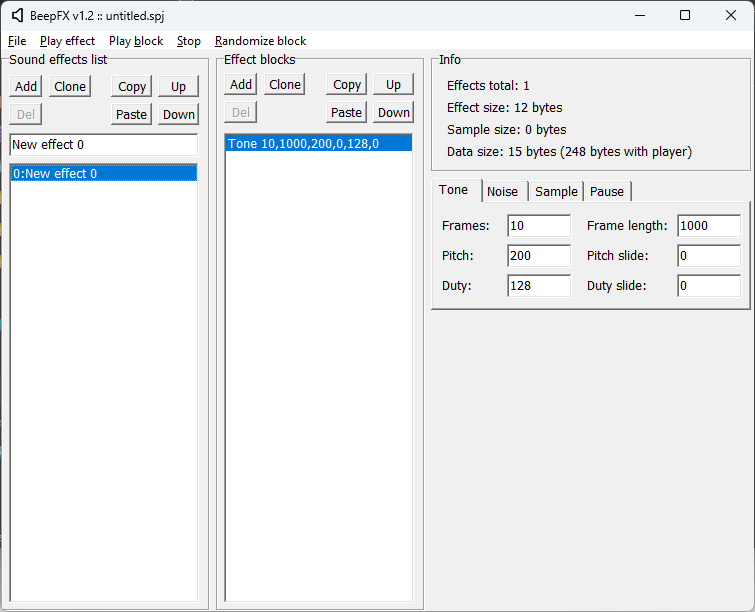

En este tutorial no vamos a enseñar cómo se maneja la herramienta, pero vamos a tomar uno de los archivos de ejemplo que incluye el paquete. Desde el menú `File -> Open project`, abrimos el fichero `demo.spj`, donde hay una serie de efectos ya creados. Los podemos reproducir con la opción `Play Effect`:

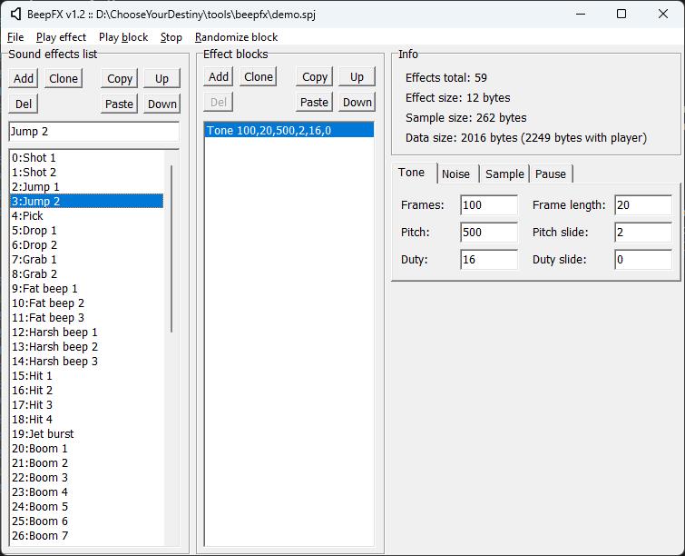

Ahora vamos a exportarlo a un fichero con el que podamos usarlos con el motor. Para ello vamos al menú `File -> Compile`, donde nos saldrá esta ventana:

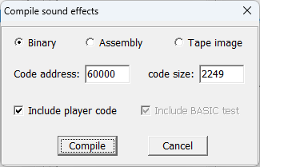

Ahora viene lo importante, **tenemos que cambiar `Code Address` a 49152**, y dejar siempre marcadas la opción `Binary` e `Include player code`:

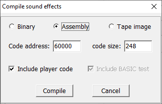

Le damos al botón `Compile` y nos sale un diálogo para guardar el fichero. **Lo tenemos que llamar `SFX.BIN`** y lo guardamos en la carpeta donde estemos desarrollando nuestra aventura. Cuando ejecutemos el guion `MakeAdv.bat`. Si éste encuentra en su mismo directorio el fichero `SFX.BIN`, lo incluirá automáticamente en la imagen de disco y lo podremos usar desde el motor.

Vamos a poner un ejemplo, pon esto como código de la aventura:

```
[[ /* Pone colores de pantalla y la borra */
   PAPER 0    /* Color de fondo negro  */
   BORDER 0   /* Borde de color negro  */
   INK   7    /* Color de texto blanco */
   PAGEPAUSE 1
   LABEL Menu
   CLEAR]]Selecciona el efecto a reproducir:

  [[ OPTION GOTO Efecto0 ]]Efecto 0
  [[ OPTION GOTO Efecto1 ]]Efecto 1
  [[ OPTION GOTO Efecto2 ]]Efecto 2
  [[ OPTION GOTO Efecto3 ]]Efecto 3
  [[ OPTION GOTO Efecto4 ]]Efecto 4
  [[ OPTION GOTO Final ]]Salir

[[ CHOOSE 
   LABEL Efecto0 : SFX 0 : GOTO Menu
   LABEL Efecto1 : SFX 1 : GOTO Menu
   LABEL Efecto2 : SFX 2 : GOTO Menu
   LABEL Efecto3 : SFX 3 : GOTO Menu
   LABEL Efecto4 : SFX 4 : GOTO Menu
   LABEL Final]]Adios...[[WAITKEY: END ]]
```

Como se puede ver, con el comando `SFX`, podemos reproducir cualquiera de los efectos del fichero indicando su número como parámetro.

Una peculiaridad del comando SFX es que, al contrario que las imágenes, si el fichero SFX.BIN no se encuentra en el disco, fallará silenciosamente sin dar error y el efecto de sonido simplemente no se reproducirá.

Como detalle más técnico, indicar que el contenido del fichero SFX.BIN se alojará en el banco 1 de la memoria del Spectrum, y por lo tanto, tenemos un límite de tamaño de 16Kb.

---

## Música (AY)

CYD también permite tocar música usando el chip AY, usando módulos creados con Vortex Tracker, en formato `PT3`.
El funcionamiento es intencionadamente similar al de las imágenes. Los nombres de los ficheros de los módulos tienen que ser números de 3 dígitos con la extensión `.PT3`, de tal manera que sean `000.PT3`, `001.PT3` y así sucesivamente, e incluirse en el disco. Para facilitar la tarea, el guion `MakeAdv.bat` lo hará por nosotros con todos los ficheros que cumplan ésta nomenclatura y se encuentren dentro de la carpeta `.\TRACKS`.

Los comandos que disponemos también son similares a los comandos de manejo de imágenes. Con el comando `TRACK`, cargamos desde disco en memoria un módulo de música, de tal manera que con `TRACK 0`, cargaríamos el módulo `000.PT3`, con `TRACK 1` cargaríamos `001.PT3`, etc.

Una vez cargado el módulo, pasaríamos a reproducirlo con el comando `PLAY 1` cuando necesitemos hacerlo. El parámetro del comando `PLAY` es un número que si es cero, para la música (si se estuviese ya reproduciendo), y si es distinto de cero, la reproduce desde el comienzo (si estuviese ya parada).

Por último, con el comando `LOOP` indicamos si queremos que el módulo se reproduzca sólo una vez o queremos que se reproduzca indefinidamente. Si el valor de su parámetro es cero, sólo lo hará una vez, y si es distinto de cero, comenzará a reproducirse de nuevo cuando acabe.

Un detalle a tener en cuenta es que el efecto del comando `LOOP` es propio del reproductor incorporado y sólo es válido cuando el módulo pueda acabar. El formato `.PT3` tiene comandos de repetición, haciendo que el módulo se reproduzca sin fin por sí mismo, con lo que es conveniente reproducir el mismo con un reproductor externo para ver si esto es así.

---

## Variables e indirecciones

Con lo que ya sabemos, ya podríamos hacer una aventura por opciones relativamente simple, tipo "Elige tu Propia Aventura", pero podemos ir más lejos...

El motor dispone de 256 variables ó banderas de un byte, es decir, 256 almacenes donde podemos almacenar valores del 0 al 255. Cada una de estas variables es identificada a su vez por un número del 0 al 255. Vamos a verlo con un ejemplo:

```
[[ /* Pone colores de pantalla y la borra */
   PAPER 0    /* Color de fondo negro  */
   BORDER 0   /* Borde de color negro  */
   INK   7    /* Color de texto blanco */
   PAGEPAUSE 1
   CLEAR]][[SET 1 TO 5]]Tienes [[PRINT @1]] gamusinos.
[[WAITKEY : END]]
```

Este es el resultado:

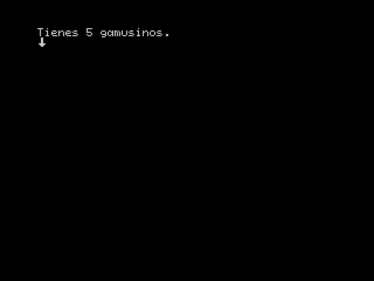

Lo primero que vemos nuevo es esto `SET 1 TO 5`, con esto le estamos indicando al motor que guarde el valor 5 dentro de la variable número 1. Y como consecuencia, con `PRINT @1` le estamos indicando que muestre el valor de la variable 1 en pantalla.

Una cosa que habrás notado es que `PRINT` pone una arroba delante del número de variable. A eso le llamamos *indirección*. Para explicarlo mejor, quítale la arroba de tal manera que quede esto:

```
[[ /* Pone colores de pantalla y la borra */
   PAPER 0    /* Color de fondo negro  */
   BORDER 0   /* Borde de color negro  */
   INK   7    /* Color de texto blanco */
   PAGEPAUSE 1
   CLEAR]][[SET 1 TO 5]]Tienes [[PRINT 1]] gamusinos.
[[WAITKEY : END]]
```

Este es el resultado si lo ejecutamos así:

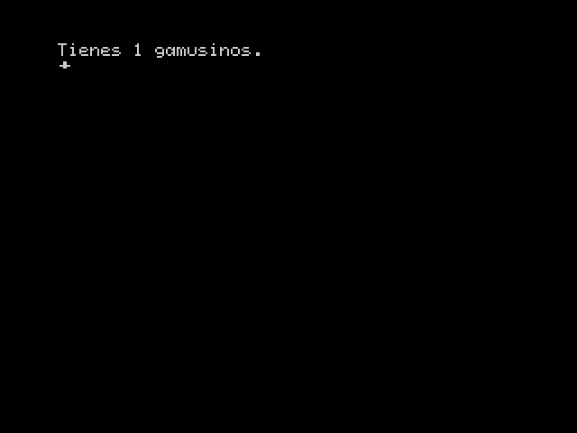

¡Vaya! Pues eso es lo que es la indirección, cuando pones una arroba delante, significa **coge el valor de la variable cuyo número indico detrás**. Si has consultado el [manual](MANUAL_es.md), habrás visto que casi todos los  comandos tienen parámetros directos e indirectos, donde en el primer caso pones un valor específico y en el segundo indicas la variable donde debe coger su valor.

Por eso, con `PRINT 1`, lo que estás indicando es "Imprime el valor 1", pero con `PRINT @1`, lo que se indica es "Imprime el contenido de la variable 1".

Vamos a afianzar este concepto con este ejemplo:

```
[[ /* Pone colores de pantalla y la borra */
   PAPER 0    /* Color de fondo negro  */
   BORDER 0   /* Borde de color negro  */
   INK   7    /* Color de texto blanco */
   PAGEPAUSE 1
   CLEAR
   SET 1 TO 5
   SET 0 TO @1
]]Tienes [[PRINT @0]] gamusinos.
[[WAITKEY : END]]
```

De nuevo, volvemos a tener 5 gamusinos:


Con `SET 1 TO 5` almacenamos 5 en la variable num. 1. Luego con `SET 0 TO @1`, lo que hacemos es almacenar en la variable número 0 el valor que contiene la variable número 1 y finalmente, con `PRINT @0`, mostramos el contenido de la variable número 0.

Ahora vamos a ver un ejemplo más práctico de las variables, que pondrá a prueba nuestros conocimientos adquiridos en este tutorial:

```
[[ /* Pone colores de pantalla y la borra */
   PAPER 0    /* Color de fondo negro  */
   BORDER 0   /* Borde de color negro  */
   INK   7    /* Color de texto blanco */
   PAGEPAUSE 1
   SET 0 TO 0
   LABEL Inicio
   CLEAR
]]Tienes [[PRINT @0]] gamusinos.
Necesitas 10 gamusinos para poder salir...
¿Qué haces?

[[OPTION GOTO Suma1]]Cojo 1 gamusino.
[[OPTION GOTO Resta1]]Dejo 1 gamusino.
[[ 
   IF 0 <> 10 THEN GOTO Escoger
   OPTION GOTO Final]]Salir.
[[
   LABEL Escoger  
   CHOOSE
   LABEL Suma1
   SET 0 ADD 1
   GOTO Inicio
   LABEL Resta1
   SET 0 SUB 1
   GOTO Inicio
   LABEL Final]]¡Gracias por jugar![[WAITKEY : END]]
```

Nos presenta este menú:

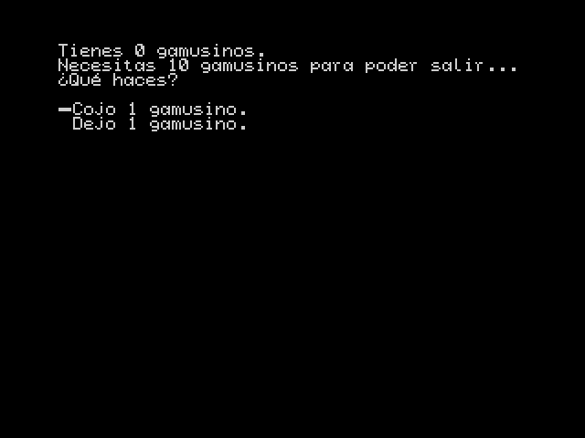

Si elegimos la primera opción, suma 1 a la variable 0, que hace el comando `SET 0 ADD 1`, y la segunda opción resta, y lo hace con `SET 0 SUB 1`.

La primera cosa que puede llamar la atención es que si doy a restar cuando el valor es cero, no hace nada. Esto es correcto, no se puede restar por debajo de cero ni se puede sumar por encima de 255 en las variables.

Y la segunda, ¿dónde está la opción de salir? Vamos a coger gamusinos hasta que tengamos 10, como se nos indica:

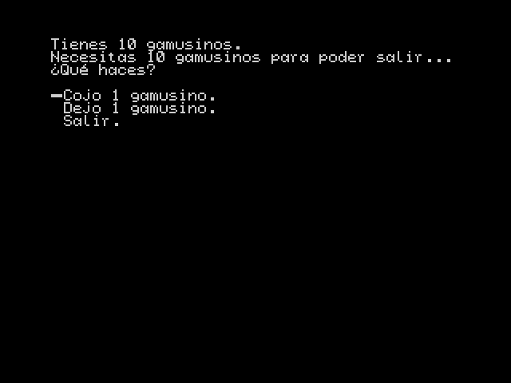

¡Ahora ya podemos salir! El secreto está en los condicionales. Si miramos en la opción de salir, vemos que antes hay `IF 0 <> 10 THEN GOTO Escoger`, lo que significa "Si la variable cero no es igual a 10, saltar a la etiqueta 'Escoger'", lo cual hace que se salte la opción de "Salir" y no se refleje en el menú hasta que el valor de la variable 0 sea 10.

Es decir, con las variables y las condiciones, tenemos las herramientas necesarias para hacer menús de opciones o textos que varíen dependiendo de ciertas condiciones y hacer nuestra aventura más dinámica.

---

## Subrutinas

Las subrutinas son un tipo de salto especial, que guarda en un almacén la posición desde la cual se llamó, y que se puede recuperar posteriormente, pudiendo continuar desde el mismo punto en el que se entró. Éste es un concepto de la programación clásico de "subrutinas" o "subprogramas", para realizar tareas repetitivas y que seguramente suene a los que hayan programado algo en Basic.

Como siempre, vamos a verlo con un ejemplo simple para entenderlo:

```
[[ /* Pone colores de pantalla y la borra */
   PAPER 0    /* Color de fondo negro  */
   BORDER 0   /* Borde de color negro  */
   INK   7    /* Color de texto blanco */
   PAGEPAUSE 1
   SET 0 TO 0
   LABEL Inicio
   CLEAR]]Tienes [[GOSUB ImprimirGamusimos]].
¿Qué haces?

[[OPTION GOTO Suma1]]Cojo 1 gamusino.
[[OPTION GOTO Resta1]]Dejo 1 gamusino.
[[OPTION GOTO Final]]Salir.
[[
   LABEL Escoger  
   CHOOSE
   LABEL Suma1
   SET 0 ADD 1
   GOTO Inicio
   LABEL Resta1
   SET 0 SUB 1
   GOTO Inicio
   LABEL Final]]¡Gracias por jugar!
Al final te quedas con [[GOSUB ImprimirGamusimos]].[[
   WAITKEY
   END
   /* Subrutina de impresión de gamusinos*/
   LABEL ImprimirGamusimos : PRINT @0]] gamusinos[[RETURN]]
```

El ejemplo de los Gamusinos otra vez... Pero esta vez hacemos la impresión del número de Gamusinos dos veces, cuando elegimos una opción y al final del todo. 

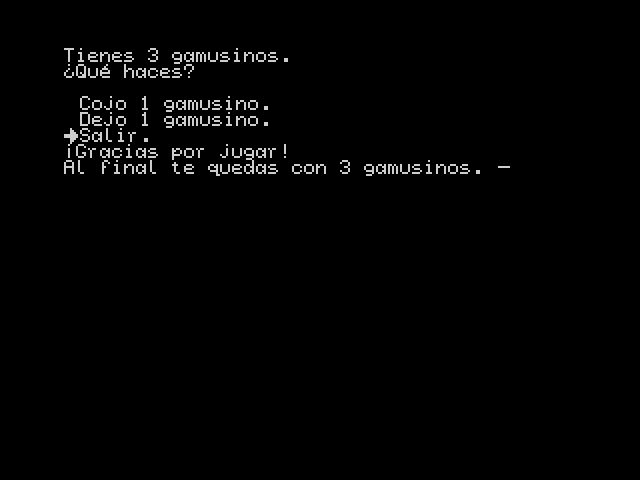

Para ello hacemos una subrutina que realice esta función:

```
[[LABEL ImprimirGamusimos]]Tienes [[PRINT @0]] gamusinos[[RETURN]]
```

Declaramos una etiqueta llamada `ImprimirGamusinos` que sirve de punto de salto. Luego tenemos la impresión del número de gamusinos, y luego el comando `RETURN`. La llamada la realizamos con `GOSUB ImprimirGamusinos` en los dos puntos donde queremos que se ejecute.

Como ya he indicado, `GOSUB ImprimirGamusinos`, lo que hace es hacer un salto a la etiqueta `ImprimirGamusinos`, pero con la salvedad que se guarda en la *pila* el punto de la llamada a la subrutina. Toda subrutina debe tener un punto de retorno, es decir, un punto de finalización con el que se indica al motor que debe volver al punto donde lo habíamos dejado, y eso lo hace el comando `RETURN`, que recupera de la pila el último punto de retorno y salta a esa posición.

Una cosa que hay que fijarse es que la subrutina está al final, después de `END`. Esto es así para que no se ejecute sin que la llamemos explícitamente. Ten en cuenta que el intérprete no diferencia una subrutina de código "normal", y si llega a ese punto la ejecutará y hará un `RETURN` inválido al final. Por ello, recomiendo para evitar estas situaciones, situarlas al final después de un `END`, o usar un `GOTO` delante para saltarla en el caso de que accidentalmente llegue a ella.

Y ahora, como ya es costumbre, las aclaraciones y excepciones. Las subrutinas pueden anidarse, es decir, se puede llamar a una subrutina dentro de otra. Se almacenarán en la pila las direcciones de retorno en orden inverso, pero **CUIDADO, la pila sólo soporta 16 direcciones como máximo**. Esto quiere decir que no puedes superar más de 16 niveles de anidamiento. Y como ya expliqué en el párrafo anterior, si se hace un `RETURN` sin un `GOSUB` previo, tendrás como mínimo un error, y como máximo, comportamiento erróneo.

---

## Compresión de textos y abreviaturas

Para ahorrar espacio en disco, el compilador realiza una compresión de los textos, buscando las subcadenas más comunes en el mismo y sustituyéndolas por "tokens" o abreviaturas.

El guion `MakeAdv.bat` hará que el compilador busque las abreviaturas si no encuentra un fichero de nombre `tokens.json` en su carpeta, y guardará las abreviaturas encontradas en un fichero con dicho nombre. Por el contrario, si encuentra este fichero, se lo pasará como parámetro al compilador para que utilice las abreviaturas contenidas en él. Para que vuelva a buscar abreviaturas de nuevo, simplemente con borrar el fichero `tokens.json` antes de ejecutarlo.

El proceso de búsqueda de abreviaturas puede ser muy costoso conforme se incrementa la cantidad de texto en la aventura. Mi consejo es escribir el guion de la aventura *antes* de ponernos a programar y ponerlo todo en un fichero de texto que le pasaremos al compilador, para que nos genere un fichero de abreviaturas adecuado. Una vez lo tengamos, ya podemos ir añadiendo comandos a dicho texto para ir dando forma a la aventura.  Una vez que ya la tengas *casi* finalizada, puedes volver a generar abreviaturas para ver si se puede rascar algo más de espacio.

---

## Flujo de trabajo

A partir de este momento ya deberías tener suficientes conocimientos para poder abordar tu propia aventura. A partir de aquí no te puedo dar consejos para escribir tu aventura, eso ya es trabajo de tu imaginación. Sin embargo, voy a recomendarte un flujo de trabajo que basado en la experiencia de desarrollar la aventura *Los Anillos de Saturno*, que presenté al concurso de Aventuras 2023 de Radastán.

Mi primera recomendación es escribir **antes** el grueso de tu aventura, como ya habrás leído en el capítulo anterior. Con eso tendrás una lista de abreviaturas válida para empezar a trabajar, ya que el proceso de búsqueda de abreviaturas es **muy costoso**. Para que te hagas una idea, comprimir *Los anillos de Saturno* completo (Un libro de unas 150 páginas) tarda hasta tres cuartos de hora. Además, nuestro flujo de trabajo va a consistir esencialmente en escribir, compilar y probar una y otra vez, así que nos interesa que este proceso sea lo más rápido posible.

Puedes escribir tu aventura con tu editor de texto favorito, pero siempre **en texto plano**, ya que es lo que entiende el compilador.

Un tema importante al trabajar con el editor es la codificación de los textos. Un fichero dentro del disco es una colección de bits ordenados con un nombre, el ordenador no "sabe" qué hacer con esos bits; son los programas quienes interpretan esos bits.

Un fichero de texto es un fichero cuyos bits representan caracteres. La forma de interpretar esos caracteres se le llama **codificación**. La codificación más famosa empleada desde comienzos de la Informática es **ASCII**, cuyo estándar soporta 128 caracteres, pensada para el idioma inglés y con ampliaciones a 256 para caracteres internacionales y especiales. Hoy en día, ASCII se ha quedado pequeño, y la codificación empleada de forma estándar por todos los editores de texto actuales por defecto es **UTF-8**.

Todos los editores actuales soportan múltiples codificaciones, con lo que tendrás que investigar el funcionamiento de tu editor para seleccionar la codificación correcta.

El compilador de **CYD** soporta textos en formato UTF-8, pero tienes que tener en cuenta una serie de limitaciones cuando escribas tu texto o lo copies desde otra fuente. El juego de caracteres por defecto del motor es el siguiente:


Ésos son los caracteres de que dispones y UTF-8 dispone de *millones* de distintas grafías, y no estoy exagerando, con lo la mayor parte de ellos darán error con el compilador. En el manual detallo los únicos caracteres que se traducirán desde UTF-8 a la codificación empleada por el motor:

| Carácter | Posición |
| -------- | -------- |
| 'ª'      | 16       |
| '¡'      | 17       |
| '¿'      | 18       |
| '«'      | 19       |
| '»'      | 20       |
| 'á'      | 21       |
| 'é'      | 22       |
| 'í'      | 23       |
| 'ó'      | 24       |
| 'ú'      | 25       |
| 'ñ'      | 26       |
| 'Ñ'      | 27       |
| 'ü'      | 28       |
| 'Ü'      | 29       |

Como puedes comprobar no están, por ejemplo, las vocales mayúsculas acentuadas. Ten en cuenta esta limitación.

Una vez escrita una buena parte de tu aventura, y obtenido un fichero de abreviaturas, podemos empezar a programarla.

Mi recomendación es emplear la táctica de "divide y vencerás", una técnica que consiste en dividir un problema a resolver en subproblemas más pequeños que iremos solventando poco a poco. En nuestro contexto, significa que habría que dividir la aventura en secciones que iremos programando una a una. Seguramente ya hayas realizado de forma instintiva este paso al escribir tu relato, dividiéndolo en capítulos.

Con esta subdivisión, ahora trabajaremos con dos ficheros fuente, un *fichero global* con el texto de la aventura "completa", y otro que será el que pasemos con el compilador con la sección que vayamos a programar, que llamaremos *fichero de trabajo*. El proceso consiste en los siguientes pasos:

   1. Copiar una de las secciones no completadas del fichero global al fichero de trabajo.
   2. Añadir los comandos al texto del fichero de trabajo y formatearlo si es preciso.
   3. Compilar el fichero de trabajo.
   4. Ejecutar la imagen resultante en un emulador y probar.
   5. Si no estamos satisfechos, modificar el fichero y volver al paso 3.
   6. Cuando tengamos la sección completa, copiamos la sección completada en el fichero de trabajo y la sustituimos en el fichero global.
   7. Si nos quedan secciones por completar, volver al paso 1.
   8. Pasar la totalidad del fichero global al de trabajo.

Sin embargo, una vez completada la aventura, seguramente tendrás que corregir cosas, compilar y probar de nuevo. Y, dependiendo de la extensión de la aventura, llegar a la parte relevante puede ser un "inferno". Te voy a sugerir varias técnicas para evitar ésto.

Una táctica que podemos emplear es etiquetar con `LABEL` el comienzo de todas y cada una de las secciones (esto lo haríamos en el proceso anterior). Después, simplemente ponemos un `GOTO` a la etiqueta de la sección que queramos probar al principio de la aventura. Al ejecutarse ésta, saltaría directamente a la sección relevante, con lo que nos ahorramos un tiempo precioso. ¡Recuerda luego quitar el `GOTO` inicial!

Otra técnica que he empleado es la de anular las pausas. Para ello me ayudo de la posibilidad del compilador de poder usar comentarios dentro de las secciones de código. Mediante nuestro editor de texto, podemos reemplazar todas las apariciones del comando `WAITKEY`, por ejemplo, con el texto `/*WAITKEY*/`. Al compilar de nuevo, al estar esos comandos comentados no se ejecutarán y se mostrará todo sin parar. Cuando queramos deshacer el cambio, hacemos el proceso contrario, reemplazamos `/*WAITKEY*/` por `WAITKEY`. Para acelerar este proceso más, podemos incluso introducir los comandos comentados en la fase anterior.

Por último, casi todos emuladores modernos ofrecen la posibilidad de acelerar la velocidad de ejecución. Podemos aprovechar esta ventaja para mostrar el texto más rápido de lo normal.

Espero que estas técnicas te ayuden a crear tu aventura de la manera más cómoda posible. Programar es un proceso iterativo de escribir, compilar, ejecutar y probar, y puede resultar monótono, pero también muy satisfactorio cuando obtenemos el resultado deseado.

---
