# Tutorial de Choose Your Destiny

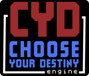

- [Tutorial de Choose Your Destiny](#tutorial-de-choose-your-destiny)
  - [Introducción](#introducción)
  - [Instalación](#instalación)
    - [Windows](#windows)
    - [Linux, BSDs, etc. (Experimental)](#linux-bsds-etc-experimental)
    - [Resaltador para VSCode](#resaltador-para-vscode)
  - [Preparando nuestra primera aventura](#preparando-nuestra-primera-aventura)
  - [Formato del fichero fuente](#formato-del-fichero-fuente)
  - [Saltos y etiquetas](#saltos-y-etiquetas)
  - [Opciones](#opciones)
  - [Pausas y esperas](#pausas-y-esperas)
  - [Disposición del texto en pantalla](#disposición-del-texto-en-pantalla)
  - [Imágenes](#imágenes)
  - [Efectos de sonido (Beeper)](#efectos-de-sonido-beeper)
  - [Versiones para los diferentes modelos de Zx Spectrum](#versiones-para-los-diferentes-modelos-de-zx-spectrum)
  - [Música (AY)](#música-ay)
  - [Variables](#variables)
  - [Declaración de variables](#declaración-de-variables)
  - [Subrutinas](#subrutinas)
  - [Ejecución condicional](#ejecución-condicional)
  - [Bucles](#bucles)
  - [Compresión de textos y abreviaturas](#compresión-de-textos-y-abreviaturas)
  - [Organización del Código con INCLUDE](#organización-del-código-con-include)
  - [Flujo de trabajo](#flujo-de-trabajo)
  - [Menús con desplazamiento lateral](#menús-con-desplazamiento-lateral)
  - [Copia de fragmentos de imagen a pantalla](#copia-de-fragmentos-de-imagen-a-pantalla)
  - [Leyendo el teclado, arrays de variables e indirecciones](#leyendo-el-teclado-arrays-de-variables-e-indirecciones)
    - [Indirección](#indirección)
    - [Lectura del teclado (INKEY)](#lectura-del-teclado-inkey)
    - [Borrar carácteres y hacer saltos de línea (BACKSPACE y NEWLINE)](#borrar-carácteres-y-hacer-saltos-de-línea-backspace-y-newline)
  - [Usar el juego de caracteres alternativo](#usar-el-juego-de-caracteres-alternativo)
  - [Ventanas](#ventanas)
  - [Arrays o secuencias](#arrays-o-secuencias)
  - [Datos inmutables (DATA)](#datos-inmutables-data)
  - [Constantes anchas (WORD, DWORD y cadenas)](#constantes-anchas-word-dword-y-cadenas)
  - [Más comodidades: SELECT, ENUM, SWAP y literales](#más-comodidades-select-enum-swap-y-literales)
  - [Alterar el juego de caracteres](#alterar-el-juego-de-caracteres)

---

## Introducción

**ChooseYourDestiny** (o **CYD** para abreviar) es una entorno que te permitirá crear la experiencia de los librojuegos en tu Spectrum. La herramienta consiste en un compilador que, mediante un lenguaje sencillo sobre un texto ya preparado, te permite añadir interactividad y efectos visuales y sonoros para "jugar" a este tipo de aventuras.

A la hora de diseñar este tipo de herramientas hay diferentes aproximaciones. Se puede diseñar una herramienta sencilla, de fácil manejo y conprensión para cualquiera, pero a costa de reducir su flexibilidad. O se puede coger un compilador de un lenguaje general para Spectrum como **ZxBasic** de Boriel o **Z88DK**, donde ya se tiene que tener conceptos avanzados de la máquina y meterse, si fuese necesario, incluso con ensamblador. Para **CYD** decidí tomar una aproximación intermedia: un lenguaje de programación basado en marcas sencillo, pero lo suficientemente flexible para poder crear casi cualquier cosa que se desee, pero lo suficientemente simplificado para centrarte en los aspectos creativos en lugar de los técnicos.

Por ello, se ha creado este tutorial para introducir conceptos que te permitan comprender el funcionamiento y empezar a hacer tus propias aventuras. Este documento está en constante revisión y actualización pero puede estar un poco desfasado con respecto a la distribución de referencia, con lo que la referencia de información absoluta será siempre el manual, el cual siempre se actualiza con la herramienta. Recomiendo que siempre lo tengas a mano.

Además, también dispones de ejemplos en la carpeta `examples` de la distribución, con los que podrás jugar y aprender de ellos, y que seguramente te darán muchas ideas para tus propias creaciones. Para probarlas, simplemente copia el contenido de cada carpeta de ejemplo y cópialo en el directorio raíz de la distribución, sobreescribiendo los ficheros. Si tienes algo ya hecho que desees conservar, **recuerda copiarlo a otra parte antes**.

Con esto, espero que te sirva para crear aventuras que podamos disfrutar todos.

## Instalación

### Windows

Para instalar en Windows 10 (64 bits) o superiores, descarga el archivo `ChooseYourDestiny.Win_x64.zip` de la sección [Releases](https://github.com/cronomantic/ChooseYourDestiny/releases) del repositorio y descomprímelo en una carpeta llamada Tutorial, que puedes crear donde creas conveniente. El guion para montar aventuras se llama `make_adv.cmd`, tendrás que ejecutarlo para compilar la aventura. Te recomiendo hacerlo desde la línea de comandos.

### Linux, BSDs, etc. (Experimental)

Antes tienes que cumplir los prerrequisitos, para ello consulta la sección relevante del [manual](MANUAL_es).

Luego descarga el archivo `ChooseYourDestiny.Linux_x64.zip` de la sección [Releases](https://github.com/cronomantic/ChooseYourDestiny/releases) del repositorio y descomprímelo en una carpeta llamada Tutorial, que puedes crear donde creas conveniente. El guion para montar aventuras se llama `make_adv.cmd`, tendrás que ejecutarlo para compilar la aventura. Te recomiendo hacerlo desde la línea de comandos.

### Resaltador para VSCode

Para escribir el código más fácilmente, dispones de un [resaltador](https://github.com/cronomantic/chooseyourdestiny-highlighter/releases) el archivo `chooseyourdestiny-highlighter-x.x.x.vsix desde Releases`. En VsCode, ve a la pantalla de extensiones, y en el botón ..., se abrirá un nuevo menú. Desde ahí, selecciona la opción Instalar desde VSIX y abre el archivo anterior.

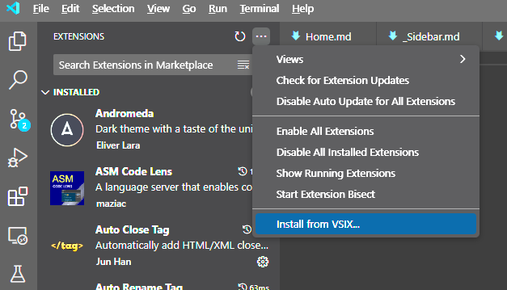

De lo contrario, descarga este repositorio y copia la carpeta en la carpeta `<user home>/.vscode/extensions` y reinicia Code. Si tu instalación de Code es portable, debe copiarse en la carpeta `data/extensions/` dentro de la carpeta donde tengas instalado VSCode.

---

## Preparando nuestra primera aventura

Lo primero que vamos a hacer es cambiar un par de cosas para poder generar una aventura personalizada.

Si estás usando Windows, abre el fichero `make_adv.cmd` con cualquier editor de texto y verás esto al principio:

```batch
REM ---- Configuration variables ----------

REM Name of the game
SET GAME=test
REM This name will be used as:
REM   - The file to compile will be test.cyd with this example
REM   - The name of the TAP file or +3 disk image

REM Target for the compiler (48k, 128k for TAP, plus3 for DSK)
SET TARGET=48k

REM Number of lines used on SCR files at compressing
SET IMGLINES=192

REM Loading screen
SET LOAD_SCR="LOAD.scr"

REM Parameters for compiler
SET CYDC_EXTRA_PARAMS=

REM ------
```

Lo primero que vamos a hacer es poner nuestro nombre a la aventura que vamos a crear. Por ejemplo, la llamaremos `Tutorial`:

```batch
REM ---- Configuration variables ----------

REM Name of the game
SET GAME=Tutorial
REM This name will be used as:
REM   - The file to compile will be test.cyd with this example
REM   - The name of the TAP file or +3 disk image

REM Target for the compiler (48k, 128k for TAP, plus3 for DSK)
SET TARGET=48k

REM Number of lines used on SCR files at compressing
SET IMGLINES=192

REM Loading screen
SET LOAD_SCR="LOAD.scr"

REM Parameters for compiler
SET CYDC_EXTRA_PARAMS=

REM ------
```

Si usas otro sistema operativo, el proceso es similar con `make_adv.sh`:

```bash
# ---- Configuration variables ----------
# Name of the game
GAME="Tutorial"
# This name will be used as:
#   - The file to compile will be test.cyd with this example
#   - The name of the TAP file or +3 disk image
#
# Target for the compiler (48k, 128k for TAP, plus3 for DSK)
TARGET="48k"
#
# Number of lines used on SCR files at compressing
IMGLINES="192"
#
# Loading screen
LOAD_SCR="./LOAD.scr"
#
# Parameters for compiler
CYDC_EXTRA_PARAMS=
# --------------------------------------
```

Guardamos el fichero y ahora creamos un fichero nuevo de texto, llamado `Tutorial.cyd`. En éste fichero, escribimos esto:

```
Hola Mundo[[WAITKEY]]
```

Y lo guardamos en el mismo sitio que `make_adv.cmd` y `make_adv.sh`. Ejecutamos el fichero CMD y si todo va bien, habrá creado un fichero de cinta llamado Tutorial.TAP, que puedes ejecutar con tu emulador favorito.

## Formato del fichero fuente

Al lanzar el fichero TAP resultante con un emulador, sale esto:

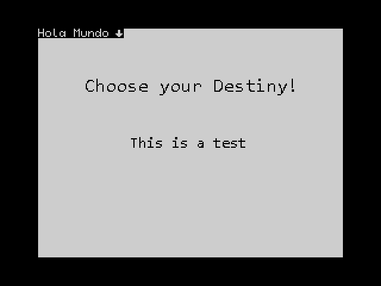

Vamos a analizar lo que sucede...

Aparte de `GAME`, otra variable importante es `TARGET`, la cual indica el modelo de Spectrum y el tipo de archivo de salida a emplear. De momento usaremos el valor `48k`, que luego cambiaremos cuando deseemos características más avanzadas.

Volviendo al código de la aventura, vemos que se pinta el texto *Hola Mundo* y después sale una especie de cursor. Si pulsamos la tecla `Enter` o `Space`, se reinicia el programa. Si volvemos al código:

```
Hola Mundo[[WAITKEY]]
```

Hay dos partes diferenciadas, una es el *Hola Mundo*, y después *[[WAITKEY]]*. La segunda parte es un comando que se le manda al intérprete para que saque ese cursor animado y espere la pulsación de una tecla. Esto es la base fundamental para entender cómo funciona el compilador: **Todo lo que se encuentre entre `[[` y `]]` se considera código o comandos para el motor y todo lo que esté fuera se considera texto imprimible**.

Para entender ésto mejor, vamos a hacer un experimento. Vamos a poner un salto de línea detrás de los dos corchetes abiertos, tal que así:

```
Hola Mundo[[
WAITKEY]]
```

Si compilamos y cargamos el juego, vemos que sale lo mismo. Ahora, borramos el salto de línea que hemos puesto y lo ponemos **antes** de los dobles corchetes:

```
Hola Mundo
[[WAITKEY]]
```

Si compilamos y cargamos de nuevo, vemos que ahora el icono está en la siguiente línea:

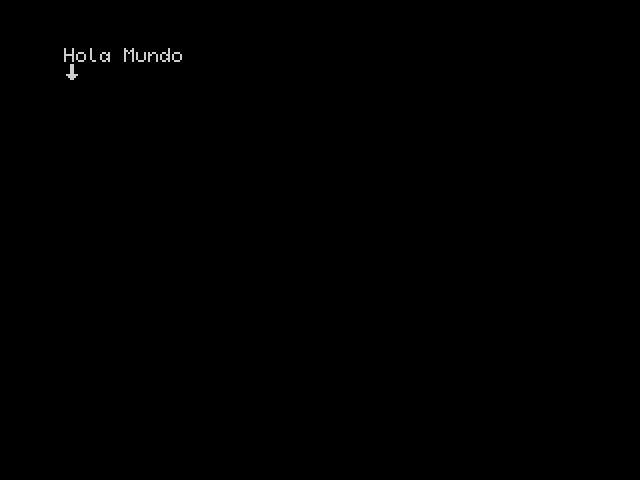

Eso es debido a que el salto de línea, al estar fuera de los dobles corchetes, es considerado texto imprimible y, por tanto, el icono de espera pasa a la siguiente línea. Ten en cuenta estas situaciones cuando escribas la aventura.

Dejemos de momento esto como estaba y vamos a añadir más comandos. Teclea esto dentro de `Tutorial.cyd`:

```
[[CLEAR]]Hola Mundo[[WAITKEY]]
```

Ahora hemos puesto un comando por delante del texto. Si compilamos y ejecutamos, obtenemos esto:

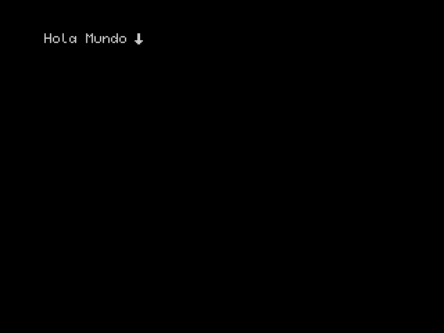

Con el comando CLEAR borramos la zona imprimible que, de momento, es la pantalla completa. Como la pantalla se borra automáticamente al iniciarse el intérprete, no veremos de momento nada, pero con este comando tendremos la pantalla limpia para imprimir desde el comienzo. Tienes una referencia completa de los comandos en el [manual](https://github.com/cronomantic/ChooseYourDestiny/blob/main/MANUAL_es.md).

Ahora vamos a cambiar el color del texto. Para ello vamos a usar el comando INK n, donde n es un número del 0 al 7 que corresponde con los colores del Spectrum. Por defecto es blanco, así que vamos a ponerlo de color cian, que es el número 5, con lo que sería INK 5. Lo pondremos antes del CLEAR, tal que así:

```
[[INK 5]][[CLEAR]]Hola Mundo[[WAITKEY]]
```

El resultado es...

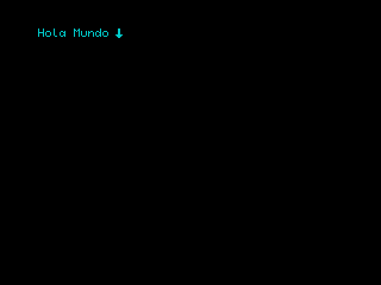

Pero el color es un poco apagado... ¡Vamos a darle brillo!
Para ello usamos el comando BRIGHT 1, (de nuevo, mirar la referencia en el [manual](https://github.com/cronomantic/ChooseYourDestiny/blob/main/MANUAL_es.md)), de esta manera:

```
[[INK 5]][[BRIGHT 1]][[CLEAR]]Hola Mundo[[WAITKEY]]
```


Esto ya está mejor.

Pero tanto corchete puede ser bastante confuso y poco agradable a la vista. Como ya he indicado, cada vez que se encuentra `[[`, el compilador interpreta que lo siguiente son comandos. ¿Cómo podemos encadenarlos sin estar abriendo y cerrando corchetes? Pues hay dos maneras:

- Mediante saltos de línea:

```
[[
    INK 5
    BRIGHT 1
    CLEAR
]]Hola Mundo[[WAITKEY]]
```

- Mediante dos puntos en la misma línea:

```
[[ INK 5 : BRIGHT 1 : CLEAR ]]Hola Mundo[[ WAITKEY ]]
```

Las dos variantes anteriores producirán el mismo resultado y son equivalentes.

Un último punto son los comentarios. Dentro del código podemos poner comentarios encerrándolos con `/*` y `*/`:

```
[[
    INK 5     /* Imprime en color Cyan */
    BRIGHT 1  /* Activamos brillo */
    CLEAR     /* Borramos la pantalla */
]]Hola Mundo[[
  WAITKEY     /* Espera a pulsar tecla */
]]
```

Con esto ya deberías tener una buena noción de cómo funciona el código fuente de CYD.

---

## Saltos y etiquetas

En el ejemplo del capítulo anterior, habrás notado que cuando pulsamos la tecla de selección, se resetea el Spectrum. Eso es debido a que al pulsar la tecla de validación (estando en espera con WAITKEY), llega al final del fichero. Cuando esto sucede, se reinicia el Spectrum. Podemos hacer lo mismo usando el comando END en cualquier parte del código.

Pero no queremos que haga eso. Queremos que vuelva a empezar de nuevo. Para ello copia lo siguiente en el fichero fuente:

```
[[
  LABEL principio
  INK 5
  BRIGHT 1
  CLEAR
]]Hola Mundo[[
  WAITKEY
  GOTO principio
]]
```

Cuando compiles y ejecutes, no se verá muy bien, pero notarás que cuando pulses la tecla de validación, no se reinicia, sino que borra la pantalla y vuelve a imprimir el texto y hacer la espera.

Los dos añadidos al código son `LABEL principio` y `GOTO principio`. El primer comando no es en realidad un comando, sino una etiqueta, que lo que hace es poner un marcador es ese punto con un identificador de nombre *principio*; y el segundo lo que hace es indicar al intérprete que salte hacia donde se encuentre la etiqueta *principio*.

El resultado es que, al pulsar la tecla de validación con WAITKEY, se encuentra el `GOTO principio` y salta hacia donde está declarada la etiqueta *principio* que, al ser el comienzo, lo que hace es volver a ejecutar todos los comandos posteriores e imprimir el texto *Hola Mundo*, y esperar con WAITKEY de nuevo... En resumen, hemos hecho un bucle infinito.

Sin embargo, podemos mejorar el ejemplo así:

```
[[
  INK 5
  BRIGHT 1
  LABEL principio
  CLEAR
]]Hola Mundo[[
  WAITKEY
  GOTO principio
]]
```

Ahora la etiqueta está declarada justo antes del borrado de la pantalla, y allí irá cuando se alcance el GOTO, dejando sin ejecutar de nuevo el INK y el BRIGHT. ¿Por qué? Pues porque ya no es necesario ejecutarlos otra vez, ya hemos puesto el color del texto y el brillo al principio y ¡ejecutarlos de nuevo es redundante!

El concepto de etiquetas y saltos es fundamental para comprender cómo hacer un "Elige tu propia aventura", ya que presentaremos opciones al jugador, y dependiendo de esas opciones, iremos de un lugar a otro del texto.

Un importante detalle es el formato de los identificadores de etiquetas. Éstos sólo pueden ser una **secuencia de cifras y letras o el carácter de subrayado seguidos, y debe empezar por una letra. No se admiten acentos o la ñ**. Es decir, `LABEL 1` o `LABEL La Etiqueta` no son válidos, pero `LABEL l1` o `LABEL LaEtiqueta` sí lo son. Además son sensibles al caso, es decir, que **se distinguen mayúsculas y minúsculas**, con lo que `LABEL Etiqueta` y `LABEL etiqueta` no son la misma etiqueta. Y, obviamente, no se puede declarar una etiqueta con el mismo nombre dos veces.

Por el contrario, los comandos no son sensibles al caso, es decir, que `CLEAR`, `clear` ó `Clear`, son perfectamente válidos. Sin embargo, yo recomiendo ponerlos en mayúsculas para distinguirlos mejor.

A partir de la versión 0.5 se ha añadido una forma corta de declarar etiquetas, anteponiendo el carácter `#` al nombre de la etiqueta, con lo que `LABEL Etiqueta` puede escribirse como `#Etiqueta`. De tal manera, el ejemplo anterior lo podemos escribir así:

```
[[
  INK 5
  BRIGHT 1
  #principio
  CLEAR
]]Hola Mundo[[
  WAITKEY
  GOTO principio
]]
```

---

## Opciones

Las opciones es el punto más importante del motor. De nuevo, vamos a verlo con el ejemplo del manual:

```
[[ /* Pone colores de pantalla y la borra */
   PAPER 0    /* Color de fondo negro  */
   INK   7    /* Color de texto blanco */
   BORDER 0   /* Borde de color negro  */
   CLEAR      /* Borramos la pantalla*/
]][[ LABEL Localidad1]]Estás en la localidad 1. ¿Donde quieres ir?
[[ OPTION GOTO Localidad2 ]]Ir a la localidad 2
[[ OPTION GOTO Localidad3 ]]Ir a la localidad 3
[[ CHOOSE ]]
[[ LABEL Localidad2 ]]¡¡¡Lo lograste!!!
[[ GOTO Final ]]
[[ LABEL Localidad3 ]]¡¡¡Estas muerto!!!
[[ GOTO Final]]
[[ LABEL Final : WAITKEY: END ]]
```

Al compilar y ejecutar tenemos esto:

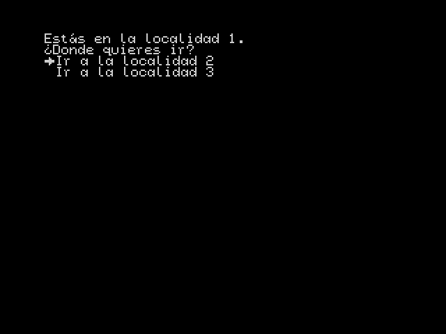

Nos aparecen dos opciones que podemos elegir con las teclas **P** y **Q** y seleccionar una con **Space** o **Enter**.
Si elegimos la primera opción, nos sale esto:

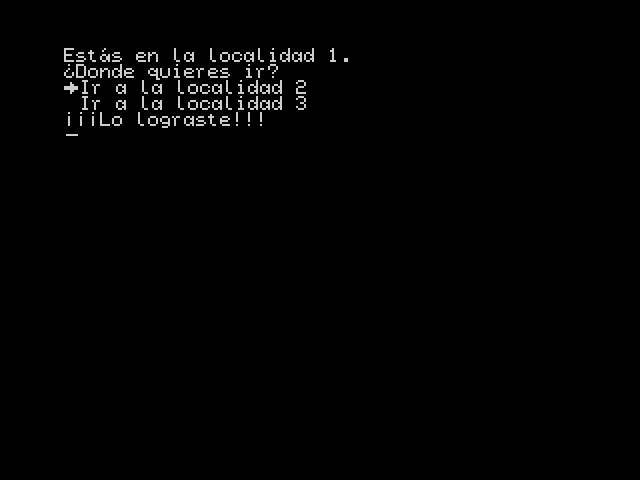

Y si elegimos la segunda:

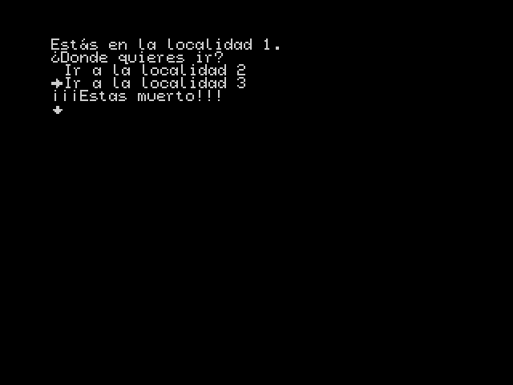

Con el comando `OPTION GOTO etiqueta`, lo que hacemos es declarar una opción seleccionable. El lugar donde esté el cursor en ese momento será el punto donde aparezca el icono de opción. Vamos a recolocar un poco las opciones para ilustrar esto último:

```
[[ /* Pone colores de pantalla y la borra */
   PAPER 0    /* Color de fondo negro  */
   INK   7    /* Color de texto blanco */
   BORDER 0   /* Borde de color negro  */
   CLEAR      /* Borramos la pantalla*/
]][[ LABEL Localidad1]]Estás en la localidad 1.
¿Donde quieres ir?

  [[ OPTION GOTO Localidad2 ]]Ir a la localidad 2

  [[ OPTION GOTO Localidad3 ]]Ir a la localidad 3
[[ CHOOSE ]]
[[ LABEL Localidad2 ]]¡¡¡Lo lograste!!!
[[ GOTO Final ]]
[[ LABEL Localidad3 ]]¡¡¡Estas muerto!!!
[[ GOTO Final]]
[[ LABEL Final : WAITKEY: END ]]
```

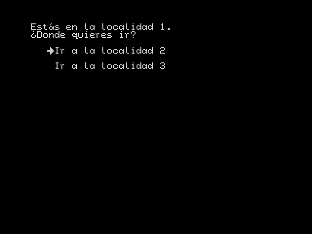

Como se puede ver, hemos separado las opciones con saltos de línea y puesto dos espacios de sangrado por delante del comando `OPTION GOTO` y eso se refleja en el resultado final.

Una vez declaradas las opciones, con el comando `CHOOSE`, activamos el menú, que nos permitirá elegir entre una de las opciones que ya estuviesen en pantalla. Cuando seleccionemos una, se saltará a la etiqueta indicada en el correspondiente `OPTION GOTO`. En el ejemplo, Si seleccionamos la primera opción, `OPTION GOTO Localidad2`, saltará a la etiqueta `LABEL Localidad2` e imprimirá *Lo lograste* y luego saltará a la etiqueta `LABEL Final`. El `GOTO Final` es necesario hacerlo, porque si no, nos imprimiría *¡¡¡Lo lograste!!!* y después *¡¡¡Estas muerto!!!*; el `GOTO` es necesario, en este caso, para evitar que se ejecute el resultado de la segunda opción.

Como nota adicional con `CHOOSE`, sólo se permiten un máximo de 32 opciones y un mínimo de una (inútil, pero se permite). Fuera de ese rango el intérprete dará un error.

También destacar que hay una variante de `CHOOSE` temporizada, compila y ejecuta esto sin seleccionar nada en el menú:

```
[[ /* Pone colores de pantalla y la borra */
   PAPER 0    /* Color de fondo negro  */
   INK   7    /* Color de texto blanco */
   BORDER 0   /* Borde de color negro  */
   CLEAR      /* Borramos la pantalla*/
]][[ LABEL Localidad1]]Estás en la localidad 1.
¿Donde quieres ir?

  [[ OPTION GOTO Localidad2 ]]Ir a la localidad 2

  [[ OPTION GOTO Localidad3 ]]Ir a la localidad 3
[[ CHOOSE IF WAIT 500 THEN GOTO Localidad3]]
[[ LABEL Localidad2 ]]¡¡¡Lo lograste!!!
[[ GOTO Final ]]
[[ LABEL Localidad3 ]]¡¡¡Estas muerto!!!
[[ GOTO Final]]
[[ LABEL Final : WAITKEY: END ]]
```

Te darás cuenta de que al pasar unos 10 segundos, ha mostrado *¡¡¡Estas muerto!!!*.

Lo que hace `CHOOSE IF WAIT 500 THEN GOTO Localidad3` es lo mismo que `CHOOSE`, activar la selección de opciones, pero con la salvedad que también realiza una cuenta atrás, en este caso desde 500. Si dicha cuenta atrás llega a cero sin seleccionarse nada, entonces se hace el salto a la etiqueta indicada; en este caso *Localidad3*.
El contador funciona en base a los fotogramas del Spectrum, es decir, 1/50 de segundo, con lo que 500/50 = 10 segundos. Esto lo veremos en el siguiente capítulo.

De nuevo, el código anterior lo podríamos reescribir así con la forma acortada de las etiquetas:

```
[[ /* Pone colores de pantalla y la borra */
   PAPER 0    /* Color de fondo negro  */
   INK   7    /* Color de texto blanco */
   BORDER 0   /* Borde de color negro  */
   CLEAR      /* Borramos la pantalla*/
]][[ #Localidad1 ]]Estás en la localidad 1.
¿Donde quieres ir?

  [[ OPTION GOTO Localidad2 ]]Ir a la localidad 2

  [[ OPTION GOTO Localidad3 ]]Ir a la localidad 3
[[ CHOOSE IF WAIT 500 THEN GOTO Localidad3]]
[[ #Localidad2 ]]¡¡¡Lo lograste!!!
[[ GOTO Final ]]
[[ #Localidad3 ]]¡¡¡Estas muerto!!!
[[ GOTO Final]]
[[ #Final : WAITKEY: END ]]
```

A partir de este momento, usaré la forma abreviada para las etiquetas.

Con esto ya tenemos las bases para hacer un "Elije tu propia aventura" básico. Pero todavía tenemos muchas más posibilidades que explorar...

---

## Pausas y esperas

En los ejemplos anteriores ya habrás visto el comando `WAITKEY`. Ese comando genera una pausa, con un icono animado, en espera de que se pulse la tecla de confirmación. Con eso puedes controlar la visualización del texto y evitar que el usuario tenga que leer un muro de texto de una sentada, además de permitir controlar la presentación.

Un ejemplo sería cuando se está acabando la "página" y queremos que el usuario pulse una tecla para pasar a la siguiente, que podemos hacer así:

```
Texto al final de la página.[[
  WAITKEY
  CLEAR
]]Texto al principio de la siguiente página.
```

Con el `WAITKEY` hacemos la espera, y al confirmar, con el `CLEAR` siguiente borramos el texto en pantalla y comenzamos a escribir desde el principio de lo que sería la siguiente "página".

Sin embargo, hay una opción para que CYD haga esto por sí solo. El comportamiento por defecto cuando acabamos de imprimir en la última línea es borrar completamente la pantalla y seguir escribiendo; pero con el comando `PAGEPAUSE` podemos activar un comportamiento alternativo. Si indicamos `PAGEPAUSE 1`, por ejemplo, cuando se acabe el espacio disponible, generará automáticamente una espera para que el usuario pulse la tecla de confirmación antes de borrar la pantalla y seguir imprimiendo.

Además, también se dispone de esperas "temporizadas", siendo `CHOOSE IF WAIT X THEN GOTO Y` del capítulo anterior un ejemplo. Cuando se ejecutan, un contador se carga con el valor que se pasa como parámetro y se realiza una cuenta atrás hasta que el contador llega a cero. El contador se decrementa una vez cada fotograma del Spectrum, es decir, una vez cada 1/50 de segundo, o lo que es lo mismo, 50 veces por segundo. De tal manera que, si queremos esperar un segundo, tenemos que poner el contador a 50.

Con ésto, ya tenemos lo necesario para conocer los comandos:

- Con el comando `WAIT`, se realiza una espera incondicional, es una detención hasta que se agote el contador.

```
Espera tres segundos[[WAIT 150]]
Ya está[[WAITKEY]]
```

- El comando `PAUSE` es una combinación de `WAITKEY` y `WAIT`, se realiza una espera hasta que se agote el contador ó el usuario pulse la tecla de confirmación, podríamos considerarlo un `WAITKEY` con caducidad.

```
Espera tres segundos o pulsa una tecla[[PAUSE 150]]
Ya está[[WAITKEY]]
```

- `CHOOSE IF WAIT X THEN GOTO Y` ya ha sido explicado el en capítulo anterior, si se agota el contador antes de que se seleccione una opción del menú, se realiza el salto indicado.

Para terminar, hablar del comando `TYPERATE`, que es un poco especial comparado con el resto de los comandos de espera. Con este comando indicamos la espera que se produce cada vez que se imprime un carácter. Ésta espera no está ajustada a los fotogramas, sino que es un contador que ya depende de la velocidad del procesador (más rápido). La idea de este comando es la de escribir de forma más pausada y paulatina, para ciertas situaciones "dramáticas".

```
[[TYPERATE 100]]Esto imprime lento
[[TYPERATE 0]]Esto imprime normal[[WAITKEY]]
```

---

## Disposición del texto en pantalla

Una de las partes más importantes para el diseño de una aventura con CYD es ajustar la presentación del texto. CYD no "sabe" como presentar el texto. Como autores, tenemos que ayudarle.

Podemos visualizar su comportamiento imaginando que en la pantalla hay un cursor invisible que va imprimiendo el texto de izquierda a derecha y de arriba a abajo. El motor siempre procura que las palabras no se dividan, de tal manera que si la siguiente palabra no cabe en lo que queda de línea, salta a la línea siguiente y la imprime allí. Se considera una palabra cualquier texto separado por espacios.

Pongamos un texto tipo *Loren ipsum*, todo seguido, sin saltos de línea:

```
[[ /* Pone colores de pantalla y la borra */
   PAPER 0    /* Color de fondo negro  */
   INK   7    /* Color de texto blanco */
   BORDER 0   /* Borde de color negro  */
   CLEAR      /* Borramos la pantalla*/
   PAGEPAUSE 1
]]Lorem ipsum dolor sit amet, consectetur adipiscing elit. Nam eget pretium felis. Quisque tincidunt tortor eget libero fermentum, rutrum aliquet nisl semper. Pellentesque id eros non leo ullamcorper hendrerit. Fusce pretium bibendum lectus, vel dignissim velit interdum quis. Integer vel ipsum ac elit tincidunt vulputate. Mauris sagittis sapien in justo pretium cursus. Proin nec tincidunt purus, et tempus metus. Nunc dapibus vel ante eu dictum. Donec vestibulum scelerisque orci in tempus. Nunc quis velit id velit faucibus tempus vel id tellus.[[ WAITKEY: END ]]
```

El resultado:

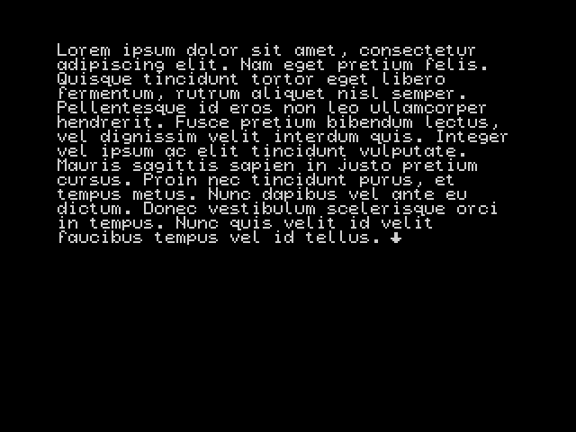

Puedes ver que las palabras que no caben en su renglón continúan en la línea siguiente sin cortarse.

Cuando el cursor de impresión llega a la última línea y debe pasar a la siguiente, se borra la pantalla y sigue imprimiendo desde el origen de la pantalla, arriba a la izquierda; excepto si se usa el comando `PAGEPAUSE`, que genera una espera de confirmación antes de borrar la pantalla.

Podemos maquetar la pantalla adecuadamente usando espacios y saltos de línea según convenga, pero si queremos hacer una sangría o tabulaciones, dispones del comando `TAB pos`, que imprime tantos espacios como los indicados en el parámetro:

```
[[ /* Pone colores de pantalla y la borra */
   PAPER 0    /* Color de fondo negro  */
   INK   7    /* Color de texto blanco */
   BORDER 0   /* Borde de color negro  */
   CLEAR      /* Borramos la pantalla*/
   PAGEPAUSE 1
]]Texto normal
[[TAB 5]]Texto 5 posiciones a la derecha.[[ WAITKEY: END ]]
```

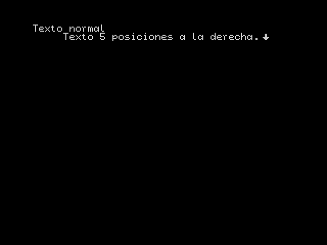

El comand `TAB` nos permite ahorrar memoria ya que, si queremos imprimir 10 espacios, consumirán más esos 10 espacios que usar el comando `TAB 10`.

De la misma manera, tenemos el comando `REPCHAR` para imprimir cualquier carácter de forma repetida:

```
[[ /* Pone colores de pantalla y la borra */
   PAPER 0    /* Color de fondo negro  */
   INK   7    /* Color de texto blanco */
   BORDER 0   /* Borde de color negro  */
   CLEAR      /* Borramos la pantalla*/
   PAGEPAUSE 1
]]Texto normal
[[ TAB 5 ]]Texto 5 posiciones a la derecha.
[[ REPCHAR 35, 10 ]]
[[ WAITKEY: END ]]
```

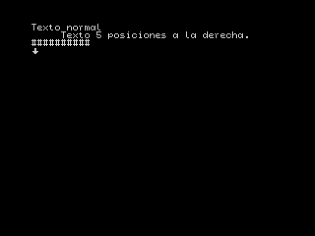

Esto repite el carácter número 35 (la almohadilla), 10 veces. Y si queremos imprimirlo sólo una vez, tenemos el comando `CHAR`:

```
[[ /* Pone colores de pantalla y la borra */
   PAPER 0    /* Color de fondo negro  */
   INK   7    /* Color de texto blanco */
   BORDER 0   /* Borde de color negro  */
   CLEAR      /* Borramos la pantalla*/
   PAGEPAUSE 1
]]Texto normal
[[ TAB 5 ]]Texto 5 posiciones a la derecha.
[[ REPCHAR 35, 10 ]]
[[ CHAR 35 ]]
[[ WAITKEY: END ]]
```

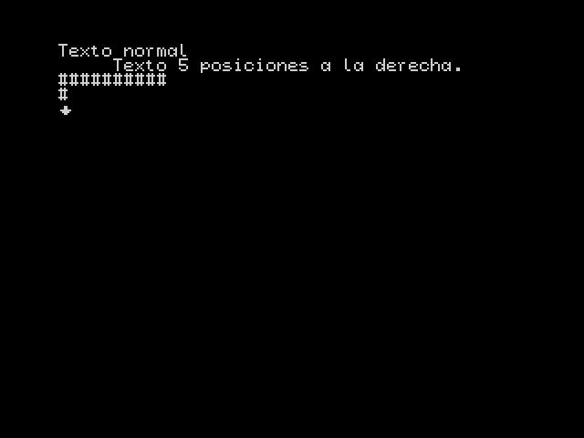

Y para hacer un salto de línea, el comando `NEWLINE`:

```
[[ /* Pone colores de pantalla y la borra */
   PAPER 0    /* Color de fondo negro  */
   INK   7    /* Color de texto blanco */
   BORDER 0   /* Borde de color negro  */
   CLEAR      /* Borramos la pantalla*/
   PAGEPAUSE 1
]]Texto normal
[[ TAB 5 ]]Texto 5 posiciones a la derecha.
[[ NEWLINE : REPCHAR 35, 10 ]]
[[ CHAR 35 ]]
[[ WAITKEY: END ]]
```

Vamos ahora a ver un comando para situar el cursor de impresión en cualquier punto de la pantalla. Con el comando `AT columna,fila`, podemos indicar las coordenadas donde queremos colocar el cursor para seguir imprimiendo. Vamos a verlo con este ejemplo:

```
[[ /* Pone colores de pantalla y la borra */
   PAPER 0    /* Color de fondo negro  */
   INK   7    /* Color de texto blanco */
   BORDER 0   /* Borde de color negro  */
   CLEAR      /* Borramos la pantalla*/
   PAGEPAUSE 1
]]
Texto abajo
[[AT 5,0]]¿Esto está arriba?.[[ WAITKEY: END ]]
```

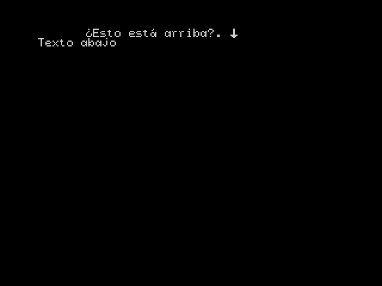

¿Qué ha pasado aquí? Si examinamos el código, vemos que antes de "Texto abajo", hay un salto de línea. Con lo que el cursor salta a la línea siguiente e imprime el "Texto abajo", pero después tenemos `AT 5,0`, que significa *mueve el cursor a la columna 5 y fila 0*, es decir, que vuelve a la fila anterior y 5 posiciones a la derecha desde el origen.

Con esto ya podemos colocar textos donde queramos. Pero nos falta algo para controlar del todo la disposición del texto en pantalla, y es definir unos márgenes. Por defecto **CYD** imprime el texto a pantalla completa, pero puede interesarnos que sólo imprima en cierta zona para no "tapar" imágenes que queramos mostrar. Para ello disponemos del comando `MARGINS`, que nos permite indicar el "rectángulo" o área de impresión de los textos.

El formato del comando es `MARGINS col_origen, fila_origen, ancho, alto`, donde los parámetros, son la columna y la fila origen del área de impresión y el correspondiente ancho y alto. Por defecto, el motor arranca como si se hubiese ejecutado el comando `MARGINS 0, 0, 32, 24`, es decir, el origen en lado izquierdo superior de la pantalla y el tamaño la pantalla completa.

Vamos ahora a retomar el ejemplo inicial de este capítulo y vamos a ponerlo en la zona inferior de la pantalla:

```
[[ /* Pone colores de pantalla y la borra */
   PAPER 0    /* Color de fondo negro  */
   INK   7    /* Color de texto blanco */
   BORDER 0   /* Borde de color negro  */
   CLEAR      /* Borramos la pantalla*/
   PAGEPAUSE 1
   MARGINS 0, 10, 32, 14
]]Lorem ipsum dolor sit amet, consectetur adipiscing elit. Nam eget pretium felis. Quisque tincidunt tortor eget libero fermentum, rutrum aliquet nisl semper. Pellentesque id eros non leo ullamcorper hendrerit. Fusce pretium bibendum lectus, vel dignissim velit interdum quis. Integer vel ipsum ac elit tincidunt vulputate. Mauris sagittis sapien in justo pretium cursus. Proin nec tincidunt purus, et tempus metus. Nunc dapibus vel ante eu dictum. Donec vestibulum scelerisque orci in tempus. Nunc quis velit id velit faucibus tempus vel id tellus.[[ WAITKEY: END ]]
```

Hemos bajado el origen del área de impresión a la fila 10, y su alto lo reducimos a 14:

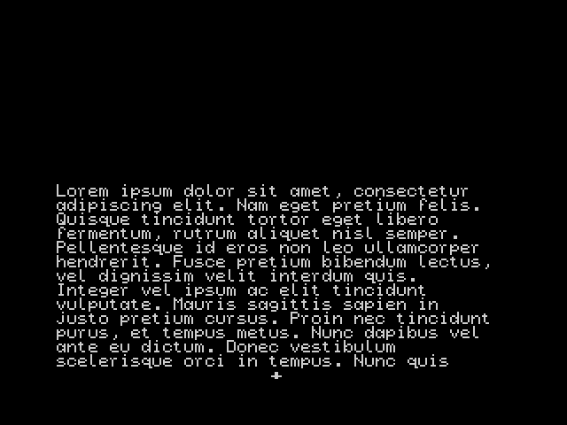

Con esto podemos ajustar la zona donde queramos que se imprima. Nótese el efecto de `PAGEPAUSE 1`, que al no caber todo, genera un icono de confirmación en el centro.

Vamos ahora a usar lo mismo en el segundo ejemplo de este capítulo:

```
[[ /* Pone colores de pantalla y la borra */
   PAPER 0    /* Color de fondo negro  */
   INK   7    /* Color de texto blanco */
   BORDER 0   /* Borde de color negro  */
   CLEAR      /* Borramos la pantalla*/
   PAGEPAUSE 1
   MARGINS 0, 10, 32, 14
]]
Texto abajo
[[AT 5,0]]¿Esto está arriba?.[[ WAITKEY: END ]]
```

¿Notas algo raro?

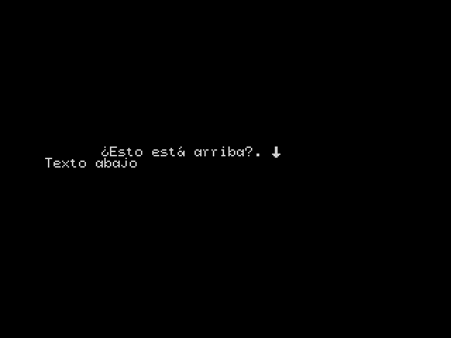

Si no lo has visto, pues que las coordenadas de `AT` no son, en este caso, las coordenadas de pantalla. Las coordenadas de `AT` **son siempre relativas al origen del área de impresión**. Cuando teníamos definida el área como la pantalla completa, pues correspondía con las coordenadas de la pantalla, (0,0). Ahora son relativas al nuevo origen, (0,10), lo que mandaría el cursor a la posición (5,10) en pantalla.

La pantalla del Spectrum tiene, de forma natural, 32 caracteres por línea, que es algo insuficiente para textos largos. **CYD** soporta fuentes de ancho variable y la que tiene por defecto usa caracteres de 6x8, lo que nos permite tener 42 caracteres por línea, pero esto ocasiona que no coincida con la rejilla de atributos del Spectrum, que es 8x8, y haya "colour clash" o choque de atributos.

Por este motivo, `AT` y `MARGINS`, tienen un sistema de coordenadas basadas en caracteres de 8x8 píxeles, es decir, 32 columnas y 24 filas, contadas de 0 a 31 y 0 a 23 respectivamente.

Por último, vamos a ver un problema de choque de atributos con este ejemplo:

```
[[ /* Pone colores de pantalla y la borra */
   PAPER 0    /* Color de fondo negro  */
   BORDER 0   /* Borde de color negro  */
   CLEAR      /* Borramos la pantalla*/
   PAGEPAUSE 1
   INK   7    /* Color de texto azul */
]]LALALALALA[[INK 4 /* COlor verde */]] LOLOLOLOLOLO[[ WAITKEY: END ]]
```

Se puede ver que al cambiar el color a verde con el comando `INK`, debido a que el siguiente carácter a imprimir (un espacio), se queda entre medias de dos celdas de atributos, se pinta el carácter anterior de blanco:

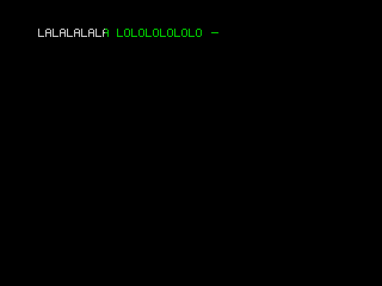

Esto lo podemos solventar realizando el cambio de color después del espacio:

```
[[ /* Pone colores de pantalla y la borra */
   PAPER 0    /* Color de fondo negro  */
   BORDER 0   /* Borde de color negro  */
   CLEAR      /* Borramos la pantalla*/
   PAGEPAUSE 1
   INK   7    /* Color de texto blanco */
]]LALALALALA [[INK 4 /*COlor verde */]]LOLOLOLOLOLO[[ WAITKEY: END ]]
```

Y ahora ya está correcto:


Será necesario por parte del autor realizar estos pequeños ajustes para mejorar la presentación del texto. Si se quiere evitar totalmente, pues no hay que mezclar colores diferentes dentro de la misma línea.

---

## Imágenes

Para darle más vistosidad a la aventura, es posible añadir imágenes en formato SCR, de pantalla de Spectrum. Estas imágenes serán comprimidas, creando archivos de tipo  `CSC` que serán incluidos en el programa final.

El compilador busca y comprime automáticamente los ficheros SCR que haya en el directorio `\IMAGES` por defecto, con lo que simplemente tendrás que depositar los ficheros allí.

Vamos a usar una imagen que tenemos de ejemplo, llamada `ORIGIN1.SCR`, dentro del directorio `\examples\test\IMAGES`. Cópiala y renómbrala como `001.SCR`. Y pon el siguiente código en `tutorial.txt`:

```
[[ /* Pone colores de pantalla y la borra */
   PAPER 0    /* Color de fondo negro  */
   BORDER 0   /* Borde de color negro  */
   CLEAR      /* Borramos la pantalla*/
   INK   7    /* Color de texto blanco */
   PAGEPAUSE 1
]]Voy a cargar la pantalla 1.[[
   WAITKEY
   /* Cargamos la imagen del fichero 001.CSC */
   PICTURE 1]]
Voy a mostrar la imagen.[[
   WAITKEY
   /* Cargamos la imagen cargada  */
   DISPLAY 1
]]
Hecho[[ WAITKEY: END ]]
```

Antes de lanzar el emulador, mira el directorio `\IMAGES`, donde encontrarás `001.SCR` y `001.CSC`. El compilador lo que hace es buscar los ficheros con nombre xxx.SCR, donde las tres x son dígitos, y los comprime, generando los ficheros correspondientes con la extensión `.CSC`. El motor buscará en el disco ficheros con esta nomenclatura cuando se le pida cargar imágenes en el caso de la versión de disco. En las versiones de cinta, se almacenarán y descomprimirán en la memoria.

Ahora ya podemos lanzar el emulador. Lo primero que verás es esto:

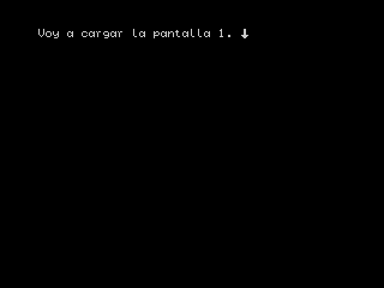

Cuando se pulse la tecla de confirmación, se lanzará el comando `PICTURE 1`. Lo que hará este comando es cargar y descomprimir en memoria la imagen del fichero `001.CSC`, pero cuidado, ¡todavía no se muestra!, pero notarás que se ha accedido a disco (esto depende del emulador).

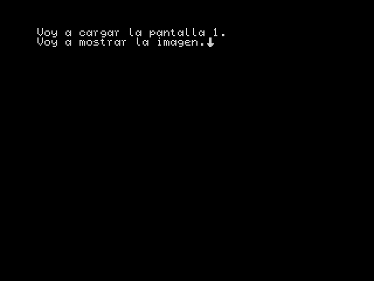

Con esto tenemos la imagen cargada, pero para mostrarla, tenemos que usar el comando `DISPLAY 1`, y entonces ya se muestra la imagen:

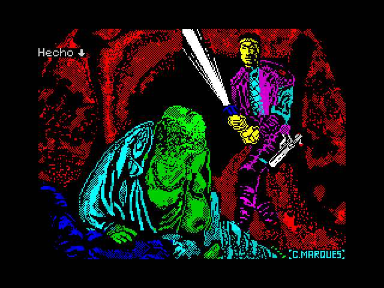

Ya podemos mostrar imágenes, pero hay que aclarar antes algunas cosas. Lo primero que te puede llamar la atención es... ¿para qué sirve el 1 de DISPLAY? Como se indica en la referencia, el comando `DISPLAY` necesita un parámetro que indica si debe mostrar la imagen o no; si el valor es cero, no la muestra, y si es distinto de cero, sí. Esto puede parecer inútil, pero tiene sentido si se usa con variables, para hacer que se muestre la imagen de forma condicional de acuerdo con el valor de una variable.

Otra cosa que te puede extrañar es ¿por qué los comandos de cargar la imagen y mostrarla están separados, en lugar de usar un único comando para hacer las dos cosas? Pues la respuesta es una decisión de diseño para la versión de disco, ya que al separar la carga en una operación diferente, podemos controlar cuándo se hace ésta para, por ejemplo, hacer la carga cuando comience un capítulo, y mostrar luego la imagen en el momento más oportuno, ya que al cargar, se detendrá el motor y generará una pausa en la lectura en un momento no deseado. Además, tanto en cinta como en desico, se tiene que descomprimir la imagen en un "buffer", lo cual lleva un poco de tiempo que puede ocasionar una pausa apreciable.

De momento, quédate que primero necesitas `PICTURE 3`, para cargar la imagen `003.CSC`, por ejemplo, y después `DISPLAY 1` para mostrarla. Hay que destacar que sólo podemos cargar una imagen a la vez, con lo que si cargamos otra imagen, la que ya estuviese cargada se borrará, y una imagen cargada la podemos mostrar tantas veces como queramos. Y tendrás un bonito error si intentas cargar una imagen que no exista en el disco o en memoria, o al mostrar una imagen sin cargarla antes.

Al visualizar imágenes hay que tener en cuenta que siempre se sobrescribirá lo que ya hubiese en pantalla. El comportamiento por defecto es cargar imágenes a pantalla completa (192 líneas), pero podemos editar el número de líneas a cargar modificando el valor de la variable `IMGLINES` en el guion `make_adv.cmd`:

```batch
REM Number of lines used on SCR files at compressing
SET IMGLINES=192
```

Debido a las limitaciones de color del Spectrum, recomiendo que siempre sea un múltiplo de 8.

Al usar imágenes, podemos ajustar el tamaño del área de impresión para que no se sobrescriba todo el dibujo usando `MARGINS`. Vamos a combinar dos ejemplos anteriores para verlo:

```
[[ /* Pone colores de pantalla y la borra */
   PAPER 0    /* Color de fondo negro  */
   INK   7    /* Color de texto blanco */
   BORDER 0   /* Borde de color negro  */
   CLEAR      /* Borramos la pantalla*/
   PAGEPAUSE 1
   PICTURE 1
   DISPLAY 1
   MARGINS 0, 10, 32, 14
]]Lorem ipsum dolor sit amet, consectetur adipiscing elit. Nam eget pretium felis. Quisque tincidunt tortor eget libero fermentum, rutrum aliquet nisl semper. Pellentesque id eros non leo ullamcorper hendrerit. Fusce pretium bibendum lectus, vel dignissim velit interdum quis. Integer vel ipsum ac elit tincidunt vulputate. Mauris sagittis sapien in justo pretium cursus. Proin nec tincidunt purus, et tempus metus. Nunc dapibus vel ante eu dictum. Donec vestibulum scelerisque orci in tempus. Nunc quis velit id velit faucibus tempus vel id tellus.[[ WAITKEY: END ]]
```

Lo primero que hará será mostrar la imagen, que sobrescribirá la pantalla completa, y luego definiremos una zona inferior donde se dibujará el texto:

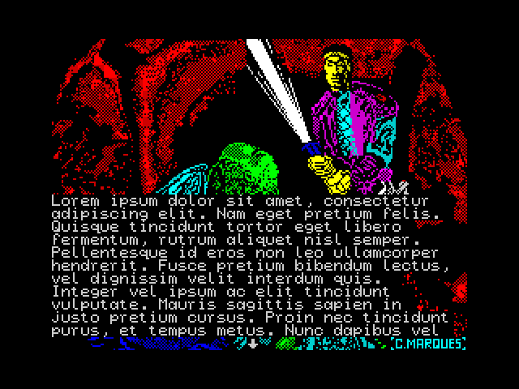

Como el texto no cabe, al darle a continuar, se borrará el área de impresión definida con `MARGINS` y seguirá imprimiendo el resto:

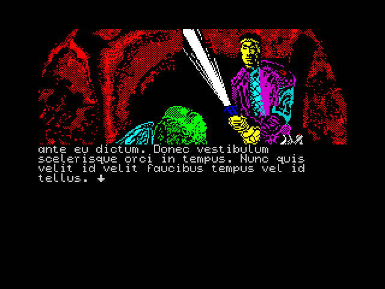

Para hacer el comportamiento un poco más coherente, vamos a poner un `CLEAR` justo después de `MARGINS`:

```
[[ /* Pone colores de pantalla y la borra */
   PAPER 0    /* Color de fondo negro  */
   INK   7    /* Color de texto blanco */
   BORDER 0   /* Borde de color negro  */
   CLEAR      /* Borramos la pantalla*/
   PAGEPAUSE 1
   PICTURE 1
   DISPLAY 1
   MARGINS 0, 10, 32, 14
   CLEAR
]]Lorem ipsum dolor sit amet, consectetur adipiscing elit. Nam eget pretium felis. Quisque tincidunt tortor eget libero fermentum, rutrum aliquet nisl semper. Pellentesque id eros non leo ullamcorper hendrerit. Fusce pretium bibendum lectus, vel dignissim velit interdum quis. Integer vel ipsum ac elit tincidunt vulputate. Mauris sagittis sapien in justo pretium cursus. Proin nec tincidunt purus, et tempus metus. Nunc dapibus vel ante eu dictum. Donec vestibulum scelerisque orci in tempus. Nunc quis velit id velit faucibus tempus vel id tellus.[[ WAITKEY: END ]]
```

Y con esto ya está mejor:

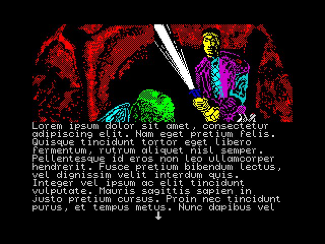

Aquí hemos usado una imagen al azar, más concretamente, la pantalla de carga de la *Aventura Original*. Pero si vamos a hacer este tipo de recortes con todas las imágenes, podemos cambiar el valor de la variable `IMGLINES`, para que recorte las líneas que no queramos. Esto ahorrará espacio, y evitará que se sobrescriba la zona inferior de texto cuando carguemos una nueva imagen. Para la gestión de imágenes y teniendo en cuenta estas restricciones, es importante planificar de antemano cómo y cuándo las vamos a mostrar.

Unas dudas que ten puede surgir: ¿y si quiero recortar el tamaño de sólo una imagen? ¿Y si quiero que cada imagen tenga un número de líneas diferente? Pues existe la posibilidad de definir el número de líneas para cada fichero específicamente. Imaginemos que queremos dejar 64 líneas para el fichero `001.SCR`, 40 líneas para el fichero `001.SCR`, y el resto a 192. Para ello habría que crear un fichero llamado `images.json` en el directorio `\IMAGES` con lo siguiente:

```json
[
  {
    "id": 0,
    "num_lines": 62,
    "force_mirror": false
  },
  {
    "id": 1,
    "num_lines": 40,
    "force_mirror": false
  }
]
```

Cuando el compilador encuentre este fichero JSON, tomará la configuración de las imágenes indicadas en éste y para el resto de imágenes se tomará lo que hayamos indicado en `IMGLINES`. De tal manera, con una supuesta imagen `003.SCR` y si no hemos cambiado `IMGLINES`, entoces se usarán las 192 líneas, es decir, la imagen completa.

Obviamente, con el campo `num_lines` indicamos el número de línea de cada fichero, pero te preguntarás ¿para qué sirve `force_mirror`? Pues lo que hará **CYD** es descartar la parte derecha de la imágen y cuando la descomprima en el buffer de pantalla, copiará la parte derecha de la imagen en la parte izquierda, pero de forma simétrica, es decir espejada, lo cual puede suponer en ciertas situaciones un ahorro importante.

---

## Efectos de sonido (Beeper)

Para mejorar la ambientación de nuestra aventura, el motor permite emitir efectos de sonido por el Beeper. Para ello nos valemos de la herramienta [BeepFx](http://shiru.untergrund.net/files/beepfx.zip) de Shiru, una herramienta muy usada en nuevos desarrollos para Spectrum.

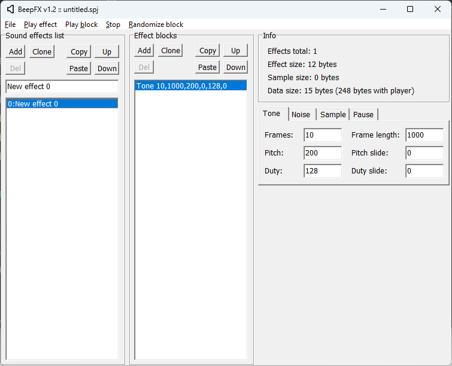

En este tutorial no vamos a enseñar cómo se maneja la herramienta, pero vamos a tomar uno de los archivos de ejemplo que incluye el paquete. Desde el menú `File -> Open project`, abrimos el fichero `demo.spj`, donde hay una serie de efectos ya creados. Los podemos reproducir con la opción `Play Effect`:

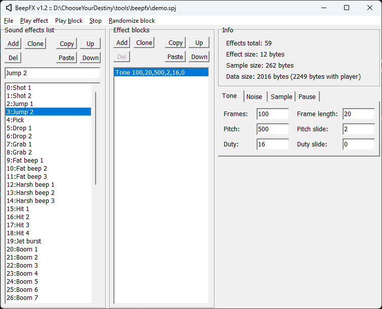

Ahora vamos a exportarlo a un fichero con el que podamos usarlos con el motor. Para ello vamos al menú `File -> Compile`, donde nos saldrá esta ventana:

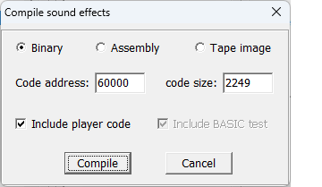

Ahora viene lo importante, **tenemos que dejar siempre marcadas la opción `Assembly` e `Include player code`**:

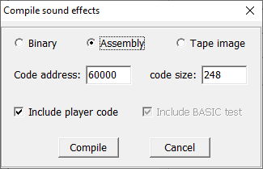

Le damos al botón `Compile` y nos sale un diálogo para guardar el fichero. **Lo tenemos que llamar `SFX.ASM`** y lo guardamos en la carpeta donde estemos desarrollando nuestra aventura. Cuando ejecutemos el guion `make_adv.cmd`. Si éste encuentra en su mismo directorio el fichero `SFX.ASM`, lo incluirá automáticamente en el fichero resultante y lo podremos usar desde el motor.

Vamos a poner un ejemplo, pon esto como código de la aventura:

```
[[ /* Pone colores de pantalla y la borra */
   PAPER 0    /* Color de fondo negro  */
   BORDER 0   /* Borde de color negro  */
   INK   7    /* Color de texto blanco */
   PAGEPAUSE 1
   LABEL Menu
   CLEAR]]Selecciona el efecto a reproducir:

  [[ OPTION GOTO Efecto0 ]]Efecto 0
  [[ OPTION GOTO Efecto1 ]]Efecto 1
  [[ OPTION GOTO Efecto2 ]]Efecto 2
  [[ OPTION GOTO Efecto3 ]]Efecto 3
  [[ OPTION GOTO Efecto4 ]]Efecto 4
  [[ OPTION GOTO Final ]]Salir

[[ CHOOSE
   LABEL Efecto0 : SFX 0 : GOTO Menu
   LABEL Efecto1 : SFX 1 : GOTO Menu
   LABEL Efecto2 : SFX 2 : GOTO Menu
   LABEL Efecto3 : SFX 3 : GOTO Menu
   LABEL Efecto4 : SFX 4 : GOTO Menu
   LABEL Final]]Adios...[[WAITKEY: END ]]
```

Como se puede ver, con el comando `SFX`, podemos reproducir cualquiera de los efectos del fichero indicando su número como parámetro.

Una peculiaridad del comando SFX es que, al contrario que las imágenes, si el fichero SFX.BIN no se encuentra en el disco, fallará silenciosamente sin dar error y el efecto de sonido simplemente no se reproducirá.

---

## Versiones para los diferentes modelos de Zx Spectrum

Hasta este momento, sólo hemos desarrollado aventuras para el Zx Spectrum original de 48k, sin embargo también se permite usar los modelos de 128k en cinta o disco. El soporte de disco tiene la peculiaridad de que las imágenes y las melodías no se almacenan en memoria, si no que se cargarán de forma dinámica desde disco cuando se ejecuten los comandos `PICTURE` y `TRACK`.

El espacio disponible variará dependiendo de la aventura y de los recursos extra a utilizar ya que si se obvian músicas y efectos de sonido, el tamaño del interprete se reducirá, dejando más espacio para textos e imágenes. Como promedio, calcula que tendrás unos 96 Kb disponibles en los modelos de 128K y unos 24 Kb en los modelos de 40K. Por este motivo, la versión de 48K no incluye soporte para melodías AY.

Si usas el guión `make_adv.cmd`, para cambiar el modelo, simplemente tienes que cambiar la variable `TARGET` por los valores `48k` o `128k` si quieres generar los TAPs para los modelos correspondientes. Por ejemplo, si queremos crear una versión de nuestro tutorial para Spectrum 128k:

```batch
@echo off  &SETLOCAL

REM ---- Configuration variables

REM Name of the game
SET GAME=Tutorial
REM This name will be used as:
REM   - The file to compile will be test.txt with this example
REM   - The name of the TAP file or +3 disk image

REM Target for the compiler (48k, 128k for TAP, plus3 for DSK)
SET TARGET=128k

REM Number of lines used on SCR files at compressing
SET IMGLINES=192

REM Loading screen
SET LOAD_SCR=%~dp0\IMAGES\000.scr
```

Con el modelo `plus3`, el formato de salida será una imagen de disco en formato DSK.

---

## Música (AY)

**CYD** también permite tocar música usando el chip AY, usando módulos creados con Vortex Tracker, en formato `PT3`. La música AY no está disponible para los modelos de 48K, así que necesitaremos cambiar la variable `TARGET` en `made_adv.cmd`, tal y como se describe en el capítulo anterior.

El funcionamiento es intencionadamente similar al de las imágenes. Los nombres de los ficheros de los módulos tienen que ser números de 3 dígitos con la extensión `.PT3`, de tal manera que sean `000.PT3`, `001.PT3` y así sucesivamente, e incluirse en el disco. Para facilitar la tarea, el guion `make_adv.cmd` lo hará por nosotros con todos los ficheros que cumplan ésta nomenclatura y se encuentren dentro de la carpeta `.\TRACKS`.

Los comandos que disponemos también son similares a los comandos de manejo de imágenes. Con el comando `TRACK`, cargamos desde disco en memoria un módulo de música, de tal manera que con `TRACK 0`, cargaríamos el módulo `000.PT3`, con `TRACK 1` cargaríamos `001.PT3`, etc.

Una vez cargado el módulo, pasaríamos a reproducirlo con el comando `PLAY 1` cuando necesitemos hacerlo. El parámetro del comando `PLAY` es un número que, si es cero, para la música (si se estuviese ya reproduciendo), y si es distinto de cero, la reproduce desde el comienzo (si estuviese ya parada).

Por último, con el comando `LOOP` indicamos si queremos que el módulo se reproduzca sólo una vez o queremos que se reproduzca indefinidamente. Si el valor de su parámetro es cero, sólo lo hará una vez, y si es distinto de cero, comenzará a reproducirse de nuevo cuando acabe.

Un detalle a tener en cuenta es que el efecto del comando `LOOP` es propio del reproductor incorporado y sólo es válido cuando el módulo pueda acabar. El formato `.PT3` tiene comandos de repetición, haciendo que el módulo se reproduzca sin fin por sí mismo, con lo que es conveniente reproducir el mismo con un reproductor externo para ver si esto es así.

---

## Variables

Con lo que ya sabemos, ya podríamos hacer una aventura por opciones relativamente simple, tipo "Elige tu Propia Aventura", pero podemos ir más lejos...

El motor dispone de 256 variables ó banderas de un byte, es decir, 256 almacenes donde podemos almacenar valores del 0 al 255. Cada una de estas variables es identificada a su vez por un número del 0 al 255. Vamos a verlo con un ejemplo:

```
[[ /* Pone colores de pantalla y la borra */
   PAPER 0    /* Color de fondo negro  */
   BORDER 0   /* Borde de color negro  */
   INK   7    /* Color de texto blanco */
   PAGEPAUSE 1
   CLEAR
   SET 1 TO 5]]Tienes [[PRINT @1]] gamusinos.
[[WAITKEY : END]]
```

Este es el resultado:

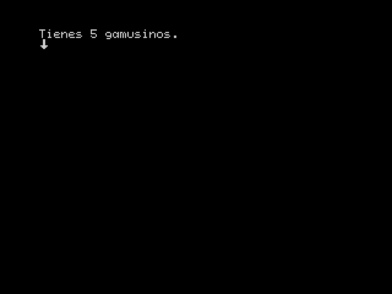

Lo primero que vemos nuevo es esto `SET 1 TO 5`, con esto le estamos indicando al motor que guarde el valor 5 dentro de la variable número 1. Y como consecuencia, con `PRINT @1` le estamos indicando que muestre el valor de la variable 1 en pantalla.

Una cosa que habrás notado es que `PRINT` pone una arroba delante del número de variable. La arroba es el indicador de variable. Para explicarlo mejor, quítale la arroba de tal manera que quede esto:

```
[[ /* Pone colores de pantalla y la borra */
   PAPER 0    /* Color de fondo negro  */
   BORDER 0   /* Borde de color negro  */
   INK   7    /* Color de texto blanco */
   PAGEPAUSE 1
   CLEAR
   SET 1 TO 5]]Tienes [[PRINT 1]] gamusinos.
[[WAITKEY : END]]
```

Este es el resultado si lo ejecutamos así:

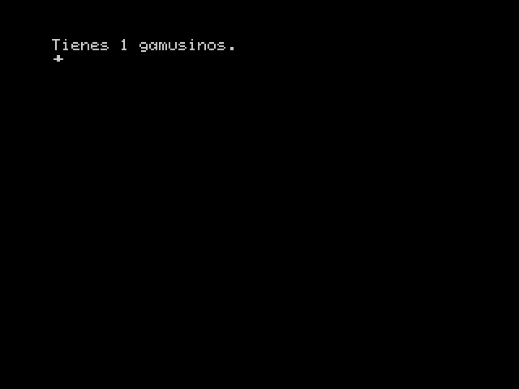

¡Vaya! Lo que pasa es que cuando pones una arroba delante, significa **coge el valor de la variable cuyo número indico detrás**. Si has consultado el [manual](MANUAL_es.md), habrás visto que casi todos los comandos admiten expresiones con variables.

Por eso, con `PRINT 1`, lo que estás indicando es "Imprime el valor 1", pero con `PRINT @1`, lo que se indica es "Imprime el contenido de la variable 1".

Vamos a afianzar este concepto con este ejemplo:

```
[[ /* Pone colores de pantalla y la borra */
   PAPER 0    /* Color de fondo negro  */
   BORDER 0   /* Borde de color negro  */
   INK   7    /* Color de texto blanco */
   PAGEPAUSE 1
   CLEAR
   SET 1 TO 5
   SET 0 TO @1
]]Tienes [[PRINT @0]] gamusinos.
[[WAITKEY : END]]
```

De nuevo, volvemos a tener 5 gamusinos:

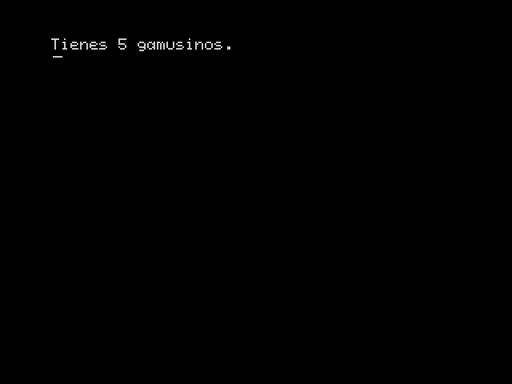

Con `SET 1 TO 5` almacenamos 5 en la variable num. 1. Luego con `SET 0 TO @1`, lo que hacemos es almacenar en la variable número 0 el valor que contiene la variable número 1 y finalmente, con `PRINT @0`, mostramos el contenido de la variable número 0.

Ahora vamos a ver un ejemplo más práctico de las variables, que pondrá a prueba nuestros conocimientos adquiridos en este tutorial:

```
[[ /* Pone colores de pantalla y la borra */
   PAPER 0    /* Color de fondo negro  */
   BORDER 0   /* Borde de color negro  */
   INK   7    /* Color de texto blanco */
   PAGEPAUSE 1
   SET 0 TO 0
   #Inicio
   CLEAR
]]Tienes [[PRINT @0]] gamusinos.
Necesitas 10 gamusinos para poder salir...
¿Qué haces?

[[OPTION GOTO Suma1]]Cojo 1 gamusino.
[[OPTION GOTO Resta1]]Dejo 1 gamusino.
[[
   IF @0 <> 10 THEN GOTO Escoger
   OPTION GOTO Final]]Salir.
[[
   #Escoger
   CHOOSE
   #Suma1
   SET 0 TO @0 + 1
   GOTO Inicio
   #Resta1
   SET 0 TO @0 - 1
   GOTO Inicio
   #Final]]¡Gracias por jugar![[WAITKEY : END]]
```

Nos presenta este menú:

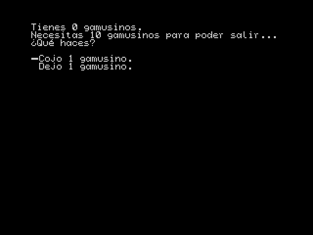

Si elegimos la primera opción, suma 1 a la variable 0, que hace el comando `SET 0 TO @0 + 1`, y la segunda opción resta, y lo hace con `SET 0 TO @0 - 1`.

La primera cosa que puede llamar la atención es que si doy a restar cuando el valor es cero, no hace nada. Esto es correcto, no se puede restar por debajo de cero ni se puede sumar por encima de 255 en las variables.

Y la segunda, ¿dónde está la opción de salir? Vamos a coger gamusinos hasta que tengamos 10, como se nos indica:

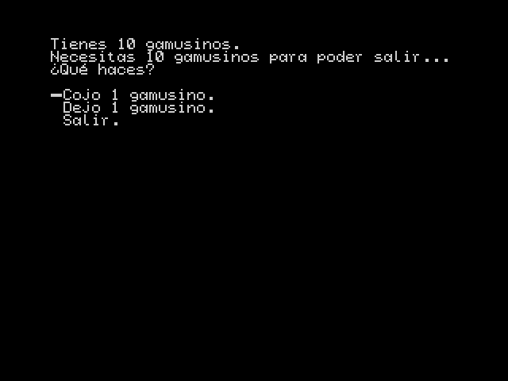

¡Ahora ya podemos salir! El secreto está en los condicionales. Si miramos en la opción de salir, vemos que antes hay `IF 0 <> 10 THEN GOTO Escoger`, lo que significa "Si la variable cero no es igual a 10, saltar a la etiqueta 'Escoger'", lo cual hace que se salte la opción de "Salir" y no se refleje en el menú hasta que el valor de la variable 0 sea 10.

Es decir, con las variables y las condiciones, tenemos las herramientas necesarias para hacer menús de opciones o textos que varíen dependiendo de ciertas condiciones y hacer nuestra aventura más dinámica.

---

## Declaración de variables

Viendo este programa, puede resultar bastante críptico:

```
[[ /* Pone colores de pantalla y la borra */
   PAPER 0    /* Color de fondo negro  */
   BORDER 0   /* Borde de color negro  */
   INK   7    /* Color de texto blanco */
   PAGEPAUSE 1
   SET 0 TO 0
   #Inicio
   CLEAR
]]Tienes [[PRINT @0]] gamusinos.
Necesitas 10 gamusinos para poder salir...
¿Qué haces?

[[OPTION GOTO Suma1]]Cojo 1 gamusino.
[[OPTION GOTO Resta1]]Dejo 1 gamusino.
[[
   IF 0 <> 10 THEN GOTO Escoger
   OPTION GOTO Final]]Salir.
[[
   #Escoger
   CHOOSE
   #Suma1
   SET 0 TO @0 + 1
   GOTO Inicio
   #Resta1
   SET 0 TO @0 - 1
   GOTO Inicio
   #Final]]¡Gracias por jugar![[WAITKEY : END]]
```

Lo primero que vamos a hacer es declarar una variable, es decir, darle un nombre o alias a uno de los flags para referirnos por su nombre. Vamos a verlo:

```
[[ /* Pone colores de pantalla y la borra */
   PAPER 0    /* Color de fondo negro  */
   BORDER 0   /* Borde de color negro  */
   INK   7    /* Color de texto blanco */
   PAGEPAUSE 1
   DECLARE 0 AS NumGamusinos
   SET NumGamusinos TO 0
   #Inicio
   CLEAR
]]Tienes [[PRINT @NumGamusinos]] gamusinos.
Necesitas 10 gamusinos para poder salir...
¿Qué haces?

[[OPTION GOTO Suma1]]Cojo 1 gamusino.
[[OPTION GOTO Resta1]]Dejo 1 gamusino.
[[
   IF 0 <> 10 THEN GOTO Escoger
   OPTION GOTO Final]]Salir.
[[
   #Escoger
   CHOOSE
   #Suma1
   SET NumGamusinos TO @NumGamusinos + 1
   GOTO Inicio
   #Resta1
   SET NumGamusinos TO @NumGamusinos - 1
   GOTO Inicio
   #Final]]¡Gracias por jugar![[WAITKEY : END]]
```

Esto está mucho mejor, con `DECLARE 0 AS NumGamusinos` lo que le estamos indicando al compilador que, a partir de este momento, la variable 0 se llamará NumGamusinos, y podremos usar ese nombre en su lugar. Con esto podemos dar un nombre significativo a los flags. Ten en cuenta además lo siguiente:

- Podemos seguir refiriéndonos a la variable por su número.
- No podemos declarar una variable y una etiqueta con el mismo nombre.
- No podemos declarar dos variables distintas con el mismo nombre.
- Podemos dar dos nombres distintos a la misma variable.

---

## Subrutinas

Las subrutinas son un tipo de salto especial, que guarda en un almacén la posición desde la cual se llamó, y que se puede recuperar posteriormente, pudiendo continuar desde el mismo punto en el que se entró. Éste es un concepto de la programación clásico de "subrutinas" o "subprogramas", para realizar tareas repetitivas y que seguramente suene a los que hayan programado algo en Basic.

Como siempre, vamos a verlo con un ejemplo simple para entenderlo:

```
[[ /* Pone colores de pantalla y la borra */
   PAPER 0    /* Color de fondo negro  */
   BORDER 0   /* Borde de color negro  */
   INK   7    /* Color de texto blanco */
   PAGEPAUSE 1
   DECLARE 0 AS NumGamusinos
   SET NumGamusinos TO 0
   #Inicio
   CLEAR]]Tienes [[GOSUB ImprimirGamusimos]].
¿Qué haces?

[[OPTION GOTO Suma1]]Cojo 1 gamusino.
[[OPTION GOTO Resta1]]Dejo 1 gamusino.
[[OPTION GOTO Final]]Salir.
[[
   #Escoger
   CHOOSE
   #Suma1
   SET NumGamusinos TO @NumGamusinos + 1
   GOTO Inicio
   #Resta1
   SET NumGamusinos TO @NumGamusinos - 1
   GOTO Inicio
   #Final]]¡Gracias por jugar!
Al final te quedas con [[GOSUB ImprimirGamusimos]].[[
   WAITKEY
   END
   /* Subrutina de impresión de gamusinos*/
   #ImprimirGamusimos : PRINT @NumGamusinos]] gamusinos[[RETURN]]
```

El ejemplo de los Gamusinos otra vez... Pero esta vez hacemos la impresión del número de Gamusinos dos veces, cuando elegimos una opción y al final del todo.

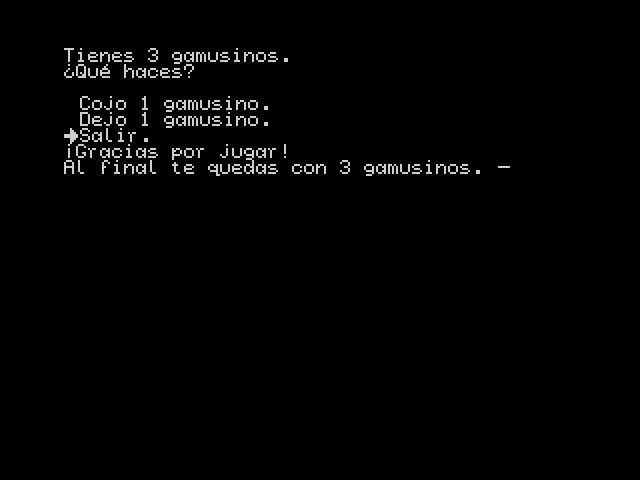

Para ello hacemos una subrutina que realice esta función:

```
[[LABEL ImprimirGamusimos]]Tienes [[PRINT @0]] gamusinos[[RETURN]]
```

Declaramos una etiqueta llamada `ImprimirGamusinos` que sirve de punto de salto. Luego tenemos la impresión del número de gamusinos, y luego el comando `RETURN`. La llamada la realizamos con `GOSUB ImprimirGamusinos` en los dos puntos donde queremos que se ejecute.

Como ya he indicado, `GOSUB ImprimirGamusinos`, lo que hace es hacer un salto a la etiqueta `ImprimirGamusinos`, pero con la salvedad que se guarda en la *pila* el punto de la llamada a la subrutina. Toda subrutina debe tener un punto de retorno, es decir, un punto de finalización con el que se indica al motor que debe volver al punto donde lo habíamos dejado, y eso lo hace el comando `RETURN`, que recupera de la pila el último punto de retorno y salta a esa posición.

Una cosa que hay que fijarse es que la subrutina está al final, después de `END`. Esto es así para que no se ejecute sin que la llamemos explícitamente. Ten en cuenta que el intérprete no diferencia una subrutina de código "normal", y si llega a ese punto la ejecutará y hará un `RETURN` inválido al final. Por ello, recomiendo para evitar estas situaciones, situarlas al final después de un `END`, o usar un `GOTO` delante para saltarla en el caso de que accidentalmente llegue a ella.

Y ahora, como ya es costumbre, las aclaraciones y excepciones. Las subrutinas pueden anidarse, es decir, se puede llamar a una subrutina dentro de otra. Se almacenarán en la pila las direcciones de retorno en orden inverso, pero **CUIDADO, la pila tiene un límite**. Esto quiere decir tienes un límite de anidamiento. Y como ya expliqué en el párrafo anterior, si se hace un `RETURN` sin un `GOSUB` previo, tendrás como mínimo un error, y como máximo, comportamiento erróneo.

Para ayudarte con esto, el compilador sigue el flujo del programa y te avisa (`WARNING [CODEGEN]`, con la línea) si se puede llegar a un `RETURN` sin ningún `GOSUB` pendiente, por ejemplo porque se entra en la subrutina con un `GOTO` o cayendo desde el código de encima, y también si una subrutina puede terminar sin `RETURN`, saliendo con un `GOTO` al resto del programa. Esto último es especialmente traicionero: cada vez queda un nivel ocupado en la pila y, al cabo de unos cientos, el juego se cuelga. Si quieres que el propio juego lo compruebe mientras se ejecuta, compila con la opción `--debug-stack` (en el compilador gráfico, "Comprobar la pila de GOSUB al ejecutar").

Por lo general, el momento idóneo para llamar a una subrutina es cuando se realiza una elección de un menú. Con lo que se ha incluido la variante `OPTION GOSUB Etiqueta`, que lo que hará si se elige esa opción es hacer una llamada a la correspondiente subrutina. Cuando llegue al `RETURN` (¡recuerda siempre acabar las subrutinas con él!), retomará la ejecución justo después del `CHOOSE` de dicha opción. Con nuestro nuevo conocimiento, vamos a ajustar nuestro código:

```
[[ /* Pone colores de pantalla y la borra */
   PAPER 0    /* Color de fondo negro  */
   BORDER 0   /* Borde de color negro  */
   INK   7    /* Color de texto blanco */
   PAGEPAUSE 1
   DECLARE 0 AS NumGamusinos
   SET NumGamusinos TO 0
   #Inicio
   CLEAR]]Tienes [[GOSUB ImprimirGamusimos]].
¿Qué haces?

[[OPTION GOSUB Suma1]]Cojo 1 gamusino.
[[OPTION GOSUB Resta1]]Dejo 1 gamusino.
[[OPTION GOTO Final]]Salir.
[[
   CHOOSE
   GOTO Inicio
   #Final]]¡Gracias por jugar!
Al final te quedas con [[GOSUB ImprimirGamusimos]].[[
   WAITKEY
   END
   /* Subrutina de impresión de gamusinos*/
   #ImprimirGamusimos : PRINT @NumGamusinos]] gamusinos[[RETURN
   /* Subrutina de suma*/
   #Suma1 : SET NumGamusinos TO @NumGamusinos + 1 : RETURN
   /* Subrutina de resta */
   #Resta1 : SET NumGamusinos TO @NumGamusinos - 1 : RETURN
   ]]
```

---

## Ejecución condicional

El el siguiente ejemplo vamos a usar la estructura `IF ... THEN ... ENDIF` para ilustrar su funcionamiento:
Copia lo siguiente en `Tutorial.cyd`:

```cyd
[[ /* Pone colores de pantalla y la borra */
   PAPER 0    /* Color de fondo negro  */
   BORDER 0   /* Borde de color negro  */
   INK   7    /* Color de texto blanco */
   PAGEPAUSE 1
   DECLARE 0 AS NumGamusinos
   SET NumGamusinos TO 0
   #Inicio
   CLEAR]]Tienes [[GOSUB ImprimirGamusimos]].
¿Qué haces?

[[OPTION GOSUB Suma1]]Cojo 1 gamusino.
[[OPTION GOSUB Resta1]]Dejo 1 gamusino.
[[ IF @NumGamusinos = 10 THEN
   OPTION GOTO Final]]Salir.
[[
   ENDIF
   CHOOSE
   GOTO Inicio
   #Final]]¡Gracias por jugar!
Al final te quedas con [[GOSUB ImprimirGamusimos]].[[
   WAITKEY
   END
   /* Subrutina de impresión de gamusinos*/
   #ImprimirGamusimos : PRINT @NumGamusinos]] gamusinos[[RETURN
   /* Subrutina de suma*/
   #Suma1 : SET NumGamusinos TO @NumGamusinos + 1 : RETURN
   /* Subrutina de resta */
   #Resta1 : SET NumGamusinos TO @NumGamusinos - 1 : RETURN
   ]]
```

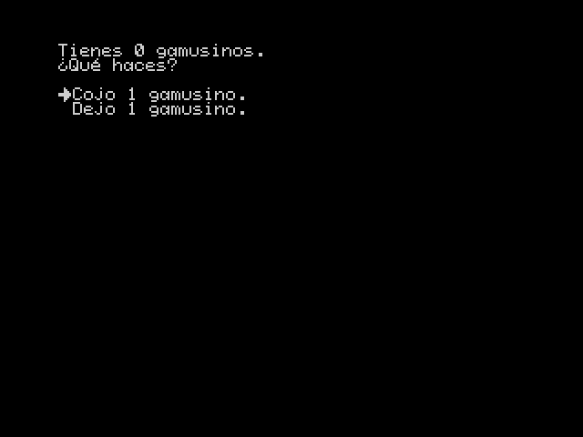

Curioso... ahora no podemos salir...

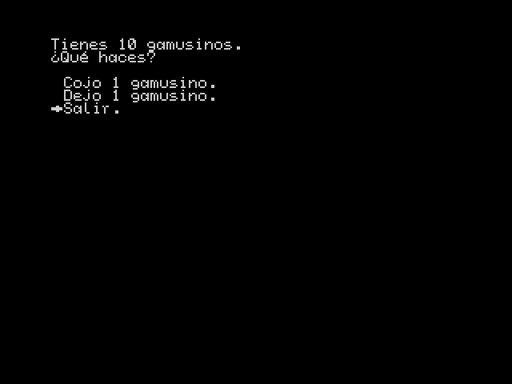

...¡hasta que tengamos 10 gamusinos! ¿Qué sucede?

La respuesta es el `IF @NumGamusinos = 10 THEN ... ENDIF`, si se cumple la condición de que tengamos 10 gamusinos, se ejecuta lo que haya entre el `THEN` y el `ENDIF`, y en caso contrario lo saltará.

Fíjate que no sólo se salta el comando de opción para salir; también se salta el texto posterior y, por tanto, tampoco lo muestra.

Ahora voy a cambiar a `IF @NumGamusinos = 10 THEN ... ELSE ... ENDIF`. Lo que hacemos es añadir otro bloque de código, que se ejecuta si *NO* se cumple la condición. En este caso vamos a añadir otro IF que nos diga lo que tenemos que hacer:

```cyd
[[ /* Pone colores de pantalla y la borra */
   PAPER 0    /* Color de fondo negro  */
   BORDER 0   /* Borde de color negro  */
   INK   7    /* Color de texto blanco */
   PAGEPAUSE 1
   DECLARE 0 AS NumGamusinos
   SET NumGamusinos TO 0
   #Inicio
   CLEAR]]Tienes [[GOSUB ImprimirGamusimos]].
¿Qué haces?

[[OPTION GOSUB Suma1]]Cojo 1 gamusino.
[[OPTION GOSUB Resta1]]Dejo 1 gamusino.
[[ IF @NumGamusinos = 10 THEN
   OPTION GOTO Final]]Salir.
[[ ELSE IF @NumGamusinos < 10 THEN ]]
Necesitas más gamusinos
[[ ELSE ]]
Te sobran gamusinos
[[ ENDIF
   ENDIF
   CHOOSE
   GOTO Inicio
   #Final]]¡Gracias por jugar!
Al final te quedas con [[GOSUB ImprimirGamusimos]].[[
   WAITKEY
   END
   /* Subrutina de impresión de gamusinos*/
   #ImprimirGamusimos : PRINT @NumGamusinos]] gamusinos[[RETURN
   /* Subrutina de suma*/
   #Suma1 : SET NumGamusinos TO @NumGamusinos + 1 : RETURN
   /* Subrutina de resta */
   #Resta1 : SET NumGamusinos TO @NumGamusinos - 1 : RETURN
   ]]
```

Si estamos por debajo:

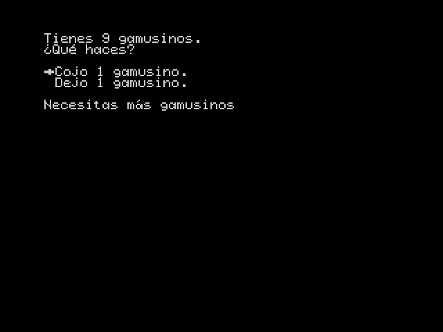

Y si estamos por encima:

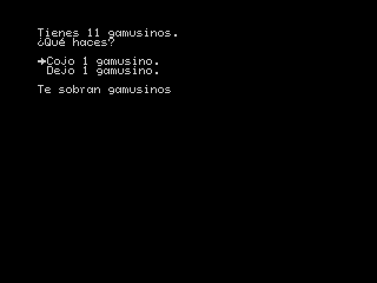

Esto nos permite, junto con `GOTO` y `GOSUB`, controlar el **flujo del programa**.

## Bucles

Para hacer que ciertas partes del código se repita mientras se cumpla una condición tenemos `WHILE (cond) ... WEND`:

```
[[ /* Pone colores de pantalla y la borra */
   PAPER 0    /* Color de fondo negro  */
   BORDER 0   /* Borde de color negro  */
   INK   7    /* Color de texto blanco */
   PAGEPAUSE 1
]]Contamos hasta 10:
[[
   DECLARE 0 AS cnt
   SET cnt TO 1
   WHILE (@cnt < 11)
      PRINT @cnt
      TAB 1
      SET cnt TO @cnt + 1
   WEND
]]
Hecho[[WAITKEY]]
```

En este ejemplo, inicio la variable *cnt* a 1, y al empezar el bucle, comprueba la condición de que la variable sea menor que 11, mientras se cumpla, se ejecuta lo que hay hasta `WEND`. Cada vez que se ejecuta el bucle, imprimimos el valor de la variable, ponemos un espacio con `TAB 1` e incrementamos su valor en 1. Cuando llegue a 11, deja de ejecutarse y continúa con lo que haya después del `WEND`.

Y ya cuenta del uno al 10:

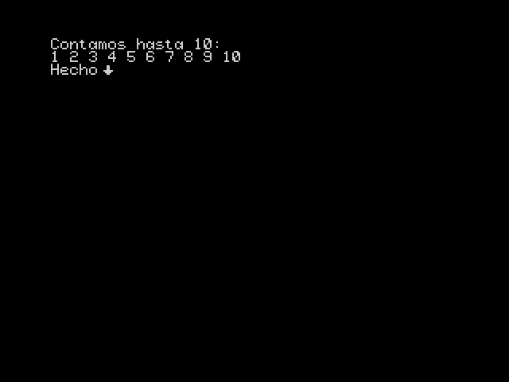

Es importante definir bien las condiciones de entrada y salida, y tener en cuenta que la verificación de la condición del bucle se realiza siempre **al principio** de cada iteración.

Cuando lo que queremos es simplemente **contar** (repetir algo un número fijo de veces con un contador que va cambiando), hay una forma más cómoda que montar el `WHILE` a mano: el bucle `FOR ... NEXT`. El ejemplo anterior de contar del 1 al 10 queda así:

```cyd
[[
   DECLARE 0 AS cnt
   FOR cnt = 1 TO 10
     PRINT @cnt : TAB 1
   NEXT
]]
```

El contador (`cnt`) va **pelado** después de `FOR` (como en `SET`/`LET`), y dentro del cuerpo lo leemos con `@cnt`. El bucle recorre el contador desde el valor inicial hasta el final, y `NEXT` marca el final del cuerpo. Si queremos contar de otra manera, añadimos `STEP` con el salto (puede ser negativo para contar hacia atrás):

```cyd
[[
   DECLARE 0 AS n
   FOR n = 10 TO 0 STEP -2   /* 10, 8, 6, 4, 2, 0 */
     PRINT @n : TAB 1
   NEXT
]]
```

El `STEP` tiene que ser un número fijo (una constante), y el contador es un byte (0..255). No te preocupes por los extremos: contar hasta 0 o hasta 255 funciona bien, no se queda en bucle infinito.

Con la adición del bucle, podemos implementar casi cualquier cosa con el lenguaje de **CYD**.

---

## Compresión de textos y abreviaturas

Para ahorrar espacio en disco, el compilador realiza una compresión de los textos, buscando las sub-cadenas más comunes en el mismo y sustituyéndolas por "tokens" o abreviaturas.

El guion `make_adv.cmd` hará que el compilador busque las abreviaturas si no encuentra un fichero de nombre `tokens.json` en su carpeta, y guardará las abreviaturas encontradas en un fichero con dicho nombre. Por el contrario, si encuentra este fichero, se lo pasará como parámetro al compilador para que utilice las abreviaturas contenidas en él. Para que vuelva a buscar abreviaturas de nuevo, simplemente con borrar el fichero `tokens.json` antes de ejecutarlo.

El proceso de búsqueda de abreviaturas puede ser muy costoso conforme se incrementa la cantidad de texto en la aventura. Mi consejo es escribir el guion de la aventura *antes* de ponernos a programar y ponerlo todo en un fichero de texto que le pasaremos al compilador, para que nos genere un fichero de abreviaturas adecuado. Una vez lo tengamos, ya podemos ir añadiendo comandos a dicho texto para ir dando forma a la aventura.  Una vez que ya la tengas *casi* finalizada, puedes volver a generar abreviaturas para ver si se puede rascar algo más de espacio.

---

## Organización del Código con INCLUDE

A medida que tu aventura crece, gestionar todo el código en un solo archivo puede volverse complicado. La directiva `INCLUDE` te permite dividir tu aventura en múltiples archivos, facilitando la organización y el mantenimiento de tu proyecto.

### Uso Básico

La directiva `INCLUDE` permite insertar el contenido de un archivo CYD dentro de otro durante la compilación:

```cyd
INCLUDE "archivo.cyd"
```

Por ejemplo, si tienes un archivo llamado `variables.cyd` con todas tus declaraciones de variables:

**variables.cyd:**
```cyd
[[
DECLARE 0 AS SaludJugador
DECLARE 1 AS OroJugador
DECLARE 2 AS TieneEspada
DECLARE 3 AS TieneLlave
]]
```

Puedes incluirlo en tu archivo principal:

**principal.cyd:**
```cyd
[[
INCLUDE "variables.cyd"
PAPER 0 : INK 7 : CLEAR
]]
Te encuentras en un oscuro calabozo...
```

Al compilar, el preprocesador insertará automáticamente el contenido de `variables.cyd` donde aparece la directiva `INCLUDE`.

### Organización de un Proyecto Grande

Esta es una estructura recomendada para una aventura más grande:

```
mi_aventura/
  ├── principal.cyd         # Punto de entrada principal
  ├── config/
  │   ├── variables.cyd     # Todas las declaraciones de variables
  │   └── ajustes.cyd       # Configuración inicial (colores, etc.)
  ├── lib/
  │   └── comunes.cyd       # Subrutinas comunes
  └── capitulos/
      ├── intro.cyd         # Introducción
      ├── capitulo1.cyd     # Capítulo 1
      ├── capitulo2.cyd     # Capítulo 2
      └── final.cyd         # Secuencias de final
```

**Ejemplo principal.cyd:**
```cyd
[[
/* Cargar configuración */
INCLUDE "config/variables.cyd"
INCLUDE "config/ajustes.cyd"

/* Cargar funciones comunes */
INCLUDE "lib/comunes.cyd"
]]

#Inicio
[[INCLUDE "capitulos/intro.cyd"]]
[[GOTO Capitulo1]]

#Capitulo1
[[INCLUDE "capitulos/capitulo1.cyd"]]

#Capitulo2
[[INCLUDE "capitulos/capitulo2.cyd"]]

#ElFinal
[[INCLUDE "capitulos/final.cyd"]]
[[END]]
```

### Ejemplo Práctico: Subrutinas Comunes

Digamos que muestras frecuentemente el estado del jugador. En lugar de repetir el código, crea un archivo de subrutinas:

**lib/comunes.cyd:**
```cyd
[[
#MostrarEstado
INK 6
PRINT "Salud: "
PRINT @SaludJugador
PRINT " | Oro: "
PRINT @OroJugador
INK 7
NEWLINE
RETURN

#JuegoTerminado
CENTER
INK 2
PRINT "JUEGO TERMINADO"
INK 7
NEWLINE : NEWLINE
PRINT "Pulsa una tecla para reiniciar..."
WAITKEY
GOTO Inicio
]]
```

Luego úsalo en tus capítulos:

**capitulos/capitulo1.cyd:**
```cyd
[[CLEAR]]
Entras en un corredor oscuro...
[[NEWLINE]]
[[GOSUB MostrarEstado]]

[[OPTION GOTO Puerta1]]Abrir la puerta izquierda
[[OPTION GOTO Puerta2]]Abrir la puerta derecha
[[CHOOSE]]

#Puerta1
¡Has encontrado un tesoro!
[[SET @OroJugador TO @OroJugador + 50]]
[[GOSUB MostrarEstado]]
[[GOTO Capitulo2]]

#Puerta2
¡Una trampa! Pierdes salud.
[[SET @SaludJugador TO @SaludJugador - 20]]
[[IF @SaludJugador <= 0 THEN
    GOSUB JuegoTerminado
ELSE
    GOSUB MostrarEstado
    GOTO Capitulo2
ENDIF]]
```

### Características Importantes

- **No distingue mayúsculas:** `INCLUDE`, `include` e `Include` funcionan igual
- **Comillas:** Se admiten tanto `"archivo.cyd"` como `'archivo.cyd'`
- **Rutas relativas:** Las rutas se resuelven relativas al archivo que contiene el `INCLUDE`
- **Inclusiones anidadas:** Los archivos pueden incluir otros archivos (hasta 20 niveles de profundidad)
- **Comentarios en CYD:** Utiliza `/* */` para comentarios (`/* Cargar utilidades */`). Aunque el patrón de `INCLUDE` ignorará texto después del nombre de archivo, no se recomienda depender de esto.
- **Detección de errores:** Las inclusiones circulares (A incluye B, B incluye A) se detectan automáticamente

### Beneficios

1. **Organización:** Mantén el código relacionado junto (todas las variables en un lugar, cada capítulo en su propio archivo)
2. **Reutilización:** Comparte subrutinas comunes entre múltiples aventuras
3. **Mantenibilidad:** Encuentra y corrige errores más fácilmente en archivos más pequeños y enfocados
4. **Colaboración:** Varias personas pueden trabajar en diferentes archivos
5. **Pruebas:** Prueba capítulos o componentes individuales por separado

### Consejos para Usar INCLUDE

1. **Empieza simple:** Comienza con un solo archivo, luego divide en módulos a medida que la aventura crece
2. **Agrupación lógica:** Agrupa funciones, variables o secciones de la historia relacionadas
3. **Nombres consistentes:** Usa nombres de archivo claros y descriptivos como `capitulo1.cyd` o `funciones_combate.cyd`
4. **Estructura de directorios:** Usa subdirectorios (`capitulos/`, `lib/`, `config/`) para mantener las cosas organizadas
5. **Documenta dependencias:** Añade comentarios explicando qué proporciona cada archivo incluido

---

## Usando las librerías incluidas

El proyecto trae en el directorio `lib/` varias **librerías escritas en el propio
lenguaje CYD**: colecciones de subrutinas listas para usar que no modifican el
motor. Se incorporan con `INCLUDE` y se llaman con `GOSUB`. Cada librería se
**auto-salta** sus rutinas (un `GOTO` interno), así que basta con incluirla al
principio de tu programa; el flujo continúa con tu código y las rutinas solo se
ejecutan cuando las llamas.

Cada librería reserva un pequeño bloque de variables como espacio de trabajo, y
los bloques no se solapan, así que puedes usar varias a la vez. No uses esos
números para otra cosa en tu programa; si lo haces, el compilador te avisa con un
`WARNING`:

- `lib/math16_32.cyd` (variables 224..254): aritmética de 16 y 32 bits.
- `lib/strings.cyd` (variables 216..223): entrada y manejo de cadenas de texto.
- `lib/sprites.cyd` (variables 200..211): sprites con máscara, que se ven en su propia sección más abajo.
- `lib/sprites_px.cyd` (variables 200..212): los mismos sprites con la X también al píxel; se usa en lugar de `lib/sprites.cyd`.

En el manual tienes la referencia completa de cada rutina; aquí vamos a ver un par
de casos prácticos.

### Una puntuación que no cabe en un byte

Las variables de CYD son de 8 bits (0..255), así que una puntuación grande se
desborda enseguida. Con `math16_32.cyd` podemos calcularla en 32 bits. Los
operandos se cargan en unos «registros» (grupos de variables consecutivas); como
los literales son de 8 bits, los valores anchos se cargan byte a byte con la
asignación múltiple `SET reg TO {byte_bajo, ...}`.

```cyd
[[
    INCLUDE "../../lib/math16_32.cyd"
    PAPER 0 : INK 7 : CLEAR

    /* enemigos (1250) * puntos (800) = 1.000.000, sin desbordar */
    SET mlA0 TO {226, 4}       /* A = 1250 */
    SET mlB0 TO {32, 3}        /* B = 800  */
    GOSUB mul1632              /* C = A * B (resultado de 32 bits) */

    /* + bonus (234567) */
    SET mlA0 TO {@mlC0, @mlC1, @mlC2, @mlC3}   /* A = C */
    SET mlB0 TO {71, 148, 3, 0}                /* B = 234567 */
    GOSUB add32                                /* A = 1234567 */
]]Puntuacion total: [[ GOSUB print32 ]][[
    WAITKEY : END
]]
```

Puedes ver este ejemplo completo en `examples/math_library`.

### Pedir el nombre del jugador

Con `strings.cyd` es muy sencillo leer una cadena del teclado. Solo hay que
decirle dónde está el buffer (`stBase`) y su capacidad (`stLen`); `strInput` se
encarga del cursor, del borrado con DELETE y de terminar con ENTER.

```cyd
[[
    INCLUDE "../../lib/strings.cyd"
    PAPER 0 : INK 7 : CLEAR

    SET stBase TO 0 : SET stLen TO 16   /* buffer en las variables 0..15 */
    GOSUB strInput
]]Hola, [[ GOSUB strPrint ]]!
[[
    GOSUB strLen
]]Tu nombre tiene [[ PRINT @stRes ]] letras.[[
    NEWLINE : WAITKEY : END
]]
```

Puedes ver este ejemplo completo en `examples/strings_library`.

---

## Flujo de trabajo

A partir de este momento ya deberías tener suficientes conocimientos para poder abordar tu propia aventura. A partir de aquí no te puedo dar consejos para escribir tu aventura, eso ya es trabajo de tu imaginación. Sin embargo, voy a recomendarte un flujo de trabajo que basado en la experiencia de desarrollar la aventura *Los Anillos de Saturno*, que presenté al concurso de Aventuras 2023 de Radastán.

### Alternativa Compilador GUI

En lugar de editar manualmente y ejecutar los scripts `make_adv`, puedes usar la herramienta **make_adventure_gui**, que proporciona una interfaz gráfica para compilar tus aventuras.

**Lanzando la GUI:**

**Windows:**
```batch
make_adventure_gui.cmd
```

**Linux/macOS:**
```bash
./make_adventure_gui.sh
```

La GUI te permite configurar todas las opciones de compilación (objetivo, rutas, líneas de imagen, configuración de abreviaturas, y más) sin tocar ningún guión. Una vez configurada, puedes compilar tu aventura con un solo clic de botón. La GUI mostrará mensajes de compilación detallados y abrirá automáticamente el archivo compilado en tu emulador elegido si está configurado.

Este enfoque elimina la necesidad de entender scripts de lotes o shell, haciendo que el proceso de compilación sea más accesible para usuarios que prefieren interfaces gráficas.

Mi primera recomendación es escribir **antes** el grueso de tu aventura, como ya habrás leído en el capítulo anterior. Con eso tendrás una lista de abreviaturas válida para empezar a trabajar, ya que el proceso de búsqueda de abreviaturas es **muy costoso**. Para que te hagas una idea, comprimir *Los anillos de Saturno* completo (Un libro de unas 150 páginas) tarda hasta tres cuartos de hora. Además, nuestro flujo de trabajo va a consistir esencialmente en escribir, compilar y probar una y otra vez, así que nos interesa que este proceso sea lo más rápido posible.

Puedes escribir tu aventura con tu editor de texto favorito, pero siempre **en texto plano**, ya que es lo que entiende el compilador.

Un tema importante al trabajar con el editor es la codificación de los textos. Un fichero dentro del disco es una colección de bits ordenados con un nombre, el ordenador no "sabe" qué hacer con esos bits; son los programas quienes interpretan esos bits.

Un fichero de texto es un fichero cuyos bits representan caracteres. La forma de interpretar esos caracteres se le llama **codificación**. La codificación más famosa empleada desde comienzos de la Informática es **ASCII**, cuyo estándar soporta 128 caracteres, pensada para el idioma inglés y con ampliaciones a 256 para caracteres internacionales y especiales. Hoy en día, ASCII se ha quedado pequeño, y la codificación empleada de forma estándar por todos los editores de texto actuales por defecto es **UTF-8**.

Todos los editores actuales soportan múltiples codificaciones, con lo que tendrás que investigar el funcionamiento de tu editor para seleccionar la codificación correcta.

El compilador de **CYD** soporta textos en formato UTF-8, pero tienes que tener en cuenta una serie de limitaciones cuando escribas tu texto o lo copies desde otra fuente. El juego de caracteres por defecto del motor es el siguiente:

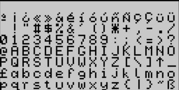

Ésos son los caracteres de que dispones y UTF-8 dispone de *millones* de distintas grafías, y no estoy exagerando, con lo la mayor parte de ellos darán error con el compilador. En el manual detallo los únicos caracteres que se traducirán desde UTF-8 a la codificación empleada por el motor:

| Carácter | Posición |
| -------- | -------- |
| 'ª'      | 16       |
| '¡'      | 17       |
| '¿'      | 18       |
| '«'      | 19       |
| '»'      | 20       |
| 'á'      | 21       |
| 'é'      | 22       |
| 'í'      | 23       |
| 'ó'      | 24       |
| 'ú'      | 25       |
| 'ñ'      | 26       |
| 'Ñ'      | 27       |
| 'ü'      | 28       |
| 'Ü'      | 29       |

Como puedes comprobar no están, por ejemplo, las vocales mayúsculas acentuadas. El compilador transformará de forma automática las mayúsculas acentuadas por las mayúsculas sin acento.

Una vez escrita una buena parte de tu aventura, y obtenido un fichero de abreviaturas, podemos empezar a programarla.

Mi recomendación es emplear la táctica de "divide y vencerás", una técnica que consiste en dividir un problema a resolver en subproblemas más pequeños que iremos solventando poco a poco. En nuestro contexto, significa que habría que dividir la aventura en secciones que iremos programando una a una. Seguramente ya hayas realizado de forma instintiva este paso al escribir tu relato, dividiéndolo en capítulos.

Con esta subdivisión, ahora trabajaremos con dos ficheros fuente, un *fichero global* con el texto de la aventura "completa", y otro que será el que pasemos con el compilador con la sección que vayamos a programar, que llamaremos *fichero de trabajo*. El proceso consiste en los siguientes pasos:

   1. Copiar una de las secciones no completadas del fichero global al fichero de trabajo.
   2. Añadir los comandos al texto del fichero de trabajo y formatearlo si es preciso.
   3. Compilar el fichero de trabajo.
   4. Ejecutar la imagen resultante en un emulador y probar.
   5. Si no estamos satisfechos, modificar el fichero y volver al paso 3.
   6. Cuando tengamos la sección completa, copiamos la sección completada en el fichero de trabajo y la sustituimos en el fichero global.
   7. Si nos quedan secciones por completar, volver al paso 1.
   8. Pasar la totalidad del fichero global al de trabajo.

Sin embargo, una vez completada la aventura, seguramente tendrás que corregir cosas, compilar y probar de nuevo. Y, dependiendo de la extensión de la aventura, llegar a la parte relevante puede ser un "inferno". Te voy a sugerir varias técnicas para evitar esto.

Una táctica que podemos emplear es etiquetar con `LABEL` el comienzo de todas y cada una de las secciones (esto lo haríamos en el proceso anterior). Después, simplemente ponemos un `GOTO` a la etiqueta de la sección que queramos probar al principio de la aventura. Al ejecutarse ésta, saltaría directamente a la sección relevante, con lo que nos ahorramos un tiempo precioso. ¡Recuerda luego quitar el `GOTO` inicial!

Otra técnica que he empleado es la de anular las pausas. Para ello me ayudo de la posibilidad del compilador de poder usar comentarios dentro de las secciones de código. Mediante nuestro editor de texto, podemos reemplazar todas las apariciones del comando `WAITKEY`, por ejemplo, con el texto `/*WAITKEY*/`. Al compilar de nuevo, al estar esos comandos comentados no se ejecutarán y se mostrará todo sin parar. Cuando queramos deshacer el cambio, hacemos el proceso contrario, reemplazamos `/*WAITKEY*/` por `WAITKEY`. Para acelerar este proceso más, podemos incluso introducir los comandos comentados en la fase anterior.

Por último, casi todos emuladores modernos ofrecen la posibilidad de acelerar la velocidad de ejecución. Podemos aprovechar esta ventaja para mostrar el texto más rápido de lo normal.

Espero que estas técnicas te ayuden a crear tu aventura de la manera más cómoda posible. Programar es un proceso iterativo de escribir, compilar, ejecutar y probar, y puede resultar monótono, pero también muy satisfactorio cuando obtenemos el resultado deseado.

---

## Menús con desplazamiento lateral

Los menús de opciones permiten también desplazamiento *lateral* y el comando `MENUCONFIG` permite configurar este comportamiento.
Antes hay que destacar que todo lo explicado anteriormente en el tutorial sigue siendo aplicable, pero se ha convertido en un caso particular que detallaremos.
Sin entrar en muchos detalles técnicos del motor, vamos a explicar cómo funciona ahora el sistema de menús.

El sistema de menús está basado en una lista de opciones. Cada vez de declaramos una opción, se guarda en la lista la posición de la pantalla (ajustada a coordenadas 8x8) y la dirección del salto correspondiente, de tal manera que las opciones se van guardando en el mismo órden en el que las declaramos.
Cuando se borra la pantalla o se escoge una opción del menú, la lista se borra.

Al activar el menú con `CHOOSE`, se pone un puntero que corresponderá a la opción seleccionada en la primera posición de lista, y la opción correspondiente de la lista muestra el icono de selección en la posición de pantalla almacenada. Cuando nos desplazamos en el menú con las teclas, movemos ese puntero a lo largo de la lista, y a cada paso, se mueve el puntero en pantalla a la posición correspondiente.

En las versiones anteriores, sólo se permitía moverse una posición hacia adelante en la lista con la tecla *A* y una posición hacia atrás con la tecla *Q*. Debido a esta disposición de teclas, se esperaba que los menús fuesen verticales.

Ahora se permite usar las teclas *O* y *P* para realizar desplazamientos *"horizontales"*. En realidad **CYD** no tiene concepto de horizontalidad y verticalidad, simplemente recorre la lista de cierta manera de acuerdo a las teclas pulsadas. Gracias al comando `MENUCONFIG x,y` podemos configurar este comportamiento. El comando admite dos parámetros que significan lo siguiente:

- El primer parámetro (que llamaremos `X`) determina el incremento o decremento del número de opción seleccionado cuando pulsamos **P** y **O** respectivamente.
- El segundo parámetro (que llamaremos `Y`) determina el incremento o decremento del número de opción seleccionado cuando pulsamos **A** y **Q** respectivamente.

Es decir, si el número de opción seleccionado en determinado momento es `N`, entonces:

- Cuando pulsamos **O**, `N` pasa a ser `N - X`.
- Cuando pulsamos **P**, `N` pasa a ser `N + X`.
- Cuando pulsamos **Q**, `N` pasa a ser `N - Y`.
- Cuando pulsamos **A**, `N` pasa a ser `N + Y`.

Con esto podemos hacer diferentes tipos de desplazamientos, pero es nuestra responsabilidad colocar las opciones en el órden y posición en pantalla adecuados para que sea coherente con la pulsación de las teclas.

Vamos a verlo, como siempre con el siguiente ejemplo:

```
[[
    PAGEPAUSE 1
    BORDER 0
    INK 7
    BRIGHT 1
    FLASH 0
    PAPER 0
    CLEAR
]]Elige una opción:

[[OPTION GOTO Opcion1]]Primera opción.  [[OPTION GOTO Opcion2]]Segunda opción.
[[OPTION GOTO Opcion3]]Tercera opción.  [[OPTION GOTO Opcion4]]Cuarta opción.
[[OPTION GOTO Opcion5]]Quinta opción.   [[OPTION GOTO Opcion6]]Sexta opción.

[[
    MENUCONFIG 1,2 : CHOOSE
    LABEL Opcion1]]Has elegido la opción 1.[[
    GOTO Siguiente
    LABEL Opcion2]]Has elegido la opción 2.[[
    GOTO Siguiente
    LABEL Opcion3]]Has elegido la opción 3.[[
    GOTO Siguiente
    LABEL Opcion4]]Has elegido la opción 4.[[
    GOTO Siguiente
    LABEL Opcion5]]Has elegido la opción 5.[[
    GOTO Siguiente
    LABEL Opcion6]]Has elegido la opción 6.[[
    LABEL Siguiente
    WAITKEY : END]]
```

De acuerdo a lo que hemos explicado, al usar `MENUCONFIG 1,2`, entonces cuando pulsamos **O** y **P**, la opción seleccionada se decrementa e incrementa en 1, y al pulsar **Q** y **A**, la opción seleccionada se decrementa e incrementa en 2. Eso nos está pidiendo un menú con dos elementos por fila, ya que al darle *abajo* o *arriba*, saltamos de dos en dos. Con esto, debemos ocuparnos de colocar las opciones en dos columnas y en orden de izquierda a derecha.

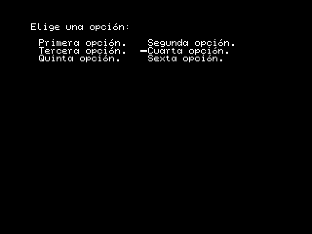

El comportamiento por defecto, y que simula el comportamiento *vertical* de las versiones anteriores, se hace con `MENUCONFIG 0,1`. Esto es, cuando pulsamos **O** y **P**, la opción seleccionada se decrementa e incrementa en 0, es decir, **no hace nada**, no se mueve. Y al pulsar **Q** y **A**, la opción seleccionada se decrementa e incrementa en 1, con lo que tendremos un menú estrictamente vertical.

De esta manera, si con `MENUCONFIG 0,1` tendremos un menú vertical en una columna, con `MENUCONFIG 1,0` tendremos un menñu horizontal en una fila. Con `MENUCONFIG 1,3` tendremos un menú a tres columnas, etc. Pero recuerda que `MENUCONFIG` no indica la disposición de las opciones, eso lo definimos nosotros al declararlas, sino el comportamiento de los botones.

En este caso, es mejor que pruebes el ejemplo en vivo y experimentes por tu cuenta. Ten en cuenta que el puntero nunca superará los límites por debajo de cero, ni por encima del número de opciones de la lista. Por tanto, deberías introducir valores *razonables* o el menú no funcionará bien.

---

## Copia de fragmentos de imagen a pantalla

Si has seguido el tutorial en órden, ya sabrás que con el comando `PICTURE` cargamos una imagen en el buffer de pantalla, y con `DISPLAY` la mostramos, es decir, se copia desde es buffer a pantalla, pero siempre a pantalla completa. Pero también se permite copiar un trozo de la imagen cargada en el buffer a cierta posición definida de la pantalla mediante el comando `BLIT`.

Pero primero, vamos a crear la siguiente imagen SCR con algún editor gráfico para Spectrum:

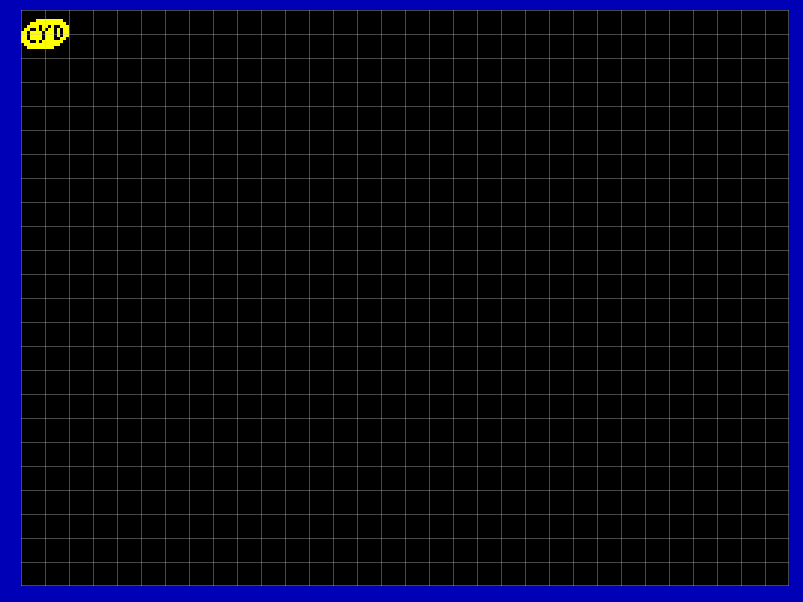

Y la dejamos en el directorio `IMAGES`. Puedes observar que hemos dibujado en el primer bloque de 16x16 pixels, o lo que es lo mismo, 2x2 caracteres.

Ahora, vamos a usar el siguiente ejemplo:

```
[[
    INK 7
    PAPER 0
    BORDER 1
    CLEAR
    PICTURE 0            /* Cargando imagen 0 en el buffer */
    DECLARE 0 AS row     /* Variable para filas */
    DECLARE 1 AS col     /* Variable para columnas */
    SET row TO 0
    WHILE (@row < 24)
        SET col TO 0
        WHILE (@col < 32)
            BLIT 0, 0, 2, 2 AT @col, @row /* Copiando a pantalla */
            SET col TO @col+2
        WEND
        SET row TO @row+2
    WEND
    AT 31, 23
    WAITKEY
    END]]
```

Este ejemplo lo que hace básicamente es borrar la pantalla y cargar la imagen 0 en el buffer de pantalla (la que hemos creado antes), y luego recorremos las filas de 0 a 24 y las columnas de 0 a 32, saltando de dos en dos caracteres. Si has seguido este tutorial, no te costará entender el funcionamiento.

El componente clave es el comando `BLIT 0, 0, 2, 2 AT @col, @row`. Lo que le estamos indicando al motor es "coge el rectángulo del buffer con origen (0,0) y tamaño 2x2 caracteres y lo copie en pantalla en la posición definida por las variables col y row". Como estamos haciendo un recorrido por toda la pantalla mediante dos bucles anidados, el resultado es el siguiente:

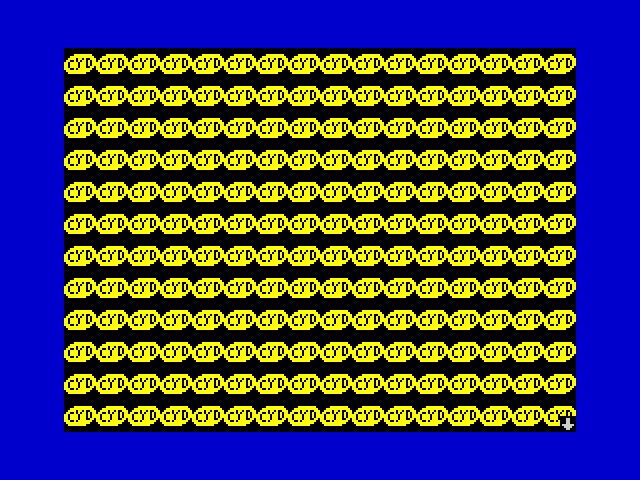

En general, con `BLIT x_orig, y_orig, anchura, altura AT x_dest, y_dest`, lo que hacemos es copiar desde la imagen cargada en el buffer un trozo de la misma definido por los 4 primeros parámetros, y lo copiamos en pantalla a partir de los dos últimos. Esto nos da muchas posibilidades para construir la imagen en pantalla mediante "tiles", crear animaciones, cortinillas, etc.

Como últimos apuntes, destacar tres cosas:

- Sólo se pueden usar variables en los dos últimos parámetros, como es el caso de este ejemplo. Los parámetros que definen el rectángulo a recortar siempre son fijos.
- En todos los parámetros, la unidad es el carácter de 8x8 píxeles.
- La implementación es lenta debido a su genericidad, con lo que si estás tentado de usarlos como "sprites", los resultados serán decepcionantes debido al parpadeo. Para eso está la librería de sprites, que veremos en la sección [Sprites con máscara](#sprites-con-máscara).

### Modo Colon Estricto (Aplicación de Sintaxis)

A partir de la versión 1.2.x, el compilador aplica el **Modo Colon Estricto de forma predeterminada**. Esto significa que cuando escribes múltiples sentencias en la misma línea, **deben** estar separadas por dos puntos (`:`).

**Sintaxis Correcta:**
```cyd
SET x TO 10 : SET y TO 20 : PRINT "Valores asignados"
```

**Sintaxis Incorrecta (fallará):**
```cyd
SET x TO 10 SET y TO 20 PRINT "Valores asignados"
```

Sin embargo, cuando las sentencias están en líneas separadas, los dos puntos son **opcionales**:

```cyd
SET x TO 10
SET y TO 20
PRINT "Valores asignados"
```

**Puntos clave:**
- Los saltos de línea separan automáticamente las sentencias, haciendo innecesarios los dos puntos cuando se usan nuevas líneas
- Si prefieres el comportamiento antiguo (sin modo colon estricto), puedes usar la bandera `--no-strict-colons` con el compilador
- El Modo Colon Estricto mejora la legibilidad del código y evita la concatenación accidental de sentencias
- El proceso de compilación aplica esta regla de forma consistente en todos tus ficheros de aventura

---

## Sprites con máscara

Como hemos visto, `BLIT` copia un rectángulo del buffer a la pantalla tal cual: lo que hubiera debajo desaparece. Para un personaje o un objeto que se mueve por encima de un escenario necesitamos otra cosa: que tape solo su silueta y que el fondo se siga viendo alrededor. Eso es un *sprite con máscara*, y lo tenemos en la librería `lib/sprites.cyd`.

Necesitamos dos imágenes: el escenario y una "hoja" con los sprites. En la hoja, junto a cada sprite (al lado o debajo) dibujamos su **máscara**: la silueta de lo que tapa, en tinta. Si la máscara es un píxel más grande que el sprite por todos lados, el sprite queda con un contorno fino del color del papel, que ayuda a distinguirlo del fondo.

Para pintar un sprite, le decimos a la librería dónde están el sprite y su máscara en el buffer, su tamaño y dónde lo queremos en pantalla, todo en caracteres como en `BLIT`, y llamamos a `sprDraw`:

```
[[
    INCLUDE "../../lib/sprites.cyd"
    PICTURE 0 : DISPLAY 1    /* el escenario, en pantalla */
    PICTURE 1                /* la hoja de sprites, al buffer (no se ve) */
    SET sprX TO 0 : SET sprY TO 0       /* el sprite en la hoja */
    SET sprW TO 2 : SET sprH TO 3       /* su tamaño */
    SET sprMX TO 0 : SET sprMY TO 3     /* su máscara, 3 filas más abajo */
    SET sprDX TO 14 : SET sprDY TO 15   /* dónde lo queremos */
    GOSUB sprDraw
    WAITKEY
    END
]]
```

Fíjate en el truco de las dos imágenes: `DISPLAY` pone el escenario en pantalla y después `PICTURE 1` carga la hoja de sprites en el buffer **sin tocar la pantalla**. A partir de ahí, las rutinas de la librería copian del buffer a la pantalla lo que les pidamos.

Por defecto el sprite no cambia los colores de la pantalla: toma la tinta de cada celda del escenario, lo que evita el "colour clash". Si quieres que ponga sus propios colores, haz `SET sprAttr TO 1`.

### Sprites que se mueven

Para mover un sprite hay que borrarlo antes de pintarlo en su nueva posición, y "borrar" aquí significa reponer el escenario que había debajo. Para eso están `sprSave`, que guarda lo que hay en pantalla donde va a ir el sprite, y `sprRestore`, que lo vuelve a poner donde estaba. En cada paso de la animación se hace siempre lo mismo:

```
    #Paso
    GOSUB sprRestore             /* borra el sprite: vuelve el fondo */
    SET sprDX TO @sprDX + 1      /* lo movemos */
    GOSUB sprSave                /* guarda el fondo de la nueva posición */
    GOSUB sprDraw                /* y lo pinta encima */
    WAIT 3
    GOTO Paso
```

(La primera vez `sprRestore` no hace nada, porque aún no hay nada guardado.)

Para animarlo mientras anda, basta con cambiar en cada paso `sprX` para que apunte al siguiente fotograma de la hoja.

Dos detalles más:

- La posición horizontal va por caracteres, pero la vertical se puede afinar al píxel con `sprPY`, que se suma a `sprDY`. Para que algo suba y baje con suavidad, deja `sprDY` a 0 y usa `sprPY` como la altura en píxeles (de 0 a 191). Si también necesitas la horizontal al píxel, incluye `lib/sprites_px.cyd` en vez de `lib/sprites.cyd`: tiene las mismas rutinas y además `sprPX`, que se suma a `sprDX`. A cambio ocupa unos 490 bytes más y pinta más despacio los sprites que no caen en un borde de carácter. El ejemplo `examples/sprites_px` es el mismo de abajo con el personaje caminando píxel a píxel.
- Si se mueven varios sprites a la vez, cada uno necesita su propio hueco para guardar el fondo: se elige con `sprSlot` (de 0 a 3). Y hay que restaurarlos **en el orden contrario al que se guardaron**; si no, cuando dos sprites se crucen, uno repondría un fondo que ya incluye al otro.

En `examples/sprites` tienes un ejemplo completo con las dos cosas: un personaje que camina por caracteres y una pelota que bota píxel a píxel, cada uno en su hueco:


La librería ocupa algo más de 1 KB, pero solo si la usas: si no llamas a ninguna de sus rutinas, el compilador no incluye nada. En el manual tienes la referencia completa de las rutinas y sus parámetros.

---

## Leyendo el teclado, arrays de variables e indirecciones

Primero aviso que este es un capítulo bastante avanzado donde se introducen conceptos de programación algo elevados si no has programado nunca. Si no lo entiendes, te lo puedes saltar sin problemas.

Hay una serie de comandos que permiten la lectura de caracteres desde el teclado y el borrado en pantalla, además de que, junto con la indirección, nos permite almacenar cadenas de texto en las variables y usar éstas como arrays. Sin embargo, **CUIDADO**, sólo tenemos 256 variables disponibles... Eso quiere decir que no podemos almacenar cadenas de texto demasiado largas, pero nos puede servir para almacenar una pequeña, como el nombre de nuestro protagonista o crear una línea de comandos sencilla.

Vamos a verlo con el siguiente ejemplo:

```cyd
[[ /* Pone colores de pantalla y la borra */
   PAPER 0    /* Color de fondo negro  */
   INK   7    /* Color de texto blanco */
   BORDER 0   /* Borde de color negro  */
   CLEAR      /* Borramos la pantalla*/
   PAGEPAUSE 1

   DECLARE 0 AS str        /* Comienzo del array de 16 caracteres */
   DECLARE 16 AS ptr       /* Puntero actual sobre la cadena */
   DECLARE 17 AS chr       /* Carácter Leído del teclado */

]]Introduce tu nombre:[[
   GOSUB inputStr]]
Bienvenido [[
   GOSUB printStr
   NEWLINE /* Salto de línea */
   WAITKEY
   END

   /* Subrutina para imprimir una cadena de 16 caracteres*/
   #printStr
   /* Inicializamos el puntero con la dirección de la variable inicial de la cadena */
   SET ptr TO @@str
   /*
   Mientras el puntero sea menor a la dirección del mismo...
   (La dirección nos sirve como marcador para indicar el final de la cadena)
   */
   WHILE (@ptr < @@ptr)
      /* Si el contenido de la variable marcada con el puntero es cero acabamos */
      IF [@ptr] = 0 THEN RETURN ENDIF
      /* Imprimimos el carácter haciendo indirección sobre el puntero */
      CHAR [@ptr]
      /* Incrementamos el puntero una posición */
      SET ptr TO @ptr + 1
   WEND
   RETURN

   #inputStr
   /* Inicializamos el puntero con la dirección de la variable inicial de la cadena */
   SET ptr TO @@str
   /* Rellenamos toda la cadena con ceros */
   WHILE (@ptr < @@ptr)
      SET [ptr] TO 0
      SET ptr TO @ptr + 1
   WEND
   /* Volvemos a poner el puntero al principio */
   SET ptr TO @@str
   /* Bucle infinito */
   WHILE ()
      /* Ponemos el carácter '_' como cursor */
      CHAR 95
      /* Leeemos una tecla pulsada y guardamos su código ASCII en chr */
      SET chr TO INKEY()
      /* Borramos el cursor */
      BACKSPACE
      /* Si la tecla es ENTER, salimos */
      IF @chr = 13 THEN RETURN ENDIF
      /* Si la tecla es DELETE... */
      IF @chr = 12 THEN
         /* Ponemos el puntero actual a cero, si no estamos al final del array */
         IF @ptr < @@ptr THEN
            SET [ptr] TO 0
         ENDIF
         /* Si no estamos al principio del array... */
         IF @ptr > @@str THEN
            /* Borramos la posición actual en pantalla y volvemos atrás */
            BACKSPACE
            /* Movemos el puntero a la posición anterior */
            SET ptr TO @ptr - 1
            /* Lo rellenamos también con cero */
            SET [ptr] TO 0
         ENDIF
      ELSE
         /*
         Si el carácter es mayor que 32 y menor que 128 (caractéres ASCII imprimibles)
         y no estamos al final del array...
         */
         IF @chr >= 32 AND @chr < 128 AND @ptr < @@ptr THEN
            /* Imprimimos el carácter */
            CHAR @chr
            /* Guardamos el carácter en el array */
            SET [ptr] TO @chr
            /* Avanzamos el puntero */
            SET ptr TO @ptr + 1
         ENDIF
      ENDIF
   WEND
]]
```

Como siempre, si lo probamos:

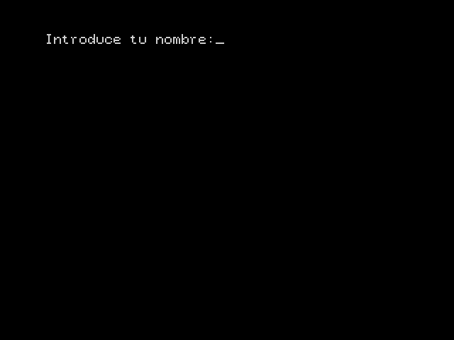

Nos aparece una "línea de comandos" donde podemos teclear; con el **ENTER** validamos, y con **DELETE** podemos borrar el último carácter que hayamos tecleado. Notarás, si juegas con el programa, que si superamos los 16 caractéres, no nos deja meter más, y sólo nos permite borrar el último carácter o darle a **ENTER**. Si hacemos ésto último:

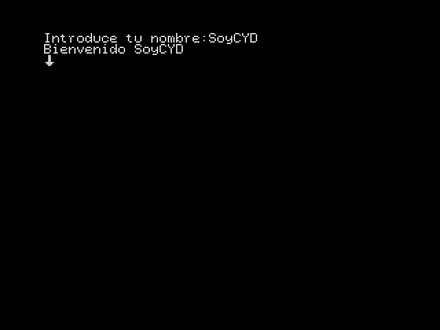

¡Nos imprime la cadena que hayamos introducido! De esta manera sencilla, ya tenemos un par de subrutinas que podemos usar para leer e imprimir pequeñas cadenas de texto. Los comentarios incluidos son suficientes para saber lo que está haciendo a cada paso, pero hay cosas que necesitamos afianzar y con conceptos ya bastante complejos; con lo que esta sección va a tener, de forma excepcional, subsecciones.

### Indirección

En el código del ejemplo habrás visto que se ponen variables entre corchetes, por ejemplo `SET [ptr] TO 0`. A esto se le llama indirección, y lo que significa es que **el resultado de la expresión de dentro de los corchetes se usa como el indicador de la variable a la que se va a acceder**. A este concepto se le llama **indirección**, lo cual nos permite crear **punteros** e implementar **arrays** o, como se ha traducido en español, **arreglos**.

La diferencia entre `SET 1 TO 0` y `SET [1] TO 0` es que el primer comando significa *"guarda cero en la variable 1"*, y el segundo significa *"guarda cero en la variable cuyo número corresponda con el contenido de la variable 1"*. De tal manera que, si en la variable 1 teníamos un dos, entonces guardará cero en la variable 2. En este caso, estamos usando la variable número 1 como un *puntero*, ya que la variable 1 *apunta* a otra variable.

Vamos a ver un ejemplo. Queremos rellenar con ceros las variables desde la 0 a la 7, usando la variable número 8 como puntero.
El código para hacer esto sería el siguiente:

```cyd
[[
SET 8 TO 0
WHILE (@8 < 8)
   SET [8] TO 0
   SET 8 TO @8 + 1
WEND
]]
```

En la primera línea inicializamos el puntero a 0 con  con `SET 8 TO 0`, con lo que tendríamos esta situación:

```text
       0 1 2 3 4 5 6 7 8
      +-+-+-+-+-+-+-+-+-+-
      | | | | | | | | |0|...
      +-+-+-+-+-+-+-+-+-+-
```

Ya dentro del bucle, vemos que tenemos `SET [8] TO 0`, que indica que en la variable cuyo índice corresponda con el valor del contenido de la variable 8, guardaremos el valor cero:

```text
       0 1 2 3 4 5 6 7 8
      +-+-+-+-+-+-+-+-+-+-
      |0| | | | | | | |0|...
      +-+-+-+-+-+-+-+-+-+-
       ^               |
       |               |
       +---------------+

```

El siguiente paso es incrementar el puntero en uno (`SET 8 TO @8 + 1`):

```text
       0 1 2 3 4 5 6 7 8
      +-+-+-+-+-+-+-+-+-+-
      |0| | | | | | | |1|...
      +-+-+-+-+-+-+-+-+-+-
```

Como el valor de la variable 8 sigue siendo menor que 8, volvemos a ejecutar `SET [8] TO 0` y guardamos 0 en la variable 1:

```text
       0 1 2 3 4 5 6 7 8
      +-+-+-+-+-+-+-+-+-+-
      |0|0| | | | | | |1|...
      +-+-+-+-+-+-+-+-+-+-
         ^             |
         |             |
         +-------------+

```

Volvemos a incrementar:

```text
       0 1 2 3 4 5 6 7 8
      +-+-+-+-+-+-+-+-+-+-
      |0|0| | | | | | |2|...
      +-+-+-+-+-+-+-+-+-+-
```

Este proceso se ejecuta hasta que deja de cumplirse la condición del bucle, con lo que nos resultaría al final esto:

```text
       0 1 2 3 4 5 6 7 8
      +-+-+-+-+-+-+-+-+-+-
      |0|0|0|0|0|0|0|0|8|...
      +-+-+-+-+-+-+-+-+-+-
```

Hasta ahora he usado la denominación numérica de las variables. Pero, ¿cómo lo haríamos con declaraciones nombres de variables?:

```cyd
[[
DECLARE array AS 0
DECLARE ptr AS 8

SET ptr TO 0
WHILE (@ptr < 8)
   SET [ptr] TO 0
   SET ptr TO @ptr + 1
WEND
]]
```

El ejemplo anterior nos podría valer... pero si decidimos mover el array y su puntero a otras variables tendremos un problema porque además de las declaraciones, habría que cambiar `SET ptr TO 0` y `WHILE (@ptr < 8)` también. Pero tenemos la siguiente posibilidad:

```cyd
[[
DECLARE array AS 0
DECLARE ptr AS 8

SET ptr TO @@array
WHILE (@ptr < @@ptr)
   SET [ptr] TO 0
   SET ptr TO @ptr + 1
WEND
]]
```

Notarás que en su lugar, estamos usando los nombres de las variables con dos arrobas `@@`. Como ya sabrás, cuando dentro de una expresión nos encontramos una arroba, eso indica que vamos a acceder al contenido de la variable correspondiente. Pues las dos arrobas indican que vamos a usar en la expresión **el número de la variable**. De tal manera que en el ejemplo anterior `@@array` será 0 y `@@ptr` será 8. En cambio, si hiciésemos lo siguiente, `@@array` sería 8 y `@@ptr` sería 16:

```cyd
[[
DECLARE array AS 8
DECLARE ptr AS 16

SET ptr TO @@array
WHILE (@ptr < @@ptr)
   SET [ptr] TO 0
   SET ptr TO @ptr + 1
WEND
]]
```

Además, nos sirve para acceder a elementos individuales del array. Por ejempo, para imprimir el valor de la cuarta posición del array, tal que si *array* es la variable cero:

```text
       0 1 2 3 4 5 6 7
      +-+-+-+-+-+-+-+-+-
      |0|0| |4| | | | |...
      +-+-+-+-+-+-+-+-+-
             ^
```

Lo haríamos así con `PRINT [@@array + 3]`, y nos imprimiría 4. Recuerda que los arrays se cuentan desde el cero, no desde el uno. Otra forma de ver la operación `@@` es como la inversa de `[]`, de tal manera que `PRINT [@@array]` sería equivalente a `PRINT @array`.

Este es un concepto bastante avanzado para alguien que no ha programado nunca. He intentado dar una explicación sencilla, pero si no lo entiendes, es normal y no es necesario para hacer una aventura interesante, pero si lo captas te puede dar una herramienta poderosa.

Con estos conceptos afianzados y con los comentarios, podrás entender cómo funciona el primer ejemplo.

### Lectura del teclado (INKEY)

Para leer una tecla pulsada, tenemos la función `INKEY()`, la cual nos devuelve el código de la tecla pulsada. Esta función funciona igual que su equivalente en Sinclair BASIC, pero con la salvedad de que la versión de BASIC devuelve cero si no hay una tecla válida pulsada, mientras que el comportamiento por defecto en **CYD** es esperar a que se haya pulsado una tecla válida. Si queremos reproducir el comportamiento de Sinclair BASIC, podemos hacerlo si usamos `INKEY(1)`.

El valor que se devuelve cuando se pulsa una tecla corresponde (normalmente) con su valor **[ASCII](https://es.wikipedia.org/wiki/ASCII)**, pero adaptado a la versión de **[Sinclair](https://en.wikipedia.org/wiki/ZX_Spectrum_character_set)**.

En el ejemplo inicial, comprobamos si el valor de la tecla devuelta es 13 (ENTER) para validar y 12 (DELETE) para borrar. Si es un valor entre 32 y 127, entonces es un carácter que podemos imprimir.

### Borrar carácteres y hacer saltos de línea (BACKSPACE y NEWLINE)

Para implementar una línea de comandos, se precisa borrar en caso de equivocación. Para ello se ha añadido el comando `BACKSPACE`, que desplaza el cursor una posición hacia atrás y borra el contenido de la nueva posición. Si está en el lado izquierdo del borde definido, saltará una línea hacia atrás y se pondrá al final de la línea anterior (si puede).

Hay que tener en cuenta que el tamaño usado en la operación es el del carácter número 32 (el espacio). Esto es importante si se usan caracteres de tamaños diferentes al del espacio, el comando no los borrará bien, ya que **CYD** no tiene "memoria" de lo que ya hay impreso.

También se introduce el comando `NEWLINE`, que imprime un salto de línea sin necesidad de pasar del modo "comando" al modo "texto".

Tanto `NEWLINE` como `BACKSPACE` permiten un parámetro opcional para indicar el número de veces que se imprime, de tal manera que `NEWLINE 3` haría 3 saltos de línea y `BACKSPACE 2` borraría dos posiciones.

---

## Usar el juego de caracteres alternativo

CYD incorpora por defecto dos juegos de caracteres para los textos, el utilizado por defecto (que tiene tiene 6 píxeles de ancho) y otro alternativo que ocupa 4 píxeles de ancho. Para cambiar de uno a otro, se usa el comando `CHARSET` de la siguiente forma:

```cyd
[[CHARSET 0]]Juego de caracteres 6x8
[[CHARSET 1]]Juego de caracteres 4x8
[[CHARSET 0]]Volvemos al juego por defecto[[
   WAITKEY
   END]]
```

Con este resultado:

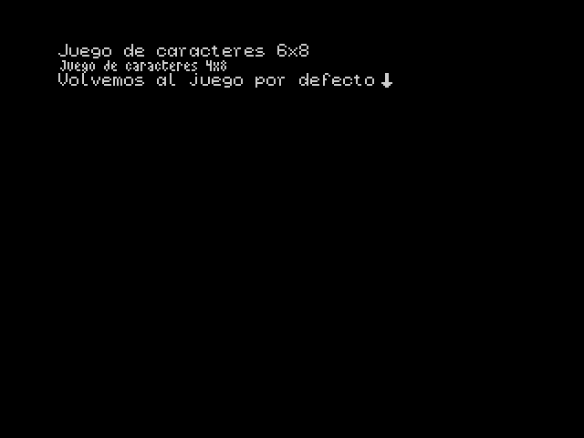

El juego de caracteres por defecto (`CHARSET 0`) son los caracteres desde el cero al 127, que contienen los caracteres de ancho 6 píxeles. Con `CHARSET 1`, indicamos que se usen los caracteres desde el 128 al 255, que contienen los caracteres de ancho 4 píxeles.

---

## Ventanas

Las ventanas son hasta 8 diferentes áreas de texto independientes que podemos definir en la pantalla. En cada una podemos definir los márgenes de forma diferente, y cada una tiene su propia posición del cursor y atributos. En cada momento, sólo podemos tener una ventana "activa", es decir, una ventana sobre la cual escribir y configurar. Se cambia de una a otra usando el comando `WINDOW`. La ventana activa por defecto es la cero.

Como siempre, un ejemplo es más elocuente:

```cyd
[[/* La ventana por defecto es la cero */
  MARGINS 0, 0, 16, 12
  INK 2
  CLEAR
  WINDOW 1
  MARGINS 16, 0, 16, 12
  INK 6
  CLEAR
  WINDOW 2
  MARGINS 0, 12, 16, 12
  INK 4
  CLEAR
  WINDOW 3
  MARGINS 16, 12, 16, 12
  INK 5
  CLEAR
  WINDOW 0
]]Esto es la ventana 0
[[
  WINDOW 1
]]Esto es la ventana 1
[[
  WINDOW 2
]]Esto es la ventana 2
[[
  WINDOW 3
]]Esto es la ventana 3
[[
  WINDOW 0
]]Volvemos a la ventana 0
[[
  WINDOW 1
]]Volvemos a la ventana 1
[[
  WINDOW 2
]]Volvemos a la ventana 2
[[
  WINDOW 3
]]Volvemos a la ventana 3
[[
  WAITKEY
  END]]
```

En el ejemplo se usan 4 ventanas, de la 0 a la 3. Primero empezamos con la ventana cero, que por defecto está seleccionada y le definimos la posición, el tamaño y el color de la tinta. Luego cambiamos a la ventana 1 y hacemos lo mismo, y así con el resto. Finalmente vamos cambiando de ventanas para poner texto en cada una.

Y éste es el resultado:

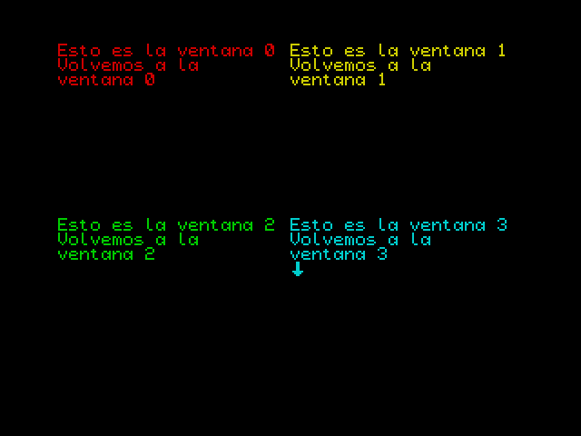

Como se puede ver, en cada ventana se conservan el color, los márgenes y la posición del cursor y podemos ir cambiando de una a otra de forma sencilla. Esto nos permite tener diferentes áreas de texto para menús, descripciones, marcadores, etc.

Por último destacar que estas ventanas no son equivalentes a las ventanas de un entorno de escritorio, como Windows, Mac, KDE o GNOME. Si dos ventanas se solapan, y se escribe en una de ellas, el contenido de la otra ventana no se conserva. Considéralas mejor como áreas de texto.

---

## Arrays o secuencias

Los llamados "arrays" son secuencias de números a las que se pueden acceder mediante un índice. Mediante el comando `DIM` podemos declarar un "array", de tal manera que con `DIM nombre(tamaño)` declaramos un array de nombre `nombre` y tamaño `tamaño`. El tamaño de un array no puede ser mayor de 256 ni ser cero. Accedemos a cada uno de los elementos del array con la nomenclatura `nombre(pos)`, donde `pos` es el número de posición del elemento a acceder dentro del array, empezando desde cero.

Vamos a ver un ejemplo:

```cyd
[[
  DIM miArray(3)          /* Declaramos un array de 3 elementos del 0 al 2              */
  LET miArray(0) = 10     /* Asignamos valores a cada elemento                          */
  LET miArray(1) = 11
  LET miArray(2) = 12
  PRINT miArray(0)        /* Imprimimos el valor almacenado en la posición 0            */
  NEWLINE
  PRINT miArray(1)        /* Imprimimos el valor almacenado en la posición 1            */
  NEWLINE
  PRINT miArray(2)        /* Imprimimos el valor almacenado en la posición 2            */
  NEWLINE : WAITKEY]]
```


Si te fijas, estamos tratando `miArray(0)`, por ejemplo, como si fuese una variable. Se le pueden asignar y recoger sus valores.

Pero **¡cuidado!**, los arrays empiezan a contar desde cero hasta el tamaño que hayamos definido en la declaración del array menos uno. Si intentamos acceder a una posición fuera de su rango, nos dará un error tipo 7:

```cyd
[[
  DIM miArray(3)          /* Declaramos un array de 3 elementos del 0 al 2              */
  LET miArray(0) = 10     /* Asignamos valores a cada elemento                          */
  LET miArray(1) = 11
  LET miArray(2) = 12
  PRINT miArray(0)        /* Imprimimos el valor almacenado en la posición 0            */
  NEWLINE
  PRINT miArray(1)        /* Imprimimos el valor almacenado en la posición 1            */
  NEWLINE
  PRINT miArray(2)        /* Imprimimos el valor almacenado en la posición 2            */
  NEWLINE
  PRINT miArray(3)        /* ¡ESTO DA ERROR!                                            */
  NEWLINE : WAITKEY]]
```

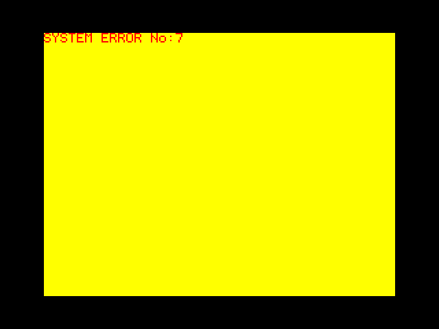

Para evitar estar situaciones, dispones de la funcion `LASTPOS(nombre_array)` que devuelve la última posición permitida para el array dado para poder comprobar antes de asignar :

```cyd
[[
  DIM miArray(3)          /* Declaramos un array de 3 elementos del 0 al 2              */
  LET miArray(0) = 10     /* Asignamos valores a cada elemento                          */
  LET miArray(1) = 11
  LET miArray(2) = 12
  PRINT miArray(0)        /* Imprimimos el valor almacenado en la posición 0            */
  NEWLINE
  PRINT miArray(1)        /* Imprimimos el valor almacenado en la posición 1            */
  NEWLINE
  PRINT miArray(2)        /* Imprimimos el valor almacenado en la posición 2            */
  NEWLINE
  ]]Última posición:[[
  PRINT LASTPOS(miArray)  /* Vemos la última posición permitida     */
  ]]
  Tamaño del Array:[[
  PRINT LASTPOS(miArray)+1  /* Sumándo uno, tenemos su tamaño total */
  NEWLINE : WAITKEY]]
```

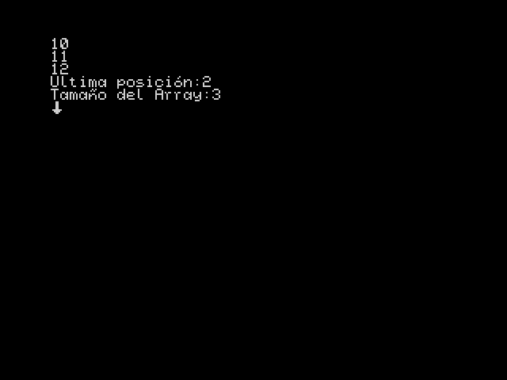

Los arrays nos permiten tener tablas de valores, pero inicializar los elementos uno a uno puede ser muy pesado y poco elegante.

Podemos inicializar los valores de los arrays al declararlos de la siguiente forma:

```cyd
[[ DIM precios(5) = {10, 40, 100, 200, 250} ]]
```

De hecho, podemos ahorrarnos indicar el tamaño ya que lo calculará a partir del número de elementos que se indiquen:

```cyd
[[ DIM precios() = {10, 40, 100, 200, 250} ]]
```

Ten en cuenta que el array tendrá en este caso el tamaño del número de elementos que hayamos indicado **y no más**.

Los arrays no se pueden re-dimensionar y sólo admiten valores entre 0 y 255, de la misma manera que las variables. El tamaño máximo es 256 y el mínimo 0.

Vamos a ver un último ejemplo para afianzar conceptos:

```cyd
[[
  DECLARE 0 AS c
  DIM precios(5) = {10, 40, 100, 200, 250}
]] Los [[ PRINT LASTPOS(precios)+1 ]] precios son:
[[
  LET c = 0
  WHILE(@c <= LASTPOS(precios))
      PRINT precios(@c)
      NEWLINE
      LET c = @c + 1
  WEND
  WAITKEY
]]
```

En el ejemplo, usamos la variable `c` para recorrer el array de precios hasta su última posición e imprimimos el contenido de cada una:

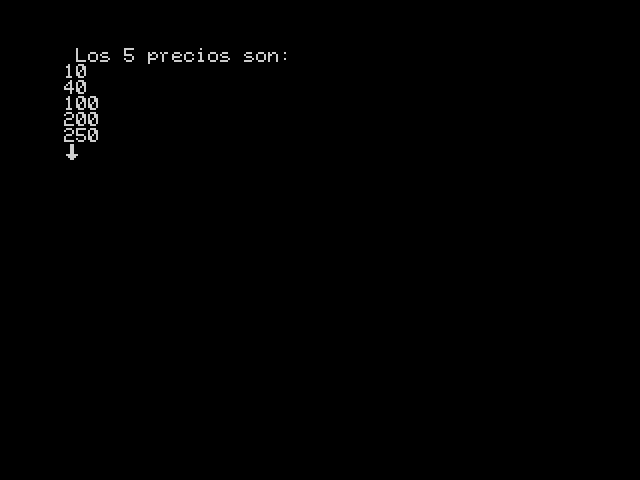

Por último, indicar que otra limitación que tienen los arrays no se pueden grabar en cinta o disco directamente, a menos que sus contenidos se vuelquen en variables previamente.

---

## Datos inmutables (DATA)

Los arrays `DIM` que acabamos de ver son de escritura, pero a menudo lo que necesitamos es un bloque de datos de **solo lectura**: tablas, mapas, secuencias de valores… Para eso **CYD** tiene el mecanismo `DATA`, igual que el BASIC clásico.

Con `DATA` vamos añadiendo valores (bytes) a un **único flujo global** de datos, en el orden en que aparecen en el guion. Después los leemos uno a uno con `READ`, que avanza un cursor interno:

```
[[
  DECLARE 0 AS v

  DATA 10, 20, 30      /* estos cinco valores forman un solo flujo */
  DATA 40, 50          /* 10, 20, 30, 40, 50                        */

  READ v               /* v vale 10, y el cursor avanza al 20 */
  READ v               /* v vale 20 ...                       */
]]
```

A diferencia de los arrays, un flujo `DATA` puede ser mucho más grande (hasta 16 KB, miles de valores) y, en cartuchos Dandanator/MLD, **no gasta memoria RAM** porque se lee directamente de la flash.

Con `RESTORE` rebobinamos el cursor al principio, y con `RESTORE etiqueta` lo colocamos en el primer `DATA` que aparezca después de esa etiqueta (igual que el `RESTORE línea` del BASIC):

```
[[
  DECLARE 0 AS v

  DATA 11, 22, 33
  LABEL segundo
  DATA 44, 55

  RESTORE segundo      /* el cursor salta al 44 */
  READ v               /* v vale 44             */
]]
```

Para recorrer todo el flujo sin pasarnos usamos la función `DATAEND()`, que devuelve `1` cuando el cursor ha llegado al final y `0` mientras queden datos. Fíjate en que lleva paréntesis (es una función) y que, al usarla como condición, la comparamos:

```
[[
  DECLARE 0 AS v

  DATA 65, 66, 67   /* codigos de 'A', 'B', 'C' */

  WHILE (DATAEND() = 0)
    READ v
    CHAR v          /* imprime A, B, C */
  WEND
]]
```

Un detalle útil: si seguimos leyendo con `READ` más allá del final, el flujo **se rebobina solo** al principio (una "cinta sin fin"), así que nunca leemos basura. Usa `DATAEND()` cuando quieras detectarte en el final.

---

## Constantes anchas (WORD, DWORD y cadenas)

Hasta ahora todos los valores que hemos metido en variables, arrays o `DATA` eran de un byte (0 a 255). Pero a veces necesitamos números más grandes: una puntuación que llegue a miles, una dirección de memoria, o simplemente el texto de una cadena. Para eso están las **constantes anchas**, que el compilador convierte en varios bytes seguidos (en formato *little-endian*: primero el byte bajo). Todo se resuelve al compilar, así que **no cuestan nada** de velocidad ni de memoria extra.

En `DATA` y en la inicialización de un `DIM`, el ancho se detecta solo por el tamaño del número (hasta 255 = 1 byte, hasta 65535 = 2 bytes, más grande = 4 bytes). Y si queremos forzar un ancho concreto, ponemos delante `WORD` (2 bytes) o `DWORD` (4 bytes). Una cadena entre comillas se guarda como los códigos de sus caracteres:

```cyd
[[
  DATA WORD 1000, 5, "HI"          /* 1000 (2 bytes) + 5 (1 byte) + 'H','I' */
  DIM tabla() = { DWORD 100000, 42 }   /* array de 5 bytes */
]]
```

Los arrays siguen siendo "byte a byte": si guardas un `WORD`, ocupa dos posiciones del array y eres tú quien recompone el número leyendo esos dos bytes (con la librería `math16_32` si vas a operar con él).

También podemos asignar una constante ancha directamente a una variable con `LET`/`SET`; los bytes se guardan en la variable indicada y en las siguientes:

```cyd
[[
  DECLARE 0 AS puntos    /* usará las variables 0 y 1 */
  DECLARE 2 AS nombre    /* usará las variables 2 y 3 */
  LET puntos = WORD 1000 /* var 0 = byte bajo, var 1 = byte alto */
  LET nombre = "AB"      /* var 2 = 'A', var 3 = 'B'             */
]]
```

Ojo: en `LET`/`SET` **hay que** poner `WORD`/`DWORD` (o la cadena) para que sea ancho; sin el marcador, `LET puntos = 1000` seguiría intentando meter un solo byte y daría error por no caber. Así siempre sabes cuántas variables vas a ocupar.

---

## Más comodidades: SELECT, ENUM, SWAP y literales

**CYD** tiene además unas cuantas ayudas que hacen el código más legible. Todas se traducen en tiempo de compilación a cosas que ya conoces (no añaden nada al motor).

### SELECT ... CASE (selección múltiple)

Cuando tienes que decidir entre varios valores de una variable, en vez de encadenar muchos `IF`, usa `SELECT`:

```cyd
[[
   SELECT @estado
     CASE 0        GOSUB intro
     CASE 1, 2, 3  GOSUB juego     /* varios valores a la misma rama */
     CASE ELSE     GOSUB fin       /* por defecto (opcional)         */
   ENDSELECT
]]
```

Se evalúa `@estado` y se ejecuta la rama del `CASE` que coincida. No hay "caída" de una rama a la siguiente: al terminar una, se salta al final. `CASE ELSE` es opcional.

### ENUM (constantes con nombre)

Para no andar con números mágicos, `ENUM` declara una lista de constantes que se numeran solas desde 0:

```cyd
[[
   ENUM { NORTE, SUR, ESTE, OESTE }   /* NORTE=0, SUR=1, ESTE=2, OESTE=3 */
   ENUM Objeto { ESPADA=1, ESCUDO, POCION=10, LLAVE }  /* 1, 2, 10, 11 */
]]
```

Puedes fijar un valor con `=` y los siguientes continúan desde ahí. Los nombres quedan como constantes globales normales (el nombre tras `ENUM` es solo decorativo).

### SWAP (intercambiar dos variables)

Intercambia el contenido de dos variables sin necesidad de una tercera:

```cyd
[[ SWAP a, b ]]
```

También funciona con indirección en cualquiera de los dos lados: `SWAP [p], [q]`.

### Literales cómodos

En las listas de `DATA` y `DIM` (y donde vaya un número) tienes:

- **Carácter `'A'`**: el código del carácter, sin memorizarlo. `LET tecla = 'A'` es lo mismo que `LET tecla = 65`.
- **Rangos `{a..b}`**: `DIM cuenta() = { 1..8 }` crea 1,2,3,4,5,6,7,8 (y al revés si `a > b`).
- **Repetición `{ v REPEAT n }`**: `DIM buffer() = { 0 REPEAT 16 }` crea dieciséis ceros.

Y se combinan: `DATA 255 REPEAT 4, 1..3, 'A'`.

---

## Alterar el juego de caracteres

**CYD** dispone del siguiente juego de caracteres por defecto:


Están organizados en la imagen en forma de cuadrícula, empezando desde arriba a la izquierda, y yendo de izquierda a derecha y arriba y abajo.

Se pueden ver tanto los caracteres 6x8 del modo normal y los caracteres 4x8 del modo alternativo, además de los caracteres usados en el icono animado de espera y selección:

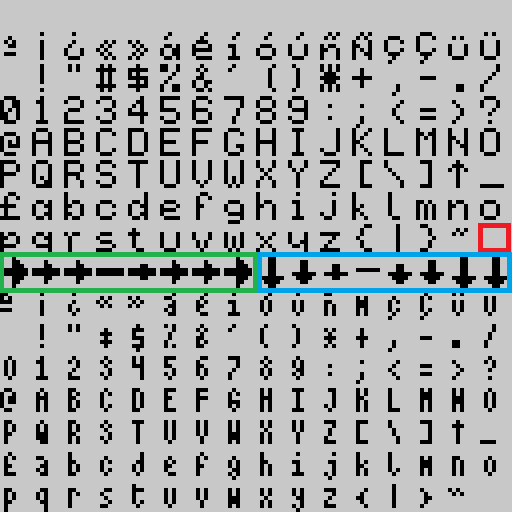

Los caracteres desde el 127 hasta el 143 (ambos incluidos y empezando a contar desde cero) son especiales y tienen las siguientes funciones:

- El carácter 127 es el carácter usado cuando una opción no está seleccionada en un menú. (En rojo en la captura anterior)
- Los caracteres del 128 al 135 forman el ciclo de animación de una opción seleccionada en un menú. (En verde en la captura anterior)
- Los caracteres del 135 al 143 forman el ciclo de animación del indicador de espera. (En azul en la captura anterior)

Una vez teniendo esto claro, lo que muchos de vosotros querréis es cambiar los iconos animados para darles un toque personal.
Para esta tarea vamos a necesitar **ZxPaintbrush**. Hay una copia incluida en la carpeta `Utiles`. También necesitaremos la fuente por defecto que se encuentra en el fichero `assets\default_charset.chr`.

Copiaremos el fichero al directorio superior, lo renombramos como `charset.chr` y lo abriremos con ZxPaintbrush y con lo que tendremos esto:

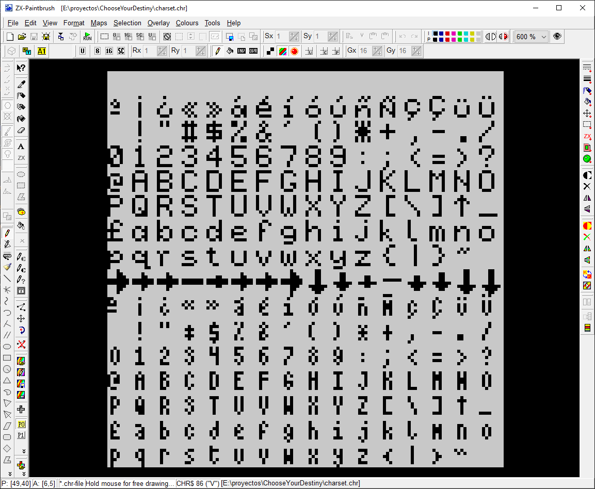

Vamos a editar el ciclo de animación de espera de tecla (los marcados en azúl en la segunda captura). Voy a poner un reloj, disculpad mis pésimas dotes artísticas:

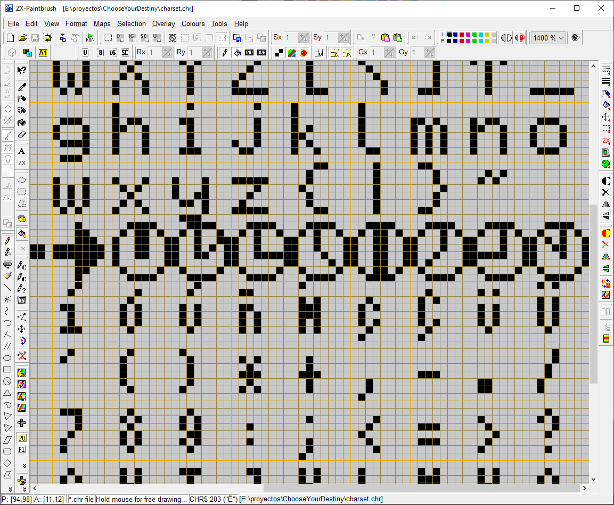

Ahora necesitamos convertirlos a un formato que pueda digerir el compilador. Para ello hacemos uso de la herramienta cyd_char_conv, que se encuentra en `.\dist\cyd_chr_conv.cmd`. Esta herramienta es por línea de comandos, con lo que nos tocará abrir una ventana de *Símbolo de Sistema* en el directorio del proyecto. Si ejecutamos este comando `.\dist\cyd_chr_conv.cmd --help`, podemos ver las opciones.

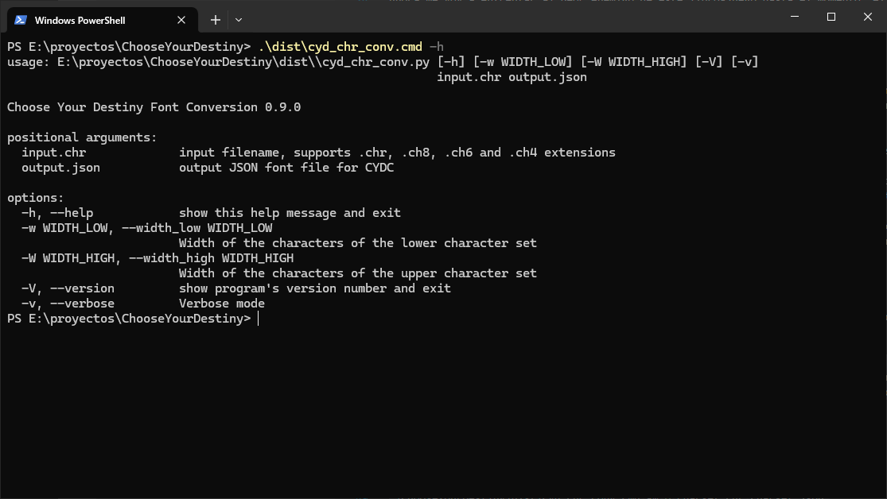

Para hacer la conversión, vamos a usarlo así:

```batch
.\dist\cyd_chr_conv.cmd -w 6 -W 4 charset.chr charset.json
```

Con el parámetro `-w`, le indicamos el ancho que van a tener los caracteres del juego inferior, que en nuestro caso son 6 y con `-W` le indicamos el tamaño de los caracteres del juego superior, 4 en este caso.

Con esto, ya tenemos el fichero `charset.json` que le tendríamos que pasar al compilador.

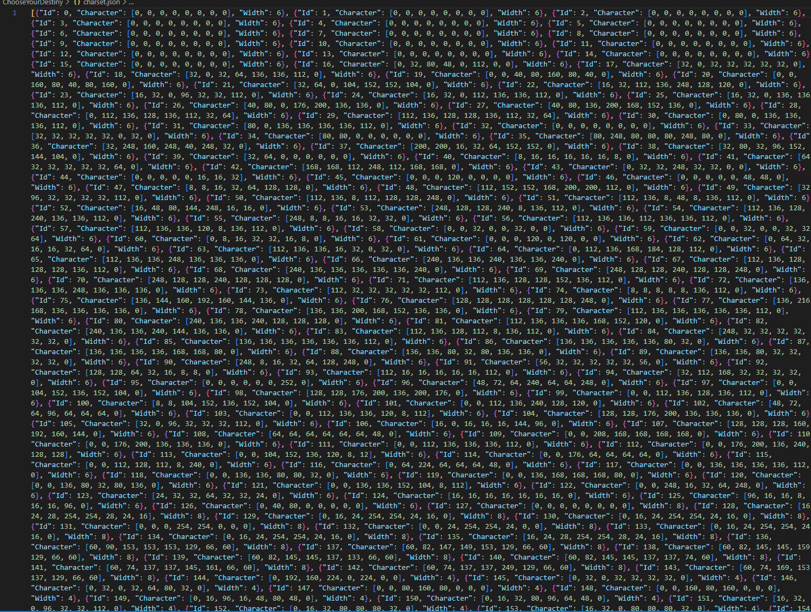

Para indicarle al compilador que vamos a usar el nuevo juego de caracteres, se lo tenemos que indicar con el parámetro `-c`. Afortunadamente, el fichero `make_adv.cmd` harás este trabajo por nosotros.

Para ello, modificamos la cabecera de ese fichero, poniendo `-c charset.json` dentro de la variable `CYDC_EXTRA_PARAMS`, de esta forma:

```batch
REM ---- Configuration variables ----------

REM Name of the game
SET GAME=test
REM This name will be used as:
REM   - The file to compile will be test.cyd with this example
REM   - The name of the TAP file or +3 disk image

REM Target for the compiler (48k, 128k for TAP, plus3 for DSK)
SET TARGET=48k

REM Number of lines used on SCR files at compressing
SET IMGLINES=192

REM Loading screen
SET LOAD_SCR="LOAD.scr"

REM Parameters for compiler
SET CYDC_EXTRA_PARAMS=-c charset.json

REM --------------------------------------
...
```

Ejecutando el archivo `make_adv.cmd` y lanzando en fichero de cinta resultante con un emulador, vemos que el icono ha cambiado:

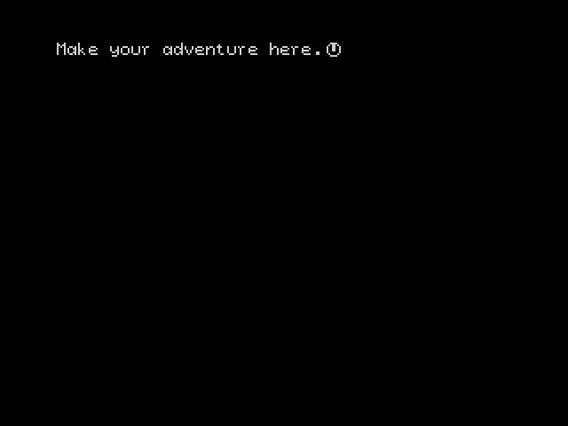

De esta forma, podemos cambiar el resto de iconos animados, las fuentes en general o incluso hacer caracteres gráficos especiales, tipo "UDG", y mostrándolos con el comando `CHAR`.

---

## Rutinas nativas (IMPORT / CALL)

Para tareas que la máquina virtual no sabe hacer por sí sola —leer o escribir un puerto del hardware, tocar una dirección de memoria cualquiera, o un cálculo que necesite ir muy rápido— puedes escribir una pequeña rutina en **ensamblador Z80** y llamarla desde tu guion.

> **Avanzado, bajo tu responsabilidad.** Esto ejecuta tu propio código nativo sin red de seguridad: un error en la rutina puede colgar la máquina, igual que el código de BeepFX o WyzTracker en el que ya confías. Si no te manejas con el ensamblador Z80, no necesitas esta función.

Intervienen dos palabras clave:

```
[[
    IMPORT peek FROM "peek.asm"   /* Declara la rutina (en compilación) */
    SET 0 TO 0 : SET 1 TO 0       /* dirección 0000h en las variables 0 y 1 */
    CALL peek                     /* La ejecuta; deja el resultado en la variable 2 */
]]
```

- `IMPORT nombre FROM "fichero.asm"` registra una rutina nativa. Es una declaración de compilación (como `DECLARE`), **no** un `INCLUDE`. Una ruta relativa se resuelve respecto a la **carpeta de tu `.cyd`**.
- `CALL nombre` la ejecuta, igual que `GOSUB` llama a una subrutina escrita en CYD.

Tú escribes **solo el cuerpo** de la rutina (sin `ORG` ni directivas); el compilador la enmarca, la ensambla aislada y la coloca en memoria por ti. La rutina entra con **`DE = FLAGS`**, la base del array de variables, así que las entradas y salidas viajan por variables (la variable `n` es el byte en `FLAGS + n`) y debe terminar en `RET`. Por ejemplo, este `peek.asm` lee el byte de la dirección formada por las variables 0 y 1 y lo deja en la variable 2:

```asm
    ld a, (de)      ; DE = FLAGS -> A = variable 0 (byte bajo de la dirección)
    ld l, a
    inc de
    ld a, (de)      ; A = variable 1 (byte alto)
    ld h, a         ; HL = la dirección a leer
    inc de          ; DE -> variable 2
    ld a, (hl)      ; A = el byte en esa dirección
    ld (de), a      ; variable 2 = resultado
    ret
```

Funciona en los cinco targets (48K, 128K, +3, mld y mld128). Tienes un ejemplo completo y ejecutable en `examples/import_demo`, y la referencia detallada del contrato (ABI) en el manual, sección **Rutinas nativas (IMPORT / CALL)**.

### Escribir el ensamblador en el propio guion (`ASM … ENDASM`)

No siempre quieres un fichero aparte. Puedes escribir el cuerpo **directamente en el `.cyd`** entre `ASM nombre` y `ENDASM`, y llamarlo con `CALL` igual que antes:

```
[[
    ASM poner42
        ld a, 42
        ld (de), a          ; DE = FLAGS -> variable 0 = 42
        ret
    ENDASM
    CALL poner42
]]
```

Es la misma ABI que con `IMPORT` (entra con `DE = FLAGS`, termina en `RET`): `ASM … ENDASM` no es más que un `IMPORT` con el cuerpo en línea. Puedes sangrar el bloque para alinearlo con el `[[ ]]`; el compilador coloca las etiquetas donde el ensamblador las necesita.

A partir de ahí, un bloque puede exponer **varias rutinas** que comparten código (`ASM lib EXPORTS a, b`), tus rutinas pueden **leer los arrays** del guion por nombre (`ARR_<nombre>`, con servicios que hacen la paginación por ti en 128K/+3), y una rutina puede **llamar a otra de otro bloque** con `CYD_CALL` declarándola en `USES`. Además, una rutina que nadie llama no ocupa memoria: se descarta sola.

Todo esto está explicado con detalle en el manual (sección **Rutinas nativas**), y hay un ejemplo completo que lo reúne en `examples/inline_asm`. La idea es poder escribir "librerías" nativas cómodas cuando la máquina virtual se queda corta en velocidad.
