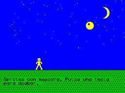

# `examples/sprites` — Sprites con máscara

Un personaje que camina y una pelota que bota sobre un escenario nocturno, sin
borrarlo, con la librería [`lib/sprites.cyd`](../../lib/README.md). Pulsa una tecla
para acabar.



## Qué demuestra

- **Sprites con máscara** (`sprDraw`): cada sprite tapa solo su silueta; el cielo,
  las estrellas y la luna se ven alrededor.
- **Animación**: el personaje tiene 4 fotogramas; en cada paso `sprX` apunta al
  siguiente.
- **Movimiento por caracteres y por píxeles**: el personaje avanza de carácter en
  carácter (`sprDX`) y la pelota sube y baja píxel a píxel (`sprPY`), acelerando al
  caer y frenando al subir.
- **Varios huecos de guardado**: cada uno guarda su fondo en su hueco (`sprSlot` 0
  y 1). En cada paso se restauran en el orden contrario al que se guardaron, así
  el fondo queda bien cuando la pelota pasa por delante del personaje.

## Las imágenes

- `IMAGES/000.scr`: el escenario.
- `IMAGES/001.scr`: la hoja de sprites. El personaje en 4 fotogramas de 2x3
  caracteres (columnas 0, 2, 4 y 6) y la pelota de 2x2 (columna 8), cada uno con su
  máscara 3 filas más abajo. Las máscaras son los sprites engordados un píxel, así
  que cada sprite lleva un contorno fino del color del papel.

Las dos las genera `make_images.py`; para cambiar los dibujos, edítalo y vuelve a
ejecutarlo (`python make_images.py`).

## Compilar

```
make_adv 48k examples/sprites/test.cyd
```

Funciona igual en 128K y +3; ahí la librería va en un banco paginado.
