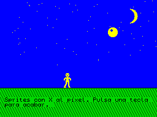

# `examples/sprites_px` — Sprites con X al píxel

El mismo escenario que [`examples/sprites`](../sprites/README.md), pero con la
librería [`lib/sprites_px.cyd`](../../lib/README.md): el personaje camina píxel a
píxel, 2 píxeles por paso, en vez de carácter a carácter. La pelota sigue botando
píxel a píxel en vertical. Pulsa una tecla para acabar.



## Qué demuestra

- **X al píxel** (`sprPX`): con `sprDX` a 0, `sprPX` es la X del personaje en
  píxeles (0..240). Cuando no cae en un borde de carácter, cada byte del sprite y
  de su máscara se reparte entre dos columnas.
- **Lo mismo que `examples/sprites`**: máscaras, 4 fotogramas, la pelota con
  `sprPY` y dos huecos de guardado que se restauran en orden inverso.

`sprites_px.cyd` ocupa unos 490 bytes más que `sprites.cyd` y, fuera de un borde
de carácter, pinta un sprite de 2x3 en casi medio frame en vez de 0,2. Si no
necesitas la X al píxel, usa `sprites.cyd`.

## Las imágenes

Son las de `examples/sprites`, que genera su `make_images.py`: `IMAGES/000.scr`
es el escenario y `IMAGES/001.scr` la hoja de sprites.

## Compilar

```
make_adv 48k examples/sprites_px/test.cyd
```

Funciona igual en 128K y +3.
